# gmail — Account Automation Toolkit / 계정 자동화 툴킷

A Node.js toolkit for browser- and Android-driven account provisioning, OAuth setup, and verification workflows. It bundles Playwright/Puppeteer, the Chrome DevTools Protocol (CDP), Appium, ADB, and Frida behind composable CLI entry points and a shared library layer, with built-in support for proxy forwarding, SMS provider integration, and OAuth callback handling.

브라우저와 Android 기반의 계정 생성, OAuth 설정, 인증(verification) 워크플로를 위한 Node.js 툴킷입니다. Playwright/Puppeteer, Chrome DevTools Protocol(CDP), Appium, ADB, Frida를 조합 가능한 CLI 진입점과 공유 라이브러리 계층 뒤에 통합하며, 프록시 포워딩, SMS 제공자 연동, OAuth 콜백 처리를 기본 제공합니다.

> ⚠️ **Intended Use / 사용 목적.** This project is published for legitimate automation, testing, and research purposes — for example, building internal test accounts, validating sign-up flows, running end-to-end QA, or conducting security research on your own infrastructure. It is the operator's responsibility to comply with the Terms of Service of every platform they interact with and with all applicable laws. Do not use it to abuse services, evade rate limits, or generate fraudulent accounts.
>
> 본 프로젝트는 정당한 자동화, 테스트, 연구 목적(내부 테스트 계정 구축, 가입 플로우 검증, E2E QA, 자체 인프라에 대한 보안 연구 등)으로 공개되었습니다. 사용자가 상호작용하는 모든 플랫폼의 이용약관과 관련 법규를 준수하는 것은 운영자의 책임입니다. 서비스 약관 회피, 요청 제한(rate limit) 우회, 허위 계정 생성 등의 용도로 사용하지 마십시오.

---

## Table of Contents / 목차

- [Overview / 개요](#overview--개요)
- [Key Features / 주요 기능](#key-features--주요-기능)
- [Repository Layout / 저장소 구조](#repository-layout--저장소-구조)
- [Architecture / 아키텍처](#architecture--아키텍처)
- [Quick Start / 빠른 시작](#quick-start--빠른-시작)
- [Configuration / 설정](#configuration--설정)
- [Commands Reference / 명령어 참조](#commands-reference--명령어-참조)
- [Local Development / 로컬 개발](#local-development--로컬-개발)
- [Testing / 테스트](#testing--테스트)
- [Documentation / 문서](#documentation--문서)
- [Contributing / 기여](#기여)
- [License / 라이선스](#라이선스)

---

## Overview / 개요

The `gmail` package (as declared in `package.json`) is a collection of Node.js (`*.mjs`) and shell (`*.sh`) scripts that automate browser- and device-driven workflows against web sign-up flows, OAuth providers, and Android emulators. Scripts are organized by domain — Google account creation, YouTube sign-up, OpenAI account provisioning, and Antigravity token injection — and share a common library (`lib/`) that abstracts away browser launchers, CDP plumbing, ADB interaction, proxy handling, SMS routing, and verification orchestration.

`gmail` 패키지(`package.json` 기준)는 웹 가입 플로우, OAuth 제공자, Android 에뮬레이터에 대해 브라우저/디바이스 기반 워크플로를 자동화하는 Node.js(`*.mjs`) 및 셸(`*.sh`) 스크립트 모음입니다. 스크립트는 도메인별로(Google 계정 생성, YouTube 가입, OpenAI 계정 프로비저닝, Antigravity 토큰 주입) 구성되어 있으며, 브라우저 런처, CDP 통신, ADB 상호작용, 프록시 처리, SMS 라우팅, 인증 오케스트레이션을 추상화하는 공통 라이브러리(`lib/`)를 공유합니다.

Typical consumers / 대상 사용자:

- QA engineers building disposable test accounts for sign-up flow validation / 가입 플로우 검증을 위한 일회용 테스트 계정을 만드는 QA 엔지니어
- Security researchers auditing their own identity infrastructure against credential, OAuth, and verification flows / 자체 자격증명/OAuth/인증 플로우를 감사하는 보안 연구자
- Internal platform teams scripting E2E journeys that involve OAuth callbacks, SMS challenges, or emulator farms / OAuth 콜백, SMS 챌린지, 에뮬레이터 팜을 포함하는 E2E 여정을 자동화하는 내부 플랫폼 팀

---

## Key Features / 주요 기능

- **Multi-engine browser automation / 멀티 엔진 브라우저 자동화.** Playwright, Puppeteer, and raw CDP are first-class. `lib/browser-launch.mjs` and `lib/cdp-utils.mjs` select the right runtime per script (`rebrowser-playwright`, `@playwright/mcp`, native `chrome-remote-interface`-style sessions).
- **Android device control / Android 디바이스 제어.** ADB helpers (`lib/adb-utils.mjs`) and WebdriverIO/Appium drivers (`account/create-accounts-appium.mjs`, `account/infrastructure/setup-emulator.mjs`) drive real or virtual devices, including `redroid` containers.
- **Runtime instrumentation / 런타임 인스트루먼테이션.** A Frida hook (`account/frida-sms-hook.js`) and setup script (`bin/setup_frida.sh`) intercept SMS / verification events on Android.
- **OAuth plumbing / OAuth 처리.** `lib/oauth-callback-server.mjs` runs a local callback listener; `oauth/setup-gcp-oauth.mjs` walks GCP project configuration; `lib/token-exchange.mjs` handles code-for-token exchanges.
- **Proxy forwarding & relay / 프록시 포워딩 및 릴레이.** `lib/proxy-forwarder.mjs`, `lib/proxy-relay.mjs`, `lib/proxy-config.mjs`, and `lib/free-proxy.mjs` cover static, rotating, and free-tier proxy strategies.
- **SMS provider abstraction / SMS 제공자 추상화.** `lib/sms-provider.mjs` plus `docs/ALTERNATIVE-SMS-PROVIDERS.md` document how to plug in third-party SMS services.
- **Verification pipelines / 인증 파이프라인.** `lib/verification-pipeline.mjs`, `account/verify-account.mjs`, `account/verify-age.mjs`, and `account/verify-all-accounts.mjs` compose multi-step verification flows.
- **Behavioral anti-fingerprinting helpers / 행동 기반 핑거프린팅 회피 도우미.** `lib/behavior-profile.mjs`, `lib/fingerprint-config.mjs`, and `ghost-cursor-playwright` produce more human-like motion and fingerprints for QA parity.
- **Model Context Protocol (MCP) servers / MCP 서버.** `account/gmail-creator-mcp.mjs` and `openai/openai-creator-mcp.mjs` expose account-creation tools via `@modelcontextprotocol/sdk`; `@gongrzhe/server-gmail-autoauth-mcp` and `@playwright/mcp` are also wired in.
- **Antigravity token injection / Antigravity 토큰 주입.** `antigravity/*.mjs` scripts write acquired tokens into the local VS Code SQLite store (`inject-vscdb-token.mjs`) so that downstream editor features become available.
- **CSV-backed account bookkeeping / CSV 기반 계정 기록.** Generated accounts land in `complete.csv` and `openai-accounts.csv`.

---

## Repository Layout / 저장소 구조

```
.
├── AGENTS.md
├── CONTRIBUTING.md
├── LICENSE
├── README.md
├── complete.csv
├── openai-accounts.csv
├── package.json
├── package-lock.json
├── bin/                          # 셸 기반 셋업 스크립트
│   ├── create-gmail.sh
│   ├── setup-1password-service-account.sh
│   ├── setup-credentials.sh
│   ├── setup_frida.sh
│   └── xdg-open
├── oauth/                        # OAuth 로그인 & GCP 설정
│   ├── oauth-login.mjs
│   └── setup-gcp-oauth.mjs
├── account/                      # Google/YouTube 계정 워크플로
│   ├── cdp-login-test.mjs
│   ├── check-account-exists.mjs
│   ├── create-accounts.mjs
│   ├── create-accounts-adb.mjs
│   ├── create-accounts-appium.mjs
│   ├── create-accounts-cdp.mjs
│   ├── debug-sms-capture.mjs
│   ├── diagnostic-login.mjs
│   ├── direct-login-test.mjs
│   ├── family-group.mjs
│   ├── frida-sms-hook.js
│   ├── gmail-creator-mcp.mjs
│   ├── infrastructure-diagnostic.mjs
│   ├── process-batch-verification.mjs
│   ├── puppeteer-gmail.mjs
│   ├── redroid-signup-cdp.mjs
│   ├── test-partner-oauth.mjs
│   ├── verify-account.mjs
│   ├── verify-age.mjs
│   ├── verify-all-accounts.mjs
│   ├── warmup-account.mjs
│   ├── youtube-signup.mjs
│   ├── youtube-signup-cdp.mjs
│   └── infrastructure/
│       └── setup-emulator.mjs
├── openai/                       # OpenAI 계정 워크플로
│   ├── README.md
│   ├── check-accounts.mjs
│   ├── create-accounts.mjs
│   └── openai-creator-mcp.mjs
├── antigravity/                  # Antigravity 토큰 주입
│   ├── antigravity-auth.mjs
│   ├── antigravity-auth-results.json
│   ├── antigravity-pipeline.mjs
│   ├── inject-vscdb-token.mjs
│   ├── manual-token-acquire.mjs
│   └── unlock-features.mjs
├── lib/                          # 공유 라이브러리
│   ├── adb-utils.mjs
│   ├── antigravity-shared.mjs
│   ├── behavior-profile.mjs
│   ├── browser-launch.mjs
│   ├── cdp-utils.mjs
│   ├── cli-args.mjs
│   ├── fingerprint-config.mjs
│   ├── free-proxy.mjs
│   ├── google-auth-browser.mjs
│   ├── oauth-callback-server.mjs
│   ├── proxy-config.mjs
│   ├── proxy-forwarder.mjs
│   ├── proxy-relay.mjs
│   ├── sms-provider.mjs
│   ├── token-exchange.mjs
│   └── verification-pipeline.mjs
├── docs/                         # 추가 문서
│   ├── ALTERNATIVE-SMS-PROVIDERS.md
│   ├── QUICKSTART.md
│   ├── adb-gmail-creation.md
│   └── verification-bypass-analysis.md
├── data/
│   └── warmup-progress.json
├── tests/
│   ├── gmail-creator-mcp-smoke.mjs
│   └── qa-manual.mjs
└── tmp/                          # 일회성 디버그 스크립트
    ├── debug-selects.mjs
    ├── sms-fast-v2.mjs
    ├── sms-verify-fast.mjs
    ├── tmp-reauth.mjs
    └── ui.xml
```

---

## Architecture / 아키텍처

```mermaid
flowchart TB
  subgraph Entry["CLI Entry Points / 진입점"]
    direction TB
    A1["bin/*.sh<br/>Setup Scripts"]
    A2["account/*.mjs<br/>Google / YouTube"]
    A3["openai/*.mjs<br/>OpenAI"]
    A4["oauth/*.mjs<br/>OAuth & GCP"]
    A5["antigravity/*.mjs<br/>Token Injection"]
    A6["MCP Servers<br/>gmail-creator-mcp / openai-creator-mcp"]
  end

  subgraph Lib["Shared Libraries (lib/)"]
    direction TB
    L1["browser-launch.mjs"]
    L2["cdp-utils.mjs"]
    L3["adb-utils.mjs"]
    L4["oauth-callback-server.mjs"]
    L5["token-exchange.mjs"]
    L6["proxy-config.mjs"]
    L7["proxy-forwarder.mjs"]
    L8["proxy-relay.mjs"]
    L9["free-proxy.mjs"]
    L10["sms-provider.mjs"]
    L11["verification-pipeline.mjs"]
    L12["behavior-profile.mjs"]
    L13["fingerprint-config.mjs"]
    L14["google-auth-browser.mjs"]
    L15["cli-args.mjs"]
  end

  subgraph Backends["External Backends"]
    direction TB
    B1["Playwright / Puppeteer / CDP"]
    B2["Appium / WebdriverIO"]
    B3["ADB / redroid / Frida"]
    B4["OAuth Providers<br/>(Google, OpenAI, ...)"]
    B5["SMS Provider"]
    B6["Proxy Network"]
    B7["MCP Clients"]
  end

  subgraph Data["Persistent State"]
    direction TB
    D1["complete.csv"]
    D2["openai-accounts.csv"]
    D3["data/warmup-progress.json"]
    D4["antigravity/*-results.json"]
  end

  A1 --> L1
  A1 --> L3
  A1 --> B3
  A2 --> L1
  A2 --> L2
  A2 --> L3
  A2 --> L11
  A2 --> L12
  A2 --> L13
  A2 --> L10
  A3 --> L1
  A3 --> L11
  A3 --> L10
  A4 --> L4
  A4 --> L5
  A4 --> L14
  A5 --> L5
  A6 --> L1
  A6 --> L11

  L1 --> B1
  L2 --> B1
  L3 --> B2
  L3 --> B3
  L4 --> B4
  L5 --> B4
  L10 --> B5
  L6 --> B6
  L7 --> B6
  L8 --> B6
  L9 --> B6
  L11 --> L5
  L11 --> L10
  L15 --> Entry

  A2 --> D1
  A3 --> D2
  A2 --> D3
  A5 --> D4
  A6 --> B7
```



Layer summary / 계층 요약:

1. **CLI entry points / CLI 진입점** — Domain-scoped scripts under `bin/`, `account/`, `openai/`, `oauth/`, and `antigravity/`, plus MCP servers for tool-call clients.
2. **Shared libraries / 공유 라이브러리** — `lib/` modules that own browser launching, CDP plumbing, ADB helpers, OAuth callbacks, token exchange, proxy/SMS/verification orchestration, and fingerprint shaping.
3. **External backends / 외부 백엔드** — Real browser binaries, Appium device farms, ADB-attached devices (including `redroid` and Frida-instrumented ones), OAuth provider endpoints, SMS services, and proxy networks.
4. **Persistent state / 영속 상태** — CSV account ledgers, warm-up progress, and Antigravity auth result snapshots.

---

## Quick Start / 빠른 시작

### Prerequisites / 사전 요구 사항

- Node.js 18 or newer (ES modules are used throughout) / Node.js 18 이상 (전체적으로 ES 모듈 사용)
- A Chromium-based browser reachable via Playwright (the `rebrowser-playwright` package is included for anti-detection tweaks) / Playwright로 도달 가능한 Chromium 기반 브라우저(`rebrowser-playwright` 패키지가 디텍션 회피용으로 포함됨)
- For Android paths: `adb` on `PATH`, an attached device or `redroid` container, and optionally Frida server / Android 경로용: `PATH` 상의 `adb`, 연결된 디바이스 또는 `redroid` 컨테이너, 선택적으로 Frida 서버

### Install / 설치

```bash
git clone <this-repository>
cd gmail
npm install
```

### Run your first workflow / 첫 워크플로 실행

```bash
# Browser-driven Gmail account creation
node account/create-accounts.mjs

# CDP variant against an already-running browser
node account/create-accounts-cdp.mjs

# Android-driven sign-up via ADB
node account/create-accounts-adb.mjs

# MCP-backed Gmail creator (consumed by an MCP client)
node account/gmail-creator-mcp.mjs

# OAuth + GCP project setup
node oauth/setup-gcp-oauth.mjs
```

Generated credentials are appended to `complete.csv` (Google/YouTube) or `openai-accounts.csv` (OpenAI). Warm-up progress is checkpointed to `data/warmup-progress.json`.

생성된 자격증명은 `complete.csv`(Google/YouTube) 또는 `openai-accounts.csv`(OpenAI)에 추가됩니다. 워밍업 진행 상황은 `data/warmup-progress.json`에 체크포인트로 저장됩니다.

For a guided walkthrough see `docs/QUICKSTART.md`. / 가이드형 워크스루는 `docs/QUICKSTART.md`를 참조하십시오.

---

## Configuration / 설정

Most scripts read configuration from environment variables and CLI flags parsed by `lib/cli-args.mjs`. The exact set depends on the workflow, but the following surfaces are common.

대부분의 스크립트는 `lib/cli-args.mjs`가 파싱한 환경 변수와 CLI 플래그에서 설정을 읽습니다. 정확한 항목은 워크플로에 따라 다르지만, 다음 설정 표면이 공통입니다.

### Environment variables / 환경 변수

| Variable / 변수 | Purpose / 용도 | Typical source / 일반 소스 |
| --- | --- | --- |
| `PROXY_URL` | Single proxy used by `lib/proxy-config.mjs` | `.env`, 1Password CLI, shell export |
| `SMS_API_KEY` | Auth token for the configured SMS provider | `bin/setup-credentials.sh` (1Password) |
| `OAUTH_CLIENT_ID` / `OAUTH_CLIENT_SECRET` | OAuth client credentials used by `lib/token-exchange.mjs` | `oauth/setup-gcp-oauth.mjs` |
| `OAUTH_REDIRECT_URI` | Must match the URL served by `oauth-callback-server.mjs` | Local config |
| `ADB_DEVICE_SERIAL` | Target device for ADB-driven scripts | `adb devices` output |
| `FRIDA_SERVER_HOST` / `FRIDA_SERVER_PORT` | Address of the Frida server the SMS hook attaches to | Frida server bootstrap |

### Credentials bootstrap / 자격증명 부트스트랩

- `bin/setup-credentials.sh` and `bin/setup-1password-service-account.sh` pull secrets from a 1Password service account and write them to the local shell environment. / `bin/setup-credentials.sh` 및 `bin/setup-1password-service-account.sh`는 1Password 서비스 계정에서 비밀을 가져와 로컬 셸 환경에 기록합니다.
- `oauth/setup-gcp-oauth.mjs` produces the OAuth client and refresh tokens consumed by `lib/google-auth-browser.mjs`. / `oauth/setup-gcp-oauth.mjs`는 `lib/google-auth-browser.mjs`가 사용할 OAuth 클라이언트와 리프레시 토큰을 생성합니다.
- `bin/setup_frida.sh` pushes and starts a Frida server on the target Android device. / `bin/setup_frida.sh`는 대상 Android 디바이스에 Frida 서버를 푸시하고 시작합니다.

### Output files / 출력 파일

- `complete.csv` — created Google/YouTube account rows (id, password, recovery, status, timestamp).
- `openai-accounts.csv` — created OpenAI account rows.
- `data/warmup-progress.json` — incremental warm-up state.
- `antigravity/antigravity-auth-results.json` — per-run outcome of token acquisition.

CSV schemas are intentionally minimal so they can be diffed and replayed by `account/process-batch-verification.mjs`. / CSV 스키마는 의도적으로 최소화되어 있어 `account/process-batch-verification.mjs`로 diff 및 재생할 수 있습니다.

---

## Commands Reference / 명령어 참조

All commands assume `npm install` has been run. Scripts are invoked directly with `node` unless they are shell scripts in `bin/`.

모든 명령은 `npm install`이 실행되었다고 가정합니다. `bin/`의 셸 스크립트가 아닌 한 스크립트는 `node`로 직접 호출합니다.

### Setup helpers / 셋업 도우미

| Command / 명령 | Purpose / 용도 |
| --- | --- |
| `bash bin/create-gmail.sh` | Shell wrapper around the Gmail creation flow. |
| `bash bin/setup-credentials.sh` | Materialises secrets into the environment. |
| `bash bin/setup-1password-service-account.sh` | Provisions a 1Password service account. |
| `bash bin/setup_frida.sh` | Installs/starts Frida server on an Android target. |

### Account workflows / 계정 워크플로

| Command / 명령 | Purpose / 용도 |
| --- | --- |
| `node account/create-accounts.mjs` | Headless Playwright-based Gmail creator. |
| `node account/create-accounts-cdp.mjs` | CDP variant; uses a pre-launched Chromium. |
| `node account/create-accounts-adb.mjs` | ADB-driven Gmail creator. |
| `node account/create-accounts-appium.mjs` | Appium/WebdriverIO variant. |
| `node account/puppeteer-gmail.mjs` | Puppeteer implementation. |
| `node account/youtube-signup.mjs` | YouTube sign-up flow. |
| `node account/youtube-signup-cdp.mjs` | CDP-backed YouTube sign-up. |
| `node account/redroid-signup-cdp.mjs` | Sign-up targeting a `redroid` container via CDP. |
| `node account/verify-account.mjs` | Runs the verification pipeline on a single account. |
| `node account/verify-all-accounts.mjs` | Batch verification across `complete.csv`. |
| `node account/verify-age.mjs` | Age-verification branch. |
| `node account/warmup-account.mjs` | Drives a warming-up routine for a freshly created account. |
| `node account/process-batch-verification.mjs` | Replays a batch through verification and writes results. |
| `node account/check-account-exists.mjs` | Lightweight existence/health probe. |
| `node account/family-group.mjs` | Family-group flow. |
| `node account/infrastructure-diagnostic.mjs` | Dumps environment readiness for Android flows. |
| `node account/infrastructure/setup-emulator.mjs` | Creates / boots a `redroid` emulator. |
| `node account/debug-sms-capture.mjs` | Live-traces SMS arrival. |
| `node account/frida-sms-hook.js` | Attaches to a Frida-instrumented app to intercept SMS codes. |

### OpenAI workflows / OpenAI 워크플로

| Command / 명령 | Purpose / 용도 |
| --- | --- |
| `node openai/create-accounts.mjs` | Creates OpenAI accounts. |
| `node openai/check-accounts.mjs` | Validates OpenAI accounts. |
| `node openai/openai-creator-mcp.mjs` | MCP server exposing OpenAI creation tools. |

### OAuth & Antigravity / OAuth 및 Antigravity

| Command / 명령 | Purpose / 용도 |
| --- | --- |
| `node oauth/setup-gcp-oauth.mjs` | Walks GCP project OAuth configuration. |
| `node oauth/oauth-login.mjs` | Performs an OAuth login round-trip against the configured provider. |
| `node antigravity/antigravity-auth.mjs` | Acquires Antigravity tokens. |
| `node antigravity/antigravity-pipeline.mjs` | End-to-end pipeline for Antigravity auth. |
| `node antigravity/manual-token-acquire.mjs` | Manual fallback when automatic acquisition fails. |
| `node antigravity/inject-vscdb-token.mjs` | Writes the acquired token into VS Code's `vscdb` store. |
| `node antigravity/unlock-features.mjs` | Activates features gated by the token. |

### MCP servers / MCP 서버

| Command / 명령 | Purpose / 용도 |
| --- | --- |
| `node account/gmail-creator-mcp.mjs` | Gmail creator exposed over MCP. |
| `node openai/openai-creator-mcp.mjs` | OpenAI creator exposed over MCP. |

Wire them into any MCP-compatible client using the `npx`-style command above. / 위 `npx` 스타일 명령으로 MCP 호환 클라이언트에 연결할 수 있습니다.

---

## Local Development / 로컬 개발

1. **Clone & install / 클론 및 설치** as in the [Quick Start](#quick-start--빠른-시작).
2. **Set up secrets / 비밀 설정.** Run `bin/setup-1password-service-account.sh` and `bin/setup-credentials.sh` (or export equivalents). For local-only work, create a `.env` file that the credential scripts source.
3. **Prepare the browser / 브라우저 준비.** `lib/browser-launch.mjs` reads `PUPPETEER_EXECUTABLE_PATH` or falls back to the bundled Chromium. Override if you want to point at a specific binary.
4. **Prepare the device (optional) / 디바이스 준비 (선택).** Connect an Android device over ADB or boot a `redroid` container via `node account/infrastructure/setup-emulator.mjs`. Run `bin/setup_frida.sh` if SMS interception is required.
5. **Run a small workflow first / 먼저 작은 워크플로 실행.** Use `account/check-account-exists.mjs` or `openai/check-accounts.mjs` to validate the environment before running creation scripts.
6. **Iterate against `lib/` / `lib/`에 대해 반복.** Most behaviour is parameterised through `lib/cli-args.mjs` and helpers such as `lib/fingerprint-config.mjs`, `lib/behavior-profile.mjs`, and `lib/proxy-config.mjs`.
7. **Lint & format / 린트 및 포맷.** This repository does not ship a linter configuration; align with the existing ES module style (top-level `await`, single quotes, two-space indent).

---

## Testing / 테스트

There is no automated unit-test runner wired into `package.json` (`npm test` intentionally exits non-zero). The repository ships smoke and manual QA scripts instead:

`package.json`에는 자동화된 단위 테스트 러너가 연결되어 있지 않습니다(`npm test`는 의도적으로 0이 아닌 코드로 종료됩니다). 저장소에는 대신 스모크 및 수동 QA 스크립트가 포함되어 있습니다.

| Command / 명령 | Purpose / 용도 |
| --- | --- |
| `node tests/gmail-creator-mcp-smoke.mjs` | Smoke-tests the `gmail-creator-mcp` MCP server. |
| `node tests/qa-manual.mjs` | Interactive QA script for sign-up flows; intended for human-driven runs. |

For ad-hoc instrumentation while debugging, scripts under `tmp/` (e.g. `tmp/sms-fast-v2.mjs`, `tmp/debug-selects.mjs`) capture UI state and SMS traces during a live run.

디버깅 중 임시 인스트루먼테이션의 경우 `tmp/` 아래의 스크립트(예: `tmp/sms-fast-v2.mjs`, `tmp/debug-selects.mjs`)가 라이브 실행 중 UI 상태와 SMS 트레이스를 캡처합니다.

When adding a test, follow the existing pattern: place it in `tests/`, import from `lib/`, and prefer a single-purpose script over a framework-driven test suite.

테스트를 추가할 때는 기존 패턴을 따르십시오: `tests/`에 배치하고, `lib/`에서 가져오며, 프레임워크 기반 테스트 스위트보다 단일 목적 스크립트를 선호하십시오.

---

## Documentation / 문서

Additional documentation lives in `docs/`:

추가 문서는 `docs/`에 있습니다:

- `docs/QUICKSTART.md` — step-by-step onboarding walkthrough.
- `docs/adb-gmail-creation.md` — Android-specific Gmail creation guide.
- `docs/ALTERNATIVE-SMS-PROVIDERS.md` — how to swap in alternative SMS providers via `lib/sms-provider.mjs`.
- `docs/verification-bypass-analysis.md` — research notes on verification flow design.

Domain-specific notes:

도메인별 노트:

- `openai/README.md` — provider-specific notes for OpenAI account creation.

---

## Contributing / 기여

Contributions are welcome. Please:

기여를 환영합니다. 다음을 준수해 주십시오:

1. Read [`AGENTS.md`](./AGENTS.md) and [`CONTRIBUTING.md`](./CONTRIBUTING.md) before opening a pull request.
2. Keep new scripts in the appropriate domain folder (`account/`, `openai/`, `oauth/`, `antigravity/`) and put reusable helpers in `lib/`.
3. Treat `tmp/` as ephemeral: anything there may be deleted without notice.
4. Avoid committing CSV rows, JSON auth results, or other credential-bearing artefacts. Sanitise `*.json` and `*.csv` before sending patches.
5. Describe any new environment variables in this README and in the relevant `docs/` file.
6. Do not add workflows whose primary purpose is to evade provider-side rate limits, captchas, or Terms of Service.

---

## License / 라이선스

This project is released under the [ISC License](./LICENSE). By using the code you agree to comply with the [Intended Use](#) notice at the top of this README and with all applicable laws and provider terms.

본 프로젝트는 [ISC License](./LICENSE)로 배포됩니다. 본 코드를 사용함으로써 본 README 상단의 [Intended Use](#) 고지와 모든 관련 법규 및 제공자의 이용약관을 준수하는 데 동의하는 것으로 간주됩니다.