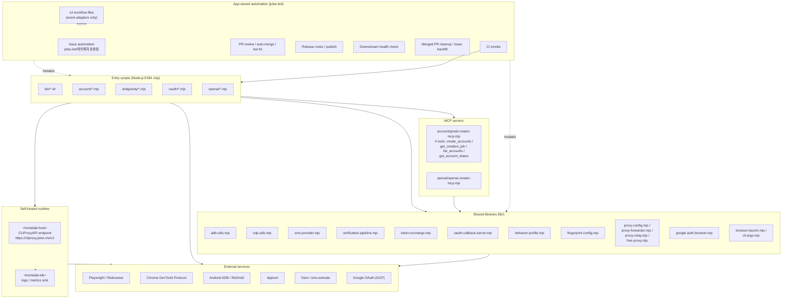

# 계정 자동화 워크스페이스 / Account Automation Workspace

[](./actions/workflows/ci.yml)
[](./actions/workflows/02_issue-to-branch.yml)
[](./actions/workflows/01_branch-to-pr.yml)
[](./actions/workflows/10_pr-review.yml)
[](./actions/workflows/11_security-pr-review.yml)
[](./actions/workflows/12_dependabot-auto-merge.yml)
[](./actions/workflows/13_pr-auto-merge.yml)
[](./actions/workflows/14_bot-auto-fix.yml)
[](./actions/workflows/25_release-publish.yml)

> README 생성 모델 / README generation model: `gpt-5.5` · fallback: `minimax-m3` via [`https://cliproxy.jclee.me/v1`](https://cliproxy.jclee.me)
>
> 외부 링크 정책 / external link policy: only [`qodo-ai/pr-agent`](https://github.com/qodo-ai/pr-agent), [`cliproxy.jclee.me`](https://cliproxy.jclee.me), [`bot.jclee.me`](https://bot.jclee.me).

---

## 1. 개요 / Overview

이 저장소는 **Gmail 계정 생성, OAuth 인증 흐름, Antigravity IDE 인증·토큰 주입, OpenAI 계정 점검·생성 보조** 작업을 위한 **Node.js ESM** 자동화 워크스페이스입니다. **Playwright / Rebrowser**, **Chrome DevTools Protocol(CDP)**, **ADB**, **Appium**, **MCP(Model Context Protocol) 서버**, 그리고 모듈형 **SMS provider 추상화**(5sim, sms-activate 등)를 단일 워크스페이스에서 결합합니다.

This repository is a **Node.js ESM** automation workspace for **Gmail account creation**, **OAuth credential flows**, **Antigravity IDE authentication / token injection**, and **OpenAI account inspection / creation helpers**. It unifies **Playwright / Rebrowser**, the **Chrome DevTools Protocol (CDP)**, **ADB**, **Appium**, an **MCP (Model Context Protocol) server**, and a modular **SMS provider abstraction** (5sim, sms-activate, …) inside a single workspace.

The repository is operated by the **jclee-bot** GitHub App, which is the single owner of every mutating automation surface (issues, PRs, releases, downstream health). The 14 workflow files under `.github/workflows/` are only event adapters that jclee-bot consumes — they are *not* the source of truth for automation policy.

### 1.1 핵심 사용 사례 / Key use cases

- Headless 브라우저로 Gmail 가입 플로우를 실행하고 5sim 등 SMS provider로 인증 코드를 수신 (`account/`).
- Antigravity IDE의 OAuth 동의 + SMS 인증을 종단간으로 조율하고 VSCDB에 토큰을 주입 (`antigravity/`).
- GCP OAuth client secret / refresh token 발급 (`oauth/`).
- OpenAI 계정 상태 점검 및 신규 계정 생성 보조 (`openai/`).
- mcphub 같은 MCP 호스트에서 호출 가능한 도구 기반 계정 생성 서버 (`account/gmail-creator-mcp.mjs`, `openai/openai-creator-mcp.mjs`).
- GitHub 이슈 / PR / 릴리스 / 다운스트림 헬스체크 라이프사이클을 jclee-bot이 단독 소유.

---

## 2. 주요 기능 / Features

- **다중 트랜스포트 계정 생성 / Multi-transport account creation**
  - `account/create-accounts.mjs` — 기본 Playwright / Rebrowser 플로우.
  - `account/create-accounts-cdp.mjs` — CDP + ReDroid WebView.
  - `account/create-accounts-adb.mjs` — ADB + Android Chrome.
  - `account/create-accounts-appium.mjs` — Appium + Docker Android.
- **MCP 서버 / MCP servers**
  - `account/gmail-creator-mcp.mjs` — 4 tools: `create_accounts`, `get_creation_job`, `list_accounts`, `get_account_status`.
  - `openai/openai-creator-mcp.mjs` — OpenAI 계정 작업용 MCP 표면.
  - `tests/gmail-creator-mcp-smoke.mjs` — 29-assertion 스모크 스위트.
- **모듈형 SMS provider / Modular SMS provider**
  - `lib/sms-provider.mjs` — 5sim / sms-activate 어댑터 추상화.
  - [`docs/ALTERNATIVE-SMS-PROVIDERS.md`](./docs/ALTERNATIVE-SMS-PROVIDERS.md)에 대안 벤더 노출 정보.
- **3단계 verification pipeline**
  - `lib/verification-pipeline.mjs` + `account/verify-age.mjs` (5sim SMS 기반 연령 검증).
  - 배치 검증은 `account/process-batch-verification.mjs`로 직렬화.
- **휴머노이드 시뮬레이션 / Human-like simulation**
  - `lib/behavior-profile.mjs` (타이핑·마우스 패턴), `lib/fingerprint-config.mjs` (브라우저 핑거프린트).
  - 프록시/릴레이는 `lib/proxy-config.mjs`, `lib/proxy-forwarder.mjs`, `lib/proxy-relay.mjs`, `lib/free-proxy.mjs`로 분기.
- **OAuth 도구 모음 / OAuth toolkit**
  - `lib/oauth-callback-server.mjs` — `127.0.0.1` 루프백에서 인증 콜백 캡처.
  - `lib/token-exchange.mjs`, `lib/google-auth-browser.mjs`, `oauth/oauth-login.mjs`, `oauth/setup-gcp-oauth.mjs`.
- **Antigravity end-to-end**
  - `antigravity/antigravity-pipeline.mjs` → `antigravity/inject-vscdb-token.mjs` → `antigravity/unlock-features.mjs` 체인.
  - 보조: `antigravity/antigravity-auth.mjs`, `antigravity/manual-token-acquire.mjs`.
- **Family / YouTube 부속 워크플로 / Family & YouTube side flows**
  - `account/family-group.mjs`, `account/youtube-signup.mjs`, `account/youtube-signup-cdp.mjs`.
- **App-owned automation (jclee-bot)**
  - 이슈 분류, PR 리뷰/머지, 릴리스 게시, 다운스트림 헬스체크, 머지된 PR 정리, 봇 자체 수정까지 jclee-bot이 단독 결정.

---

## 3. 아키텍처 / Architecture

워크플로 파일은 jclee-bot이 응답하는 **이벤트 어댑터**이며, 자동화 정책의 진실의 원천은 jclee-bot 자체입니다. 다음 다이어그램은 코드 컴포넌트와 자동화 표면을 보여줍니다.



워크플로 파일 자체는 카탈로그화하지 않습니다. 각 `.yml`은 위 다이어그램에서 jclee-bot이 실행하는 **트리거 어댑터**에 불과합니다.

---

## 4. jclee-bot 자동화 표면 / jclee-bot automation surfaces

jclee-bot GitHub App이 이 저장소에서 **mutating automation의 단독 소유자**입니다. 14개의 워크플로 파일(`01_…`, `02_…`, `10_…`, …)은 모두 jclee-bot이 구독하는 이벤트 어댑터이며, 정책 결정과 부수 효과는 전부 jclee-bot이 수행합니다.

### 4.1 이슈 자동화 / Issue automation

- **이슈 → 브랜치 → PR 파이프라인**: 새 이슈(또는 특정 라벨)가 발생하면 jclee-bot이 브랜치를 만들고 초안 PR을 엽니다. 이슈 본문에서 자동 적용된 변경에는 **`jclee-bot에의해자동화됨`** 마커가 부착됩니다.
- **백필 / CI 실패 이슈 자동 생성**: `19_issue-backfill.yml`·`37_ci-failure-issues.yml`이 발화하더라도 실제 라벨링·할당·close는 jclee-bot이 담당합니다.
- 사람이 의도적으로 만든 이슈라도 자동 라벨·자동 트리아지·자동 마일스톤 이동은 jclee-bot의 결정입니다.

### 4.2 PR 자동화 / PR automation

- PR 리뷰는 [`qodo-ai/pr-agent`](https://github.com/qodo-ai/pr-agent) 기반 시큐리티 리뷰(`11_security-pr-review.yml`)를 포함하며, 일반 리뷰(`10_pr-review.yml`), Dependabot 자동 머지(`12_dependabot-auto-merge.yml`), 일반 PR 자동 머지(`13_pr-auto-merge.yml`), 봇 자체 수정(`14_bot-auto-fix.yml`), 머지 후 PR 정리(`15_merged-pr-cleanup.yml`)까지 jclee-bot이 단독 결정·실행합니다.
- 사람이 작성자가 아닌 PR의 머지 가능 표시와 자동 머지는 모두 jclee-bot의 정책 출력입니다.

### 4.3 릴리스 자동화 / Release automation

- 릴리스 노트 자동 생성(`24_release-notes.yml`)과 릴리스 게시(`25_release-publish.yml`), 다운스트림 헬스 체크(`29_downstream-health-check.yml`)는 jclee-bot이 소유합니다.
- CI(`ci.yml`)는 smoke 단계일 뿐이며, 게시·롤백·체크런 해제는 jclee-bot이 내립니다.

### 4.4 운영 규칙 / Operating rules

- 자동화로 인한 직접 푸시, 라벨 변경, 코멘트, 이슈 close, PR 머지, 릴리스 게시, 워크플로 재실행, 봇 자체 수정 — 모두 jclee-bot의 작업입니다.
- 사람이 `workflow_dispatch`로 트리거하더라도 실제 부수 효과는 jclee-bot이 검증·승인 후에만 반영됩니다.
- 외부 상태(예: jclee-bot 컨트롤 플레인)는 [`https://bot.jclee.me`](https://bot.jclee.me)에서 확인합니다.

---

## 5. Go 자동화 도구 / Go automation tools

이 저장소에는 Go 기반 자동화 도구가 **0개** 있습니다. 모든 자동화는 Node.js ESM 스크립트와 jclee-bot GitHub App 위에 있습니다. 추후 Go 도구가 추가되면 본 섹션에 도구 이름·입출력 표면·소유자(jclee-bot 여부)를 명시합니다.

---

## 6. 빠른 시작 / Quick start

### 6.1 사전 요구 사항 / Prerequisites

- Node.js 20+ (ESM, native `fetch`, `WebSocket`).
- npm 10+.
- (선택) Android 디바이스 / 에뮬레이터 또는 ReDroid 컨테이너.
- (선택) 5sim / sms-activate API 키.
- (선택) GCP OAuth client (`oauth/setup-gcp-oauth.mjs`로 발급).

### 6.2 설치 / Install

```bash
git clone <repo-url>
cd <repo-dir>
npm install
```

### 6.3 첫 실행 / First run

```bash
# dry-run으로 진입점 동작 확인
node account/create-accounts.mjs --dry-run

# MCP 서버를 stdio로 실행
node account/gmail-creator-mcp.mjs

# GCP OAuth 시크릿 셋업
node oauth/setup-gcp-oauth.mjs

# Antigravity end-to-end 파이프라인
node antigravity/antigravity-pipeline.mjs
```

### 6.4 추가 문서 / Further reading

- [`docs/QUICKSTART.md`](./docs/QUICKSTART.md) — 환경별 빠른 시작.
- [`docs/adb-gmail-creation.md`](./docs/adb-gmail-creation.md) — ADB 트랜스포트 가이드.
- [`docs/verification-bypass-analysis.md`](./docs/verification-bypass-analysis.md) — 검증 파이프라인 분석.
- [`docs/ALTERNATIVE-SMS-PROVIDERS.md`](./docs/ALTERNATIVE-SMS-PROVIDERS.md) — SMS provider 어댑터 추가 가이드.
- [`openai/README.md`](./openai/README.md) — OpenAI 보조 도구 상세.
- [`AGENTS.md`](./AGENTS.md) — jclee-bot이 컨텍스트로 소비하는 프로젝트 지식 베이스.

---

## 7. 로컬 개발 / Local development

### 7.1 디렉토리 레이아웃 / Directory layout

```text
.
├── AGENTS.md                       # 프로젝트 지식 베이스 (jclee-bot 컨텍스트)
├── CONTRIBUTING.md                 # 기여 가이드
├── LICENSE
├── README.md
├── package.json / package-lock.json
├── complete.csv                    # 생성된 계정 종합 결과
├── openai-accounts.csv             # OpenAI 계정 점검/생성 결과
│
├── bin/                            # 셸 진입점
│   ├── create-gmail.sh
│   ├── setup-1password-service-account.sh
│   ├── setup-credentials.sh
│   ├── setup_frida.sh
│   └── xdg-open
│
├── oauth/                          # OAuth 자격 증명 흐름
│   ├── oauth-login.mjs
│   └── setup-gcp-oauth.mjs
│
├── account/                        # Gmail 계정 자동화 + 검증
│   ├── cdp-login-test.mjs
│   ├── check-account-exists.mjs
│   ├── create-accounts.mjs
│   ├── create-accounts-adb.mjs
│   ├── create-accounts-appium.mjs
│   ├── create-accounts-cdp.mjs
│   ├── debug-sms-capture.mjs
│   ├── diagnostic-login.mjs
│   ├── direct-login-test.mjs
│   ├── family-group.mjs
│   ├── frida-sms-hook.js
│   ├── gmail-creator-mcp.mjs       # MCP 서버 (4 tools)
│   ├── infrastructure-diagnostic.mjs
│   ├── process-batch-verification.mjs
│   ├── puppeteer-gmail.mjs
│   ├── redroid-signup-cdp.mjs
│   ├── test-partner-oauth.mjs
│   ├── verify-account.mjs
│   ├── verify-age.mjs
│   ├── verify-all-accounts.mjs
│   ├── warmup-account.mjs
│   ├── youtube-signup.mjs
│   ├── youtube-signup-cdp.mjs
│   └── infrastructure/
│       └── setup-emulator.mjs
│
├── openai/                         # OpenAI 계정 보조
│   ├── README.md
│   ├── check-accounts.mjs
│   ├── create-accounts.mjs
│   └── openai-creator-mcp.mjs
│
├── antigravity/                    # Antigravity IDE 인증/토큰
│   ├── antigravity-auth.mjs
│   ├── antigravity-auth-results.json
│   ├── antigravity-pipeline.mjs
│   ├── inject-vscdb-token.mjs
│   ├── manual-token-acquire.mjs
│   └── unlock-features.mjs
│
├── lib/                            # 공유 유틸
│   ├── adb-utils.mjs
│   ├── antigravity-shared.mjs
│   ├── behavior-profile.mjs
│   ├── browser-launch.mjs
│   ├── cdp-utils.mjs
│   ├── cli-args.mjs
│   ├── fingerprint-config.mjs
│   ├── free-proxy.mjs
│   ├── google-auth-browser.mjs
│   ├── oauth-callback-server.mjs
│   ├── proxy-config.mjs
│   ├── proxy-forwarder.mjs
│   ├── proxy-relay.mjs
│   ├── sms-provider.mjs
│   ├── token-exchange.mjs
│   └── verification-pipeline.mjs
│
├── docs/                           # 추가 문서
│   ├── ALTERNATIVE-SMS-PROVIDERS.md
│   ├── QUICKSTART.md
│   ├── adb-gmail-creation.md
│   └── verification-bypass-analysis.md
│
├── data/                           # 런타임 상태
│   └── warmup-progress.json
│
├── tests/                          # MCP 스모크 + 수동 QA
│   ├── gmail-creator-mcp-smoke.mjs
│   └── qa-manual.mjs
│
└── tmp/                            # 디버깅 / 일회성 스크립트
    ├── debug-selects.mjs
    ├── sms-fast-v2.mjs
    ├── sms-verify-fast.mjs
    ├── tmp-reauth.mjs
    └── ui.xml
```

### 7.2 환경 변수 / Environment variables

- `FIVESIM_API_KEY` — 5sim API 키 (`lib/sms-provider.mjs`).
- `GCP_OAUTH_CLIENT_SECRETS` / `GOOGLE_APPLICATION_CREDENTIALS` — `oauth/` 흐름에서 사용.
- `ADB_DEVICE_SERIAL` — 다중 디바이스 환경에서 타깃 디바이스 선택.
- `CLIPROXY_BASE_URL` — 기본 `https://cliproxy.jclee.me/v1`, README 생성 fallback 경로로 사용.
- `BOT_CONTROL_PLANE` — jclee-bot 컨트롤 플레인 (보통 `https://bot.jclee.me`).

### 7.3 로컬 검증 / Local verification

- `node tests/gmail-creator-mcp-smoke.mjs` — MCP 서버 29-assertion 스모크.
- `node tests/qa-manual.mjs` — 6-케이스 수동 QA.
- 각 진입점 스크립트는 `--help`를 노출합니다. 가설(flag) 동작이 다르면 `lib/cli-args.mjs`를 확인하세요.
- 자동화는 jclee-bot이 단독 소유하므로, 로컬에서 워크플로를 재현하더라도 부수 효과는 jclee-bot 측에서 검증·승인됩니다.

---

## 8. 명령어 레퍼런스 / Commands reference

### 8.1 npm / package

```bash
npm install
npm test                # 현재는 placeholder, 외부 smoke 사용
```

### 8.2 Gmail 계정 / Gmail accounts

```bash
node account/create-accounts.mjs --dry-run
node account/create-accounts.mjs --headed
node account/create-accounts-cdp.mjs
node account/create-accounts-adb.mjs
node account/create-accounts-appium.mjs
node account/verify-age.mjs
node account/verify-account.mjs
node account/verify-all-accounts.mjs
node account/family-group.mjs
node account/warmup-account.mjs
node account/check-account-exists.mjs
node account/process-batch-verification.mjs
node account/diagnostic-login.mjs
node account/direct-login-test.mjs
node account/cdp-login-test.mjs
node account/redroid-signup-cdp.mjs
node account/youtube-signup.mjs
node account/youtube-signup-cdp.mjs
node account/puppeteer-gmail.mjs
node account/infrastructure-diagnostic.mjs
node account/test-partner-oauth.mjs
node account/infrastructure/setup-emulator.mjs
```

###