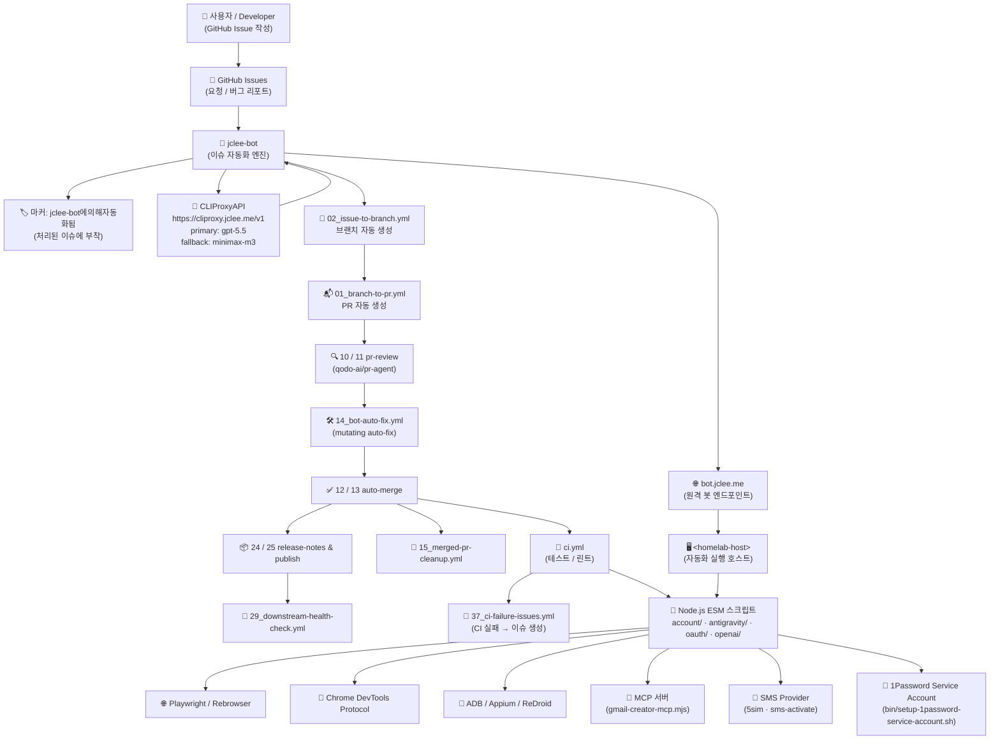

# 계정 자동화 워크스페이스 / Account Automation Workspace

[](../../actions/workflows/ci.yml)
[](../../actions/workflows/02_issue-to-branch.yml)
[](../../actions/workflows/01_branch-to-pr.yml)
[](../../actions/workflows/10_pr-review.yml)
[](../../actions/workflows/11_security-pr-review.yml)
[](../../actions/workflows/12_dependabot-auto-merge.yml)
[](../../actions/workflows/13_pr-auto-merge.yml)
[](../../actions/workflows/14_bot-auto-fix.yml)
[](../../actions/workflows/25_release-publish.yml)

> README 생성 모델 / README generation model: `gpt-5.5` · fallback: `minimax-m3` via `https://cliproxy.jclee.me/v1`

---

## 1. 개요 / Overview

이 저장소는 **Gmail 계정 생성, OAuth 인증 흐름, Antigravity IDE 인증/토큰 주입, OpenAI 계정 점검·생성 보조** 작업을 위한 Node.js ESM 기반 자동화 워크스페이스입니다. Playwright / Rebrowser, Chrome DevTools Protocol (CDP), ADB, Appium, MCP(Model Context Protocol) 서버, 그리고 모듈형 SMS provider 추상화(5sim, sms-activate 등)를 단일 저장소에서 결합합니다.

This repository is a **Node.js ESM** automation workspace for Gmail account creation, OAuth credential flows, Antigravity IDE authentication / token injection, and OpenAI account inspection / creation helper workflows. It unifies **Playwright / Rebrowser**, the **Chrome DevTools Protocol (CDP)**, **ADB**, **Appium**, an **MCP (Model Context Protocol) server**, and a modular **SMS provider abstraction** (5sim, sms-activate, …) into a single, script-first workspace.

자동화 스택은 사람이 수행하던 가입·검증 흐름을 재현할 수 있도록 설계되어 있으나, **반드시 본인이 소유하거나 운영 권한이 있는 계정·테스트 환경에서만** 사용해야 합니다. 각 서비스의 이용약관(TOS)과 applicable laws(예: 컴퓨터 사기·남용 금지법, 통신 비밀 보호법 등)를 준수할 책임은 사용자에게 있습니다.

The automations in this workspace are designed to reproduce account-creation and verification flows that a human would otherwise perform. They **must only be used against accounts and test environments that you own or are explicitly authorized to operate**. You are solely responsible for compliance with each service's Terms of Service and with all applicable laws (e.g. anti–computer-fraud, telecommunications secrecy, privacy, and consumer-protection statutes).

---

## 2. 주요 기능 / Features

### 2.1 계정 자동화 / Account Automation
- **Gmail 계정 생성**: WebDriver, CDP, ADB, Appium, MCP 다중 경로 지원 (`account/create-accounts*.mjs`).
- **가족 그룹 초대 흐름**: `account/family-group.mjs` 가 `accounts.csv` → `family-results.csv` 라운드트립 수행.
- **연령 인증 파이프라인**: 3-stage `lib/verification-pipeline.mjs` + `account/verify-age.mjs`.
- **웜업 / 검증 일괄 처리**: `account/verify-all-accounts.mjs`, `account/warmup-account.mjs`.

### 2.2 Antigravity IDE
- OAuth 인증 + SMS 인증 파이프라인 (`antigravity/antigravity-auth.mjs`, `antigravity/antigravity-pipeline.mjs`).
- VSCDB protobuf 토큰 주입 (`antigravity/inject-vscdb-token.mjs`).
- 5sim SMS 기반 feature unlock (`antigravity/unlock-features.mjs`).

### 2.3 OAuth & OpenAI 헬퍼 / OAuth & OpenAI Helpers
- GCP OAuth 자격증명 설정: `oauth/setup-gcp-oauth.mjs`, `oauth/oauth-login.mjs`.
- 로컬 콜백 서버(`lib/oauth-callback-server.mjs`)와 code→token 교환(`lib/token-exchange.mjs`).
- OpenAI 계정 점검·생성 보조: `openai/check-accounts.mjs`, `openai/create-accounts.mjs`, `openai/openai-creator-mcp.mjs`.

### 2.4 MCP 서버 / MCP Server
- `account/gmail-creator-mcp.mjs` 가 4개 tool 노출: `create_accounts`, `get_creation_job`, `list_accounts`, `get_account_status`.
- mcphub 기반 tool 호출 워크플로우 지원, 29-assertion 스모크 테스트(`tests/gmail-creator-mcp-smoke.mjs`) 동봉.

### 2.5 공유 라이브러리 / Shared Library
- 브라우저 런처(`lib/browser-launch.mjs`), CDP 유틸(`lib/cdp-utils.mjs`), ADB 래퍼(`lib/adb-utils.mjs`).
- 행동 시뮬레이션(`lib/behavior-profile.mjs`), 프록시 릴레이(`lib/proxy-relay.mjs`, `lib/proxy-forwarder.mjs`).
- 모듈형 SMS 프로바이더(`lib/sms-provider.mjs`).

---

## 3. 아키텍처 / Architecture

다음 다이어그램은 이슈 → 자동화 → 스크립트 → 외부 인프라 흐름을 요약합니다. 모든 인프라 호스트는 보안과 프라이버시를 위해 자리표시자(`<homelab-host>`)로 표현합니다.

The diagram below summarizes the issue → automation → scripts → external-infrastructure flow. All internal hosts are represented by placeholders (`<homelab-host>`) for security and privacy.



---

## 4. jclee-bot 자동화 영역 / jclee-bot Automation Surfaces

`jclee-bot` 은 이 저장소에서 **변경(mutating)을 일으키는 모든 자동화 행위의 단일 책임 주체**입니다. GitHub Actions 워크플로우 파일(`.github/workflows/*.yml`)은 이러한 자동화를 *트리거*하는 구현 디테일이며, 진실의 원천(source of truth)은 jclee-bot 본체의 동작 사양입니다. 이슈에 자동 부착되는 마커는 **`jclee-bot에의해자동화됨`** 입니다.

`jclee-bot` is the **single accountable owner of every mutating automation** in this repository. The GitHub Actions workflow files (`.github/workflows/*.yml`) are *implementation triggers* for that automation; the source of truth is jclee-bot's behavioral specification. The marker auto-applied to processed issues is **`jclee-bot에의해자동화됨`**.

### 4.1 jclee-bot 이 소유한 변형 작업 / Mutating Surfaces Owned by jclee-bot
- **이슈 → 브랜치 자동 생성**: 새 이슈에 라벨이 부착되면 작업 브랜치를 만들고 작업 진행 상황을 추적합니다.
- **브랜치 → PR 자동 생성**: 작업 완료 시 자동으로 PR 을 열고, 작업 요약을 코멘트로 게시합니다.
- **자동 자기 수정 (auto-fix)**: 린트·테스트 실패 또는 명시적 명령에 대해 jclee-bot 이 직접 commit 을 작성합니다.
- **자동 머지**: Dependabot PR 및 봇 PR 에 대해 사전 정의된 조건(라벨, 체크 상태) 충족 시 자동 머지합니다.
- **머지 후 정리**: 원격 브랜치 삭제, 임시 라벨 제거, 관련 이슈 자동 닫기.
- **릴리스 노트 / 퍼블리시**: 변경 로그 집계 및 릴리스 자산 게시.
- **CI 실패 → 이슈 생성**: CI 실패가 감지되면 자동 분석과 함께 실패 이슈를 등록합니다.
- **다운스트림 헬스 체크**: 릴리스 후 의존 저장소·봇 호스트(`bot.jclee.me`)의 헬스를 점검합니다.

### 4.2 jclee-bot 의 운영 가드레일 / Operational Guardrails
- 모든 mutating 액션은 PR / commit / issue 레코드를 GitHub 에 남깁니다 (auditability).
- 자동 머지는 명시적인 라벨 + CI 그린 상태가 *동시에* 충족될 때만 수행됩니다.
- 자동 자기 수정은 사람이 리뷰 가능한 별도 PR 로 제출되며, 보호 브랜치 규칙을 우회하지 않습니다.
- 보안 관련 PR 은 `11_security-pr-review.yml` 단계를 별도로 거칩니다.

### 4.3 이슈 자동화 마커 / Issue Automation Marker
- jclee-bot 이 분석·처리한 이슈에는 **`jclee-bot에의해자동화됨`** 마커가 부착됩니다.
- 외부 기여자는 이 마커가 있는 이슈에서 자동화 동작(라벨 이동, 자동 코멘트, 봇 코멘트 추가 등)이 일어날 수 있음을 인지해야 합니다.
- 자동화를 원하지 않을 경우 이슈에 `no-bot` 라벨을 추가하면 jclee-bot 은 관여하지 않습니다.

---

## 5. Go 도구 / Go Tools

이 저장소는 현재 **Go 기반 자동화 도구를 포함하지 않습니다** (`0` 개). 모든 자동화 로직은 Node.js ESM 스크립트와 GitHub Actions 워크플로우(트리거)로 구성되어 있습니다. 향후 Go 도구가 추가될 경우 이 섹션이 갱신됩니다.

This repository currently ships **no Go-based automation tools** (`0` total). All automation logic is implemented as Node.js ESM scripts and triggered by GitHub Actions workflows. This section will be updated as Go tools are added.

---

## 6. 빠른 시작 / Quick Start

### 6.1 사전 준비 / Prerequisites
- Node.js ≥ 20 (ESM, top-level await 지원 필요)
- npm ≥ 10 (또는 호환되는 패키지 매니저)
- Linux / macOS 권장. Windows는 WSL2 사용을 권장합니다.
- 브라우저 자동화용 디바이스: ReDroid 컨테이너, ADB 연결된 Android 기기 또는 Docker 기반 Appium 디바이스.
- 5sim 또는 동등한 SMS provider API 키.

### 6.2 설치 / Install
```bash
git clone <this-repo>
cd <this-repo>
npm ci
cp .env.example .env   # 존재하지 않으면 docs/QUICKSTART.md 참조
```

### 6.3 자격증명 설정 / Credential Setup
```bash
# 1Password 서비스 계정(권장)
./bin/setup-1password-service-account.sh

# GCP OAuth 클라이언트 자격증명
node oauth/setup-gcp-oauth.mjs

# 일반 자격증명 (1Password 또는 .env 경유)
./bin/setup-credentials.sh

# Frida (선택, deep-hook 기반 분석 시)
./bin/setup_frida.sh
```

### 6.4 첫 실행 / First Run
```bash
# Gmail 계정 생성 (드라이런)
node account/create-accounts.mjs --dry-run

# OAuth 로그인 (헤드풀)
node oauth/oauth-login.mjs --headed

# MCP 서버 기동
node account/gmail-creator-mcp.mjs
```

자세한 단계별 가이드는 [`docs/QUICKSTART.md`](docs/QUICKSTART.md) 및 [`docs/adb-gmail-creation.md`](docs/adb-gmail-creation.md) 를 참고하세요.

For step-by-step instructions, see [`docs/QUICKSTART.md`](docs/QUICKSTART.md) and [`docs/adb-gmail-creation.md`](docs/adb-gmail-creation.md).

---

## 7. 로컬 개발 / Local Development

### 7.1 환경 변수 / Environment Variables
| 변수 | 용도 |
|---|---|
| `FIVESIM_API_KEY` | 5sim SMS provider API 키 |
| `GCP_OAUTH_CLIENT_ID` / `GCP_OAUTH_CLIENT_SECRET` | GCP OAuth 자격증명 |
| `OP_SERVICE_ACCOUNT_TOKEN` | 1Password 서비스 계정 토큰 |
| `PROXY_URL` | (선택) 외부 프록시 릴레이 |
| `MCPHUB_URL` | (선택) MCP 허브 엔드포인트 |

### 7.2 테스트 / Testing
```bash
# MCP 스모크 테스트 (29 assertions)
node tests/gmail-creator-mcp-smoke.mjs

# 수동 QA (6 테스트)
node tests/qa-manual.mjs
```

### 7.3 디버깅 / Debugging
- CDP 트래픽 캡처: `lib/cdp-utils.mjs` 의 디버그 모드 사용.
- SMS 캡처 검증: `account/debug-sms-capture.mjs`.
- 인프라 진단: `account/infrastructure-diagnostic.mjs`.
- tmp/ 디렉터리는 단기 디버깅 산출물을 보관합니다 (`tmp/debug-selects.mjs`, `tmp/sms-fast-v2.mjs` 등). 영구 산출물은 `data/` 로 이동하세요.

### 7.4 린트 & 컨벤션 / Lint & Conventions
- 모든 스크립트는 ESM (`.mjs`) 만 사용. `require()` 금지.
- 비동기 I/O는 `node:fs/promises`, `node:child_process` 의 promise API 사용.
- 환경 의존성은 `lib/cli-args.mjs` 의 CLI 인자 파서로 일관되게 주입.

---

## 8. 명령어 레퍼런스 / Commands Reference

### 8.1 계정 / Account
| 명령 | 설명 |
|---|---|
| `node account/create-accounts.mjs [--dry-run] [--headed] [--count N]` | 기본 Gmail 계정 생성 흐름 |
| `node account/create-accounts-cdp.mjs` | CDP 모드 (ReDroid WebView) |
| `node account/create-accounts-adb.mjs` | ADB + Android Chrome |
| `node account/create-accounts-appium.mjs` | Appium + Docker Android |
| `node account/family-group.mjs` | 가족 그룹 초대/수락 |
| `node account/verify-age.mjs` | 5sim SMS 연령 인증 |
| `node account/verify-all-accounts.mjs` | 모든 계정 일괄 검증 |
| `node account/warmup-account.mjs` | 계정 웜업 |
| `node account/gmail-creator-mcp.mjs` | MCP 서버 기동 (4 tools) |

### 8.2 Antigravity
| 명령 | 설명 |
|---|---|
| `node antigravity/antigravity-auth.mjs` | Antigravity OAuth + SMS 파이프라인 |
| `node antigravity/antigravity-pipeline.mjs` | 종단간 계정 활성화 오케스트레이터 |
| `node antigravity/inject-vscdb-token.mjs` | VSCDB protobuf 토큰 주입 |
| `node antigravity/unlock-features.mjs` | 5sim SMS feature unlock |
| `node antigravity/manual-token-acquire.mjs` | 수동 보조 OAuth 토큰 획득 |

### 8.3 OAuth / OpenAI
| 명령 | 설명 |
|---|---|
| `node oauth/oauth-login.mjs [--headed]` | OAuth 동의/로그인 헬퍼 |
| `node oauth/setup-gcp-oauth.mjs` | GCP OAuth 자격증명 자동 설정 |
| `node openai/check-accounts.mjs` | OpenAI 계정 점검 |
| `node openai/create-accounts.mjs` | OpenAI 계정 생성 보조 |
| `node openai/openai-creator-mcp.mjs` | OpenAI 측 MCP 서버 |

### 8.4 셸 도구 / Shell Tools
| 명령 | 설명 |
|---|---|
| `./bin/create-gmail.sh` | Gmail 생성 래퍼 |
| `./bin/setup-credentials.sh` | 일반 자격증명 부트스트랩 |
| `./bin/setup-1password-service-account.sh` | 1Password 서비스 계정 부트스트랩 |
| `./bin/setup_frida.sh` | Frida 환경 설치 |
| `./bin/xdg-open` | OAuth 콜백 캡처용 URL 인터셉터 |

> 모든 `.mjs` 스크립트는 `--help` 옵션을 지원합니다. 사용법은 `node <script>.mjs --help` 로 확인하세요.

> All `.mjs` scripts support `--help`. Run `node <script>.mjs --help` for usage.

---

## 9. 저장소 구조 / Repository Structure

```text
.
├── AGENTS.md                       # 프로젝트 지식 베이스 (에이전트용)
├── CONTRIBUTING.md                 # 기여 가이드
├── LICENSE                         # 라이선스
├── README.md                       # 본 문서
├── package.json                    # 루트 의존성 (Playwright, MCP SDK 등)
├── package-lock.json
├── complete.csv                    # 생성된 계정 종합 결과
├── openai-accounts.csv             # OpenAI 계정 작업 결과
│
├── bin/                            # 셸 부트스트랩
│   ├── create-gmail.sh
│   ├── setup-1password-service-account.sh
│   ├── setup-credentials.sh
│   ├── setup_frida.sh
│   └── xdg-open                    # OAuth 콜백 캡처 인터셉터
│
├── oauth/                          # OAuth 자격증명 흐름
│   ├── oauth-login.mjs
│   └── setup-gcp-oauth.mjs
│
├── account/                        # Gmail 계정 자동화
│   ├── cdp-login-test.mjs
│   ├── check-account-exists.mjs
│   ├── create-accounts.mjs
│   ├── create-accounts-adb.mjs
│   ├── create-accounts-appium.mjs
│   ├── create-accounts-cdp.mjs
│   ├── debug-sms-capture.mjs
│   ├── diagnostic-login.mjs
│   ├── direct-login-test.mjs
│   ├── family-group.mjs
│   ├── frida-sms-hook.js
│   ├── gmail-creator-mcp.mjs       # MCP 서버
│   ├── infrastructure-diagnostic.mjs
│   ├── process-batch-verification.mjs
│   ├── puppeteer-gmail.mjs
│   ├── redroid-signup-cdp.mjs
│   ├── test-partner-oauth.mjs
│   ├── verify-account.mjs
│   ├── verify-age.mjs
│   ├── verify-all-accounts.mjs
│   ├── warmup-account.mjs
│   ├── youtube-signup.mjs
│   ├── youtube-signup-cdp.mjs
│   └── infrastructure/
│       └── setup-emulator.mjs
│
├── openai/                         # OpenAI 보조
│   ├── README.md
│   ├── check-accounts.mjs
│   ├── create-accounts.mjs
│   └── openai-creator-mcp.mjs
│
├── antigravity/                    # Antigravity IDE 인증/주입
│   ├── antigravity-auth.mjs
│   ├── antigravity-pipeline.mjs
│   ├── inject-vscdb-token.mjs
│   ├── manual-token-acquire.mjs
│   ├── unlock-features.mjs
│   ├── antigravity-auth-results.json
│   └── antigravity-auth.mjs
│
├── lib/                            # 공유 유틸
│   ├── adb-utils.mjs
│   ├── antigravity-shared.mjs
│   ├── behavior-profile.mjs
│   ├── browser-launch.mjs
│   ├── cdp-utils.mjs
│   ├── cli-args.mjs
│   ├── fingerprint-config.mjs
│   ├── free-proxy.mjs
│   ├── google-auth-browser.mjs
│   ├── oauth-callback-server.mjs
│   ├── proxy-config.mjs
│   ├── proxy-forwarder.mjs
│   ├── proxy-relay.mjs
│   ├── sms-provider.mjs
│   ├── token-exchange.mjs
│   └── verification-pipeline.mjs
│
├── data/                           # 영구 런타임 데이터
│   └── warmup-progress.json
│
├── tests/                          # 테스트
│   ├── gmail-creator-mcp-smoke.mjs
│   └── qa-manual.mjs
│
├── docs/                           # 문서
│   ├── ALTERNATIVE-SMS-PROVIDERS.md
│   ├── QUICKSTART.md
│   ├── adb-gmail-creation.md
│   └── verification-bypass-analysis.md
│
└── tmp/                            # 단기 디버깅 산출물
    ├── debug-selects.mjs
    ├── sms-fast-v2.mjs
    ├── sms-verify-fast.mjs
    ├── tmp-reauth.mjs
    └── ui.xml
```

---

## 10. 기여 가이드 / Contribution Guide

기여 절차는 [`CONTRIBUTING.md`](CONTRIBUTING.md) 를 따릅니다. 요약하면:

1. 이슈를 먼저 작성하고 jclee-bot 의 자동 분류를 기다립니다. 자동 분류된 이슈에는 `jclee-bot에의해자동화됨` 마커가 부착됩니다.
2. 작업 브랜치는 `02_issue-to-branch.yml` 트리거를 통해 자동 생성됩니다 (수동 생성도 허용).
3. PR 은 `01_branch-to-pr.yml` 트리거 또는 수동으로 열고, `10_pr-review.yml` · `11_security-pr-review.yml` (qodo-ai/pr-agent 기반) 의 리뷰를 거칩니다.
4. Dependabot / 봇 PR 은 `12_dependabot-auto-merge.yml`, 일반 봇 PR 은 `13_pr-auto-merge.yml` 조건 충족 시 자동 머지됩니다.
5. 머지 후 `15_merged-pr-cleanup.yml` 이 원격 브랜치 정리, `24_release-notes.yml` / `25_release-publish.yml` 이 릴리스 산출물을 게시합니다.
6. CI 실패는 `37_ci-failure-issues.yml` 이 자동 분석과 함께 새 이슈를 등록합니다.

Contributions follow [`CONTRIBUTING.md`](CONTRIBUTING.md). In short:

1. Open an issue first; jclee-bot auto-classifies it. Processed issues are tagged with `jclee-bot에의해자동화됨`.
2. Working branches are created via the `02_issue-to-branch.yml` trigger (manual branches are also accepted).
3. PRs are opened (auto via `01_branch-to-pr.yml` or manually) and reviewed by `10_pr-review.yml` / `11_security-pr-review.yml` (qodo-ai/pr-agent).
4. Dependabot / bot PRs auto-merge when conditions in `12_dependabot-auto-merge.yml` / `13_pr-auto-merge.yml` are satisfied.
5. After merge, `15_merged-pr-cleanup.yml` cleans up remote branches and `24_release-notes.yml` / `25_release-publish.yml` publish release artifacts.
6. CI failures are triaged into new issues by `37_ci-failure-issues.yml`.

### 10.1 코딩 규칙 / Coding Rules
- ESM only; 모든 스크립트는 `.mjs`.
- 외부 의존성 추가는 PR 본문에 근거 + 영향 분석 명시.
- 비밀값(API 키, OAuth 시크릿, 1Password 토큰)은 절대 커밋하지 않습니다 — `lib/` 의 `*Provider` 추상화나 1Password 서비스 계정을 사용하세요.
- 새 자동화 표면을 도입할 경우 `jclee-bot` 의 책임 영역에 해당하는지 메인tainer 와 합의합니다.

### 10.2 보안 / Security
- 보안 취약점은 공개 이슈로 등록하지 마세요. `11_security-pr-review.yml` 단계가 자동으로 감지합니다.
- 자격증명 누출 감지 시 `bin/setup-credentials.sh` 로 회전 절차를 따릅니다.

---

## 11. 외부 링크 / External Links

- PR 리뷰 에이전트: [qodo-ai/pr-agent](https://github.com/qodo-ai/pr-agent)
- LLM 게이트웨이: [https://cliproxy.jclee.me/v1](https://cliproxy.jclee.me/v1)
- 원격 자동화 호스트: [https://bot.jclee.me](https://bot.jclee.me)

---

## 12. 라이선스 / License

이 저장소는 [`LICENSE`](LICENSE) 파일에 명시된 조건 하에 배포됩니다. 자동화 스크립트의 사용으로 발생하는 모든 책임은 사용자에게 있습니다.

This repository is distributed under the terms described in [`LICENSE`](LICENSE). You bear all responsibility for any use of the automation scripts contained herein.