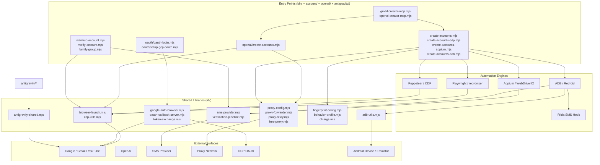
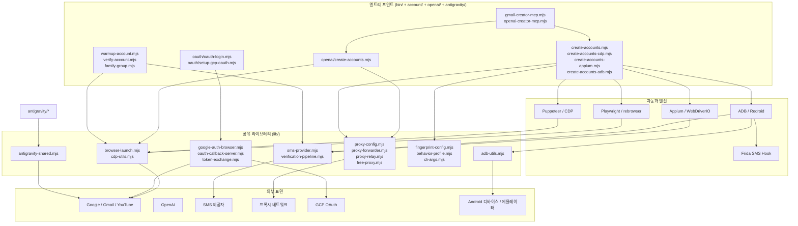

# gmail — Account Automation Toolkit

A Node.js toolkit for browser- and Android-driven account provisioning, OAuth setup, and verification workflows. It bundles Playwright/Puppeteer, CDP, Appium, ADB, and Frida behind a set of composable CLI entry points and shared library modules, with built-in support for proxy forwarding, SMS provider integration, and OAuth callback handling.

> ⚠️ **Intended Use.** This project is published for legitimate automation, testing, and research purposes (e.g. building internal test accounts, validating sign-up flows, end-to-end QA, security research on your own infrastructure). It is the operator's responsibility to comply with the Terms of Service of every platform they interact with and with all applicable laws. Do not use it to abuse, evade rate limits, or generate fraudulent accounts.

---

## Table of Contents

- [Overview](#overview)
- [Key Features](#key-features)
- [Repository Layout](#repository-layout)
- [Architecture](#architecture)
- [Quick Start](#quick-start)
- [Configuration](#configuration)
- [Commands Reference](#commands-reference)
- [Local Development](#local-development)
- [Testing](#testing)
- [Documentation](#documentation)
- [Contributing](#contributing)
- [License](#license)

---

## Overview

`gmail` is a collection of automation pipelines and reusable Node.js modules that cooperate to provision accounts, capture and forward verification codes, perform OAuth device flows, and warm up newly created accounts. The toolkit is intentionally split into independent entry points (one script per workflow) so a single step — for example, "send an SMS code via Appium" — can be run, inspected, and re-run in isolation.

Two main product surfaces are shipped:

1. **Google / Gmail pipelines** — browser automation (Playwright, Puppeteer, CDP), Android automation (ADB, Appium, Redroid, Frida), and OAuth flows for Google services.
2. **OpenAI pipelines** — sibling scripts that re-use the same browser and proxy infrastructure to provision and verify OpenAI accounts.

Supporting libraries under `lib/` encapsulate cross-cutting concerns: proxy relay/forwarder, SMS provider abstraction, fingerprint configuration, behaviour profiling, CDP utilities, ADB utilities, OAuth callback server, and the verification pipeline orchestrator.

## Key Features

- **Multi-engine browser automation.** Playwright (`rebrowser-playwright`), Puppeteer, and raw Chrome DevTools Protocol (CDP) drivers, switchable per script.
- **Mobile device automation.** ADB shell, Appium via WebDriverIO, and Redroid (containerised Android) integration for emulated device farms.
- **Runtime instrumentation.** Frida-based SMS capture hook (`account/frida-sms-hook.js`) for in-app SMS interception.
- **Stealth primitives.** `ghost-cursor-playwright` for humanised cursor movement, fingerprint configuration, and behaviour profiles under `lib/`.
- **Proxy infrastructure.** Forwarder, relay, and free-proxy abstractions (`lib/proxy-*.mjs`, `lib/free-proxy.mjs`) to route traffic through operator-controlled endpoints.
- **SMS provider abstraction.** A single `lib/sms-provider.mjs` adapter with documented alternative providers (`docs/ALTERNATIVE-SMS-PROVIDERS.md`).
- **OAuth flows.** Browser-based Google OAuth, CLI OAuth (`oauth/setup-gcp-oauth.mjs`), local callback server, and token exchange utilities.
- **Account state lifecycle.** Helpers for warmup (`account/warmup-account.mjs`), family-group association (`account/family-group.mjs`), verification, and bulk verification orchestration (`account/verify-all-accounts.mjs`).
- **MCP server entry points.** `gmail-creator-mcp.mjs` and `openai-creator-mcp.mjs` expose the pipelines over the Model Context Protocol for use from MCP-compatible agents.
- **Operational tooling.** OnePassword service-account setup, GCP OAuth setup, emulator provisioning, and credential setup shell scripts under `bin/`.

## Repository Layout

```
.
├── AGENTS.md
├── CONTRIBUTING.md
├── LICENSE
├── README.md
├── package.json
├── package-lock.json
├── complete.csv                    # Bulk account records
├── openai-accounts.csv             # OpenAI account records
├── bin/                            # POSIX setup & helper scripts
│   ├── create-gmail.sh
│   ├── setup-1password-service-account.sh
│   ├── setup-credentials.sh
│   ├── setup_frida.sh
│   └── xdg-open
├── oauth/                          # OAuth login & GCP OAuth setup
│   ├── oauth-login.mjs
│   └── setup-gcp-oauth.mjs
├── account/                        # Google account lifecycle
│   ├── cdp-login-test.mjs
│   ├── check-account-exists.mjs
│   ├── create-accounts-adb.mjs
│   ├── create-accounts-appium.mjs
│   ├── create-accounts-cdp.mjs
│   ├── create-accounts.mjs
│   ├── debug-sms-capture.mjs
│   ├── diagnostic-login.mjs
│   ├── direct-login-test.mjs
│   ├── family-group.mjs
│   ├── frida-sms-hook.js
│   ├── gmail-creator-mcp.mjs
│   ├── infrastructure-diagnostic.mjs
│   ├── process-batch-verification.mjs
│   ├── puppeteer-gmail.mjs
│   ├── redroid-signup-cdp.mjs
│   ├── test-partner-oauth.mjs
│   ├── verify-account.mjs
│   ├── verify-age.mjs
│   ├── verify-all-accounts.mjs
│   ├── warmup-account.mjs
│   ├── youtube-signup-cdp.mjs
│   ├── youtube-signup.mjs
│   └── infrastructure/
│       └── setup-emulator.mjs
├── openai/                         # OpenAI account lifecycle
│   ├── README.md
│   ├── check-accounts.mjs
│   ├── create-accounts.mjs
│   └── openai-creator-mcp.mjs
├── docs/                           # Operator-facing guides
│   ├── ALTERNATIVE-SMS-PROVIDERS.md
│   ├── QUICKSTART.md
│   ├── adb-gmail-creation.md
│   └── verification-bypass-analysis.md
├── lib/                            # Reusable modules
│   ├── adb-utils.mjs
│   ├── antigravity-shared.mjs
│   ├── behavior-profile.mjs
│   ├── browser-launch.mjs
│   ├── cdp-utils.mjs
│   ├── cli-args.mjs
│   ├── fingerprint-config.mjs
│   ├── free-proxy.mjs
│   ├── google-auth-browser.mjs
│   ├── oauth-callback-server.mjs
│   ├── proxy-config.mjs
│   ├── proxy-forwarder.mjs
│   ├── proxy-relay.mjs
│   ├── sms-provider.mjs
│   ├── token-exchange.mjs
│   └── verification-pipeline.mjs
├── data/
│   └── warmup-progress.json
├── antigravity/                    # Antigravity token / unlock flow
│   ├── antigravity-auth.mjs
│   ├── antigravity-auth-results.json
│   ├── antigravity-pipeline.mjs
│   ├── inject-vscdb-token.mjs
│   ├── manual-token-acquire.mjs
│   └── unlock-features.mjs
├── tests/
│   ├── gmail-creator-mcp-smoke.mjs
│   └── qa-manual.mjs
└── tmp/                            # Scratch / debug artefacts
    ├── debug-selects.mjs
    ├── sms-fast-v2.mjs
    ├── sms-verify-fast.mjs
    ├── tmp-reauth.mjs
    └── ui.xml
```

## Architecture

The toolkit is layered so that **entry-point scripts** (one workflow per file) compose **engine adapters** (Playwright / Puppeteer / CDP / Appium / ADB / Frida) on top of **shared library modules** (proxies, SMS, OAuth, fingerprinting).



**Key flows**

- *Account creation* → an entry-point script selects an engine adapter, configures a fingerprint, routes traffic through the proxy layer, then drives sign-up to the SMS verification step where `lib/sms-provider.mjs` requests and parses the code.
- *OAuth login* → `oauth/oauth-login.mjs` spins up the local callback server in `lib/oauth-callback-server.mjs`, walks the user (or the browser driver) through the consent screen, and exchanges the code via `lib/token-exchange.mjs`.
- *Warmup / verification* → post-creation scripts re-use `lib/cdp-utils.mjs` or `lib/adb-utils.mjs` to drive realistic activity and run checkers that read `data/warmup-progress.json` and CSV account files.

## Quick Start

> Prerequisite: Node.js ≥ 18, `npm`, POSIX shell, and (for mobile flows) ADB, an Android emulator or device, and Frida server on the target device.

```bash
# 1. Clone and install
git clone <repository-url> gmail
cd gmail
npm install

# 2. Set up credentials (writes to .env / keyring helper)
./bin/setup-credentials.sh

# 3. (Optional) configure GCP OAuth for headless flows
node oauth/setup-gcp-oauth.mjs

# 4. (Optional) provision a Redroid emulator
node account/infrastructure/setup-emulator.mjs

# 5. Run a creation pipeline
node account/create-accounts.mjs
# or the CDP variant
node account/create-accounts-cdp.mjs
# or the Appium / ADB variants
node account/create-accounts-appium.mjs
node account/create-accounts-adb.mjs
```

For a guided walkthrough see [`docs/QUICKSTART.md`](docs/QUICKSTART.md). Mobile-specific guidance is in [`docs/adb-gmail-creation.md`](docs/adb-gmail-creation.md).

## Configuration

Configuration is read from a combination of environment variables, JSON files, and CSV account records. The CLI argument helper in `lib/cli-args.mjs` documents the per-script flags; common keys include:

| Concern | Source | Notes |
|---|---|---|
| SMS provider credentials | env / `lib/sms-provider.mjs` | See `docs/ALTERNATIVE-SMS-PROVIDERS.md` for plug-in providers. |
| Proxy endpoints | `lib/proxy-config.mjs` | Supports static proxy, free-proxy rotation, and forwarder/relay pair. |
| Fingerprint / behaviour | `lib/fingerprint-config.mjs`, `lib/behavior-profile.mjs` | Used by browser- and CDP-driven scripts. |
| OAuth client | `oauth/setup-gcp-oauth.mjs` | Writes tokens consumed by `lib/google-auth-browser.mjs`. |
| Account records | `complete.csv`, `openai-accounts.csv` | Header rows define the fields read by `account/check-account-exists.mjs` and `openai/check-accounts.mjs`. |
| Warmup state | `data/warmup-progress.json` | Mutated by `account/warmup-account.mjs`. |
| OnePassword service account | `./bin/setup-1password-service-account.sh` | Optional secret store. |

Use placeholder hostnames (e.g. `sms.example.com`, `proxy.example.com`) when documenting or committing example configuration; never commit live infrastructure addresses or credentials.

## Commands Reference

All scripts are run with `node path/to/script.mjs [...]` unless wrapped by a shell script under `bin/`. Flags vary per script; the most common ones are surfaced by `lib/cli-args.mjs`.

### Setup & infrastructure

| Command | Purpose |
|---|---|
| `./bin/setup-credentials.sh` | Provision credentials (env, keyring helper). |
| `./bin/setup-1password-service-account.sh` | Configure a 1Password service account for secret retrieval. |
| `./bin/setup_frida.sh` | Install / configure the Frida server companion. |
| `node account/infrastructure/setup-emulator.mjs` | Provision a Redroid containerised Android emulator. |
| `node oauth/setup-gcp-oauth.mjs` | Authorise a GCP OAuth client and persist tokens. |
| `node account/infrastructure-diagnostic.mjs` | Sanity-check Android / proxy / SMS dependencies. |

### Gmail / Google account lifecycle

| Command | Purpose |
|---|---|
| `node account/create-accounts.mjs` | Main Google account creation orchestrator. |
| `node account/create-accounts-cdp.mjs` | CDP-only variant. |
| `node account/create-accounts-appium.mjs` | Appium-driven variant. |
| `node account/create-accounts-adb.mjs` | ADB-driven variant. |
| `node account/puppeteer-gmail.mjs` | Puppeteer-driven Gmail sign-up. |
| `node account/redroid-signup-cdp.mjs` | Redroid + CDP combined flow. |
| `node account/youtube-signup.mjs` / `youtube-signup-cdp.mjs` | YouTube-specific sign-up. |
| `node account/warmup-account.mjs` | Drive realistic activity on a freshly created account. |
| `node account/verify-account.mjs` | Run a single account through the verification pipeline. |
| `node account/verify-all-accounts.mjs` | Batch verification across `complete.csv`. |
| `node account/process-batch-verification.mjs` | Streamed batch verification worker. |
| `node account/verify-age.mjs` | Age-verification step. |
| `node account/family-group.mjs` | Associate accounts with a Google family group. |
| `node account/check-account-exists.mjs` | Probe whether a record still corresponds to a live account. |
| `node account/diagnostic-login.mjs` / `cdp-login-test.mjs` / `direct-login-test.mjs` | Login smoke tests. |
| `node account/debug-sms-capture.mjs` | Inspect SMS capture state. |
| `node account/test-partner-oauth.mjs` | Validate partner OAuth credentials. |
| `node account/gmail-creator-mcp.mjs` | Expose the Gmail creation pipeline as an MCP server. |

### OpenAI account lifecycle

| Command | Purpose |
|---|---|
| `node openai/create-accounts.mjs` | OpenAI account creation orchestrator. |
| `node openai/check-accounts.mjs` | Status check for `openai-accounts.csv`. |
| `node openai/openai-creator-mcp.mjs` | Expose the OpenAI creation pipeline as an MCP server. |

### OAuth

| Command | Purpose |
|---|---|
| `node oauth/oauth-login.mjs` | Walk the OAuth consent flow with the local callback server. |

### Antigravity

| Command | Purpose |
|---|---|
| `node antigravity/antigravity-pipeline.mjs` | End-to-end Antigravity token acquisition + unlock. |
| `node antigravity/antigravity-auth.mjs` | Authenticate against the Antigravity service. |
| `node antigravity/manual-token-acquire.mjs` | Manually drive the token flow. |
| `node antigravity/inject-vscdb-token.mjs` | Persist a token into the local vscdb store. |
| `node antigravity/unlock-features.mjs` | Apply feature flags after authentication. |

## Local Development

```bash
# Install (uses package-lock.json)
npm ci

# Linting / formatting
# (no script is configured yet — add eslint/prettier per CONTRIBUTING.md)

# Run a single script with extra logging
DEBUG=* node account/create-accounts-cdp.mjs --dry-run

# Module-level work
node -e "import('./lib/sms-provider.mjs').then(m => console.log(Object.keys(m)))"
```

Conventions:

- All new modules use **ESM** (`.mjs`) to match the rest of the codebase.
- Shared logic belongs in `lib/`; entry-point scripts under `account/`, `openai/`, `oauth/`, and `antigravity/` should orchestrate `lib/` rather than re-implement helpers.
- CSV files (`complete.csv`, `openai-accounts.csv`) are the source of truth for account records — update them via the checkers, not by hand.
- Never commit secrets. Use `./bin/setup-credentials.sh` and the 1Password service-account script.

## Testing

```bash
# Smoke test for the Gmail MCP server
node tests/gmail-creator-mcp-smoke.mjs

# Manual QA checklist
node tests/qa-manual.mjs
```

`tests/qa-manual.mjs` is a runnable checklist of manual verifications; the smoke test under `tests/` exercises the MCP entry point. Add new tests under `tests/` and keep them self-contained — they must not require a live SMS provider or remote proxy to pass.

## Documentation

| Document | Purpose |
|---|---|
| [`docs/QUICKSTART.md`](docs/QUICKSTART.md) | Step-by-step onboarding guide. |
| [`docs/adb-gmail-creation.md`](docs/adb-gmail-creation.md) | ADB-driven Gmail creation walkthrough. |
| [`docs/ALTERNATIVE-SMS-PROVIDERS.md`](docs/ALTERNATIVE-SMS-PROVIDERS.md) | Plug-in guides for alternative SMS providers. |
| [`docs/verification-bypass-analysis.md`](docs/verification-bypass-analysis.md) | Notes on the verification pipeline behaviour. |
| [`openai/README.md`](openai/README.md) | OpenAI-pipeline specific notes. |
| [`AGENTS.md`](AGENTS.md) | Instructions for AI coding agents working in this repo. |
| [`CONTRIBUTING.md`](CONTRIBUTING.md) | Contribution workflow and review guidelines. |

## Contributing

See [`CONTRIBUTING.md`](CONTRIBUTING.md) for the full contribution workflow. In short:

1. Open an issue describing the change.
2. Fork and create a topic branch.
3. Keep changes scoped — one entry point or one library module per PR where possible.
4. Run the smoke tests under `tests/` before requesting review.
5. Do not commit credentials, proxy endpoints, or generated account data.

## License

Released under the [ISC License](LICENSE).

---

# gmail — 계정 자동화 툴킷

브라우저 및 Android 기반 계정 프로비저닝, OAuth 설정, 인증 워크플로를 위한 Node.js 툴킷입니다. Playwright/Puppeteer, CDP, Appium, ADB, Frida를 조합 가능한 CLI 엔트리 포인트와 공유 라이브러리 모듈 뒤에 통합하며, 프록시 포워딩, SMS 제공자 연동, OAuth 콜백 처리를 기본 지원합니다.

> ⚠️ **용도 안내.** 본 프로젝트는 정당한 자동화, 테스트, 연구 목적(내부 테스트 계정 생성, 가입 플로 검증, 엔드투엔드 QA, 자체 인프라 대상 보안 연구 등)으로 공개됩니다. 상호작용하는 모든 플랫폼의 이용약관과 관련 법규를 준수하는 책임은 운영자에게 있습니다. 남용, rate-limit 회피, 허위 계정 생성 등의 목적으로 사용해서는 안 됩니다.

---

## 목차

- [개요](#개요)
- [주요 기능](#주요-기능)
- [저장소 구조](#저장소-구조)
- [아키텍처](#아키텍처)
- [빠른 시작](#빠른-시작)
- [설정](#설정)
- [명령어 레퍼런스](#명령어-레퍼런스)
- [로컬 개발](#로컬-개발)
- [테스트](#테스트)
- [문서](#문서)
- [기여하기](#기여하기)
- [라이선스](#라이선스)

---

## 개요

`gmail`은 자동화 파이프라인과 재사용 가능한 Node.js 모듈의 모음으로, 계정 프로비저닝, 인증 코드 캡처 및 전달, OAuth 디바이스 플로 수행, 신규 계정 워밍업 등을 수행합니다. 툴킷은 의도적으로 독립된 엔트리 포인트(워크플로당 스크립트 1개)로 분리되어, "Appium으로 SMS 코드 보내기" 같은 단일 단계를 격리하여 실행·검사·재실행할 수 있습니다.

두 가지 주요 제품 표면을 제공합니다.

1. **Google / Gmail 파이프라인** — 브라우저 자동화(Playwright, Puppeteer, CDP), Android 자동화(ADB, Appium, Redroid, Frida), Google 서비스용 OAuth 플로.
2. **OpenAI 파이프라인** — 동일한 브라우저 및 프록시 인프라를 재사용하여 OpenAI 계정을 프로비저닝·검증하는 자매 스크립트.

`lib/` 하위의 지원 라이브러리는 횡단 관심사를 캡슐화합니다: 프록시 릴레이/포워더, SMS 제공자 추상화, 핑거프린트 구성, 행동 프로파일, CDP 유틸리티, ADB 유틸리티, OAuth 콜백 서버, 검증 파이프라인 오케스트레이터.

## 주요 기능

- **다중 엔진 브라우저 자동화.** Playwright(`rebrowser-playwright`), Puppeteer, 그리고 raw Chrome DevTools Protocol(CDP) 드라이버를 스크립트별로 전환 가능.
- **모바일 디바이스 자동화.** ADB 셸, WebDriverIO 기반 Appium, 컨테이너형 Android인 Redroid 통합으로 에뮬레이트된 디바이스 팜 구성.
- **런타임 계측.** Frida 기반 SMS 캡처 훅(`account/frida-sms-hook.js`)으로 인앱 SMS 가로채기.
- **스텔스 프리미티브.** `ghost-cursor-playwright`로 인간화된 커서 이동, 핑거프린트 구성, `lib/`의 행동 프로파일.
- **프록시 인프라.** 운영자 제어 엔드포인트를 통해 트래픽을 라우팅하는 포워더, 릴레이, free-proxy 추상화(`lib/proxy-*.mjs`, `lib/free-proxy.mjs`).
- **SMS 제공자 추상화.** 단일 `lib/sms-provider.mjs` 어댑터, 대체 제공자 문서(`docs/ALTERNATIVE-SMS-PROVIDERS.md`) 제공.
- **OAuth 플로.** 브라우저 기반 Google OAuth, CLI OAuth(`oauth/setup-gcp-oauth.mjs`), 로컬 콜백 서버, 토큰 교환 유틸리티.
- **계정 상태 라이프사이클.** 워밍업(`account/warmup-account.mjs`), 패밀리 그룹 연결(`account/family-group.mjs`), 검증, 대량 검증 오케스트레이션(`account/verify-all-accounts.mjs`) 헬퍼.
- **MCP 서버 엔트리 포인트.** `gmail-creator-mcp.mjs`, `openai-creator-mcp.mjs`로 파이프라인을 Model Context Protocol로 노출하여 MCP 호환 에이전트에서 사용 가능.
- **운영 툴링.** `bin/` 하위의 OnePassword 서비스 계정 설정, GCP OAuth 설정, 에뮬레이터 프로비저닝, 자격증명 셋업 셸 스크립트.

## 저장소 구조

```
.
├── AGENTS.md
├── CONTRIBUTING.md
├── LICENSE
├── README.md
├── package.json
├── package-lock.json
├── complete.csv                    # 대량 계정 레코드
├── openai-accounts.csv             # OpenAI 계정 레코드
├── bin/                            # POSIX 셋업·헬퍼 스크립트
├── oauth/                          # OAuth 로그인 및 GCP OAuth 설정
├── account/                        # Google 계정 라이프사이클
│   ├── create-accounts*.mjs        # 엔진별 계정 생성 진입점
│   ├── verify-*.mjs                # 검증 단계
│   ├── warmup-account.mjs          # 워밍업
│   ├── family-group.mjs            # 패밀리 그룹 연결
│   ├── frida-sms-hook.js           # Frida SMS 캡처 훅
│   ├── gmail-creator-mcp.mjs       # MCP 서버 진입점
│   ├── youtube-signup*.mjs         # YouTube 가입
│   ├── infrastructure/
│   │   └── setup-emulator.mjs
│   └── ...
├── openai/                         # OpenAI 계정 라이프사이클
│   ├── README.md
│   ├── check-accounts.mjs
│   ├── create-accounts.mjs
│   └── openai-creator-mcp.mjs
├── docs/                           # 운영자 가이드
├── lib/                            # 재사용 모듈
│   ├── adb-utils.mjs
│   ├── browser-launch.mjs
│   ├── cdp-utils.mjs
│   ├── google-auth-browser.mjs
│   ├── oauth-callback-server.mjs
│   ├── token-exchange.mjs
│   ├── sms-provider.mjs
│   ├── verification-pipeline.mjs
│   ├── proxy-config.mjs
│   ├── proxy-forwarder.mjs
│   ├── proxy-relay.mjs
│   ├── free-proxy.mjs
│   ├── fingerprint-config.mjs
│   ├── behavior-profile.mjs
│   ├── cli-args.mjs
│   └── antigravity-shared.mjs
├── data/
│   └── warmup-progress.json
├── antigravity/                    # Antigravity 토큰·잠금해제 플로
│   ├── antigravity-pipeline.mjs
│   ├── antigravity-auth.mjs
│   ├── manual-token-acquire.mjs
│   ├── inject-vscdb-token.mjs
│   ├── unlock-features.mjs
│   └── antigravity-auth-results.json
├── tests/
│   ├── gmail-creator-mcp-smoke.mjs
│   └── qa-manual.mjs
└── tmp/                            # 스크래치·디버그 산출물
```

## 아키텍처

툴킷은 **엔트리 포인트 스크립트**(워크플로당 파일 1개)가 **엔진 어댑터**(Playwright / Puppeteer / CDP / Appium / ADB / Frida)를 합성하고, 그 위에 **공유 라이브러리 모듈**(프록시, SMS, OAuth, 핑거프린팅)을 두도록 계층화되어 있습니다.



**핵심 플로**

- *계정 생성* → 엔트리 포인트 스크립트가 엔진 어댑터를 선택하고, 핑거프린트를 구성하고, 프록시 레이어를 통해 트래픽을 라우팅한 뒤, 가입 절차를 SMS 검증 단계까지 진행합니다. `lib/sms-provider.mjs`가 인증 코드를 요청·파싱합니다.
- *OAuth 로그인* → `oauth/oauth-login.mjs`가 `lib/oauth-callback-server.mjs`의 로컬 콜백 서버를 띄우고, 사용자(또는 브라우저 드라이버)를 동의 화면까지 안내한 뒤, `lib/token-exchange.mjs`를 통해 코드를 교환합니다.
- *워밍업 / 검증* → 가입 후 스크립트는 `lib/cdp-utils.mjs` 또는 `lib/adb-utils.mjs`를 재사용하여 현실적인 활동을 구동하고, `data/warmup-progress.json`과 CSV 계정 파일을 읽는 체커를 실행합니다.

## 빠른 시작

> 사전 요구 사항: Node.js ≥ 18, `npm`, POSIX 셸. 모바일 플로우의 경우 ADB, Android 에뮬레이터 또는 디바이스, 그리고 대상 디바이스의 Frida 서버.

```bash
# 1. 클론 및 설치
git clone <repository-url> gmail
cd gmail
npm install

# 2. 자격증명 설정(.env / 키링 헬퍼에 기록)
./bin/setup-credentials.sh

# 3. (선택) 헤드리스 플로용 GCP OAuth 구성
node oauth/setup-gcp-oauth.mjs

# 4. (선택) Redroid 에뮬레이터 프로비저닝
node account/infrastructure/setup-emulator.mjs

# 5. 생성 파이프라인 실행
node account/create-accounts.mjs
# 또는 CDP 변형
node account/create-accounts-cdp.mjs
# 또는 Appium / ADB 변형
node account/create-accounts-appium.mjs
node account/create-accounts-adb.mjs
```

단계별 가이드는 [`docs/QUICKSTART.md`](docs/QUICKSTART.md)를 참고하세요. 모바일 전용 안내는 [`docs/adb-gmail-creation.md`](docs/adb-gmail-creation.md)에 있습니다.

## 설정

설정은 환경 변수, JSON 파일, CSV 계정 레코드의 조합으로 읽어옵니다. `lib/cli-args.mjs`의 CLI 인자 헬퍼가 스크립트별 플래그를 문서화합니다. 주요 키는 다음과 같습니다.

| 관심사 | 소스 | 비고 |
|---|---|---|
| SMS 제공자 자격증명 | env / `lib/sms-provider.mjs` | 플러그인 제공자는 `docs/ALTERNATIVE-SMS-PROVIDERS.md` 참고. |
| 프록시 엔드포인트 | `lib/proxy-config.mjs` | 정적 프록시, free-proxy 로테이션, 포워더/릴레이 페어 지원. |
| 핑거프린트 / 행동 | `lib/fingerprint-config.mjs`, `lib/behavior-profile.mjs` | 브라우저 및 CDP 스크립트에서 사용. |
| OAuth 클라이언트 | `oauth/setup-gcp-oauth.mjs` | `lib/google-auth-browser.mjs`가 소비하는 토큰 기록. |
| 계정 레코드 | `complete.csv`, `openai-accounts.csv` | `account/check-account-exists.mjs`, `openai/check-accounts.mjs`가 읽는 필드 정의. |
| 워밍업 상태 | `data/warmup-progress.json` | `account/warmup-account.mjs`가 갱신. |
| OnePassword 서비스 계정 | `./bin/setup-1password-service-account.sh` | 선택적 시크릿 저장소. |

문서화하거나 커밋할 예제 설정에는 반드시 플레이스홀더 호스트명(예: `sms.example.com`, `proxy.example.com`)을 사용하고, 실제 인프라 주소나 자격증명은 커밋하지 마세요.

## 명령어 레퍼런스

모든 스크립트는 `bin/` 하위의 셸 스크립트로 감싸져 있지 않은 한 `node path/to/script.mjs [...]`로 실행합니다. 플래그는 스크립트별로 다르며, 가장 일반적인 것은 `lib/cli-args.mjs`에 정리되어 있습니다.

### 셋업 & 인프라

| 명령어 | 용도 |
|---|---|
| `./bin/setup-credentials.sh` | 자격증명 프로비저닝(env, 키링 헬퍼). |
| `./bin/setup-1password-service-account.sh` | 시크릿 조회를 위한 1Password 서비스 계정 구성. |
| `./bin/setup_frida.sh` | Frida 서버 동반자 설치/구성. |
| `node account/infrastructure/setup-emulator.mjs` | Redroid 컨테이너형 Android 에뮬레이터 프로비저닝. |
| `node oauth/setup-gcp-oauth.mjs` | GCP OAuth 클라이언트 승인 및 토큰 영속화. |
| `node account/infrastructure-diagnostic.mjs` | Android / 프록시 / SMS 의존성 정상 여부 점검. |

### Gmail / Google 계정 라이프사이클

| 명령어 | 용도 |
|---|---|
| `node account/create-accounts.mjs` | Google 계정 생성 메인 오케스트레이터. |
| `node account/create-accounts-cdp.mjs` | CDP 전용 변형. |
| `node account/create-accounts-appium.mjs` | Appium 기반 변형. |
| `node account/create-accounts-adb.mjs` | ADB 기반 변형. |
| `node account/puppeteer-gmail.mjs` | Puppeteer 기반 Gmail 가입. |
| `node account/redroid-signup-cdp.mjs` | Redroid + CDP 결합 플로. |
| `node account/youtube-signup.mjs` / `youtube-signup-cdp.mjs` | YouTube 전용 가입. |
| `node account/warmup-account.mjs` | 신규 계정에 현실적인 활동 구동. |
| `node account/verify-account.mjs` | 단일 계정을 검증 파이프라인으로 실행. |
| `node account/verify-all-accounts.mjs` | `complete.csv` 일괄 검증. |
| `node account/process-batch-verification.mjs` | 스트리밍 방식의 일괄 검증 워커. |
| `node account/verify-age.mjs` | 나이 인증 단계. |
| `node account/family-group.mjs` | 계정을 Google 패밀리 그룹에 연결. |
| `node account/check-account-exists.mjs` | 레코드가 실제 계정에 대응하는지 확인. |
| `node account/diagnostic-login.mjs` / `cdp-login-test.mjs` / `direct-login-test.mjs` | 로그인 스모크 테스트. |
| `node account/debug-sms-capture.mjs` | SMS 캡처 상태 점검. |
| `node account/test-partner-oauth.mjs` | 파트너 OAuth 자격증명 검증. |
| `node account/gmail-creator-mcp.mjs` | Gmail 생성 파이프라인을 MCP 서버로 노출. |

### OpenAI 계정 라이프사이클

| 명령어 | 용도 |
|---|---|
| `node openai/create-accounts.mjs` | OpenAI 계정 생성 오케스트레이터. |
| `node openai/check-accounts.mjs` | `openai-accounts.csv` 상태 점검. |
| `node openai/openai-creator-mcp.mjs` | OpenAI 생성 파이프라인을 MCP 서버로 노출. |

### OAuth

| 명령어 | 용도 |
|---|---|
| `node oauth/oauth-login.mjs` | 로컬 콜백 서버와 함께 OAuth 동의 플로 진행. |

### Antigravity

| 명령어 | 용도 |
|---|---|
| `node antigravity/antigravity-pipeline.mjs` | Antigravity 토큰 획득 + 잠금해제 엔드투엔드. |
| `node antigravity/antigravity-auth.mjs` | Antigravity 서비스 인증. |
| `node antigravity/manual-token-acquire.mjs` | 토큰 플로를 수동으로 구동. |
| `node antigravity/inject-vscdb-token.mjs` | 로컬 vscdb 저장소에 토큰 영속화. |
| `node antigravity/unlock-features.mjs` | 인증 후 기능 플래그 적용. |

## 로컬 개발

```bash
# 설치(package-lock.json 사용)
npm ci

# 린트 / 포맷팅
# (스크립트 미설정 — CONTRIBUTING.md에 따라 eslint/prettier 추가)

# 추가 로깅과 함께 단일 스크립트 실행
DEBUG=* node account/create-accounts-cdp.mjs --dry-run

# 모듈 단위 작업
node -e "import('./lib/sms-provider.mjs').then(m => console.log(Object.keys(m)))"
```

컨벤션:

- 신규 모듈은 모두 **ESM**(`.mjs`)을 사용해 코드베이스와 일관성을 유지합니다.
- 공유 로직은 `lib/`에 둡니다. `account/`, `openai/`, `oauth/`, `antigravity/` 하위의 엔트리 포인트 스크립트는 헬퍼를 재구현하지 말고 `lib/`를 오케스트레이션해야 합니다.
- CSV 파일(`complete.csv`, `openai-accounts.csv`)이 계정 레코드의 진실의 원천입니다. 손으로 수정하지 말고 체커를 통해 갱신하세요.
- 시크릿은 커밋하지 마세요. `./bin/setup-credentials.sh`와 1Password 서비스 계정 스크립트를 사용하세요.

## 테스트

```bash
# Gmail MCP 서버 스모크 테스트
node tests/gmail-creator-mcp-smoke.mjs

# 수동 QA 체크리스트
node tests/qa-manual.mjs
```

`tests/qa-manual.mjs`는 수동 검증의 실행 가능한 체크리스트이며, `tests/` 하위의 스모크 테스트는 MCP 엔트리 포인트를 검증합니다. 새 테스트는 `tests/` 아래에 추가하고, 라이브 SMS 제공자나 원격 프록시 없이도 통과하도록 자기완결적으로 유지하세요.

## 문서

| 문서 | 용도 |
|---|---|
| [`docs/QUICKSTART.md`](docs/QUICKSTART.md) | 단계별 온보딩 가이드. |
| [`docs/adb-gmail-creation.md`](docs/adb-gmail-creation.md) | ADB 기반 Gmail 생성 워크스루. |
| [`docs/ALTERNATIVE-SMS-PROVIDERS.md`](docs/ALTERNATIVE-SMS-PROVIDERS.md) | 대체 SMS 제공자 플러그인 가이드. |
| [`docs/verification-bypass-analysis.md`](docs/verification-bypass-analysis.md) | 검증 파이프라인 동작에 대한 노트. |
| [`openai/README.md`](openai/README.md) | OpenAI 파이프라인 전용 노트. |
| [`AGENTS.md`](AGENTS.md) | 본 저장소에서 작업하는 AI 코딩 에이전트 지침. |
| [`CONTRIBUTING.md`](CONTRIBUTING.md) | 기여 워크플로 및 리뷰 가이드라인. |

## 기여하기

자세한 워크플로는 [`CONTRIBUTING.md`](CONTRIBUTING.md)를 참고하세요. 요약:

1. 변경 사항을 설명하는 이슈를 먼저 엽니다.
2. 포크하여 토픽 브랜치를 만듭니다.
3. 변경 범위를 좁게 유지합니다 — 가능하면 엔트리 포인트 또는 라이브러리 모듈 하나당 PR 하나로.
4. 리뷰 요청 전 `tests/` 하위의 스모크 테스트를 실행합니다.
5. 자격증명, 프록시 엔드포인트, 생성된 계정 데이터는 커밋하지 않습니다.

## 라이선스

[ISC License](LICENSE)에 따라 배포됩니다.