# gmail — Account Automation Toolkit / 계정 자동화 툴킷

A Node.js toolkit for browser- and Android-driven account provisioning, OAuth setup, and verification workflows. It bundles Playwright/Puppeteer, CDP, Appium, ADB, and Frida behind a set of composable CLI entry points and shared library modules, with built-in support for proxy forwarding, SMS provider integration, and OAuth callback handling.

브라우저와 Android 기반의 계정 생성, OAuth 설정, 인증(verification) 워크플로를 위한 Node.js 툴킷입니다. Playwright/Puppeteer, CDP, Appium, ADB, Frida를 조합 가능한 CLI 진입점과 공유 라이브러리 모듈 뒤에 통합하며, 프록시 포워딩, SMS 제공자 연동, OAuth 콜백 처리 기능을 기본 제공합니다.

> ⚠️ **Intended Use / 사용 목적.** This project is published for legitimate automation, testing, and research purposes (e.g. building internal test accounts, validating sign-up flows, end-to-end QA, security research on your own infrastructure). It is the operator's responsibility to comply with the Terms of Service of every platform they interact with and with all applicable laws. Do not use it to abuse, evade rate limits, or generate fraudulent accounts.
>
> 본 프로젝트는 정당한 자동화, 테스트, 연구 목적(내부 테스트 계정 구축, 가입 플로우 검증, E2E QA, 자체 인프라에 대한 보안 연구 등)으로 공개되었습니다. 사용자가 상호작용하는 모든 플랫폼의 이용약관과 관련 법규를 준수하는 것은 운영자의 책임입니다. 서비스 약관 회피, 요청 제한(rate limit) 우회, 허위 계정 생성 등의 용도로 사용하지 마십시오.

---

## Table of Contents / 목차

- [Overview / 개요](#overview--개요)
- [Key Features / 주요 기능](#key-features--주요-기능)
- [Repository Layout / 저장소 구조](#repository-layout--저장소-구조)
- [Architecture / 아키텍처](#architecture--아키텍처)
- [Quick Start / 빠른 시작](#quick-start--빠른-시작)
- [Configuration / 설정](#configuration--설정)
- [Commands Reference / 명령어 참조](#commands-reference--명령어-참조)
- [Local Development / 로컬 개발](#local-development--로컬-개발)
- [Testing / 테스트](#testing--테스트)
- [Documentation / 문서](#documentation--문서)
- [Contributing / 기여](#contributing--기여)
- [License / 라이선스](#license--라이선스)

---

## Overview / 개요

`gmail` is a collection of automation pipelines and reusable Node.js modules that cooperate to provision accounts, capture and forward verification codes, perform OAuth device flows, and warm up newly created accounts. The toolkit is intentionally split into independent entry points (one script per workflow) so a single step — for example, "send an SMS code via Appium" — can be run, inspected, and re-run in isolation.

`gmail`은 계정 생성, 인증 코드 캡처 및 전달, OAuth 디바이스 플로우 수행, 신규 계정 워밍업(warm-up)을 위해 협동하는 자동화 파이프라인과 재사용 가능한 Node.js 모듈의 모음입니다. 툴킷은 의도적으로 워크플로 하나당 스크립트 하나씩의 독립적인 진입점으로 분할되어 있어, "Appium으로 SMS 코드 발송" 같은 단일 단계를 격리하여 실행·검사·재실행할 수 있습니다.

The repository ships three primary product surfaces:

이 저장소는 세 가지 주요 제품 표면을 제공합니다.

1. **Google / Gmail pipelines / Google / Gmail 파이프라인** — browser automation (Playwright, Puppeteer, CDP), Android automation (ADB, Appium, Redroid, Frida), and OAuth flows for Google services. 브라우저 자동화(Playwright, Puppeteer, CDP), Android 자동화(ADB, Appium, Redroid, Frida) 및 Google 서비스용 OAuth 플로우.
2. **OpenAI pipelines / OpenAI 파이프라인** — sibling scripts that re-use the same browser, proxy, and verification infrastructure to drive OpenAI account workflows (see `openai/`). 동일한 브라우저·프록시·인증 인프라를 재사용하여 OpenAI 계정 워크플로를 구동하는 자매 스크립트 모음(`openai/` 참조).
3. **Antigravity token & auth tooling / Antigravity 토큰 및 인증 도구** — utility scripts for token acquisition, injection into VS Code–style SQLite databases, and feature unlock operations (see `antigravity/`). VS Code 스타일 SQLite 데이터베이스에 토큰 획득·주입 및 기능 언락 작업을 위한 유틸리티 스크립트(`antigravity/` 참조).

A Model Context Protocol (MCP) server integration is included via `@gongrzhe/server-gmail-autoauth-mcp` and `@modelcontextprotocol/sdk`, allowing the Gmail creation flow to be driven from MCP-compatible clients.

Model Context Protocol(MCP) 서버 연동이 `@gongrzhe/server-gmail-autoauth-mcp` 및 `@modelcontextprotocol/sdk`를 통해 포함되어 있어, MCP 호환 클라이언트에서 Gmail 생성 플로우를 구동할 수 있습니다.

---

## Key Features / 주요 기능

### English

- **Composable CLI entry points.** Each workflow is its own `.mjs` script under `account/`, `openai/`, `oauth/`, and `antigravity/`. Run only the step you need.
- **Multi-driver browser automation.** Playwright (`rebrowser-playwright` for stealth), Puppeteer, and raw Chrome DevTools Protocol (CDP) all share a common launch helper in `lib/browser-launch.mjs`.
- **Android automation.** ADB for low-level device control, Appium/WebdriverIO for cross-driver flows, Redroid for containerized emulators, and Frida (`frida-sms-hook.js`) for runtime SMS interception.
- **Shared library modules.** Reusable utilities live in `lib/` — fingerprint configuration, behavior profile, proxy forwarding/relay, OAuth callback server, SMS provider, token exchange, verification pipeline, and ADB/CDP helpers.
- **Proxy forwarding & rotation.** `lib/proxy-forwarder.mjs`, `lib/proxy-relay.mjs`, `lib/proxy-config.mjs`, and `lib/free-proxy.mjs` provide a complete proxy stack.
- **OAuth setup helpers.** `oauth/setup-gcp-oauth.mjs` and `oauth/oauth-login.mjs` cover Google Cloud OAuth client creation and login flows. `lib/oauth-callback-server.mjs` runs a local callback listener.
- **Account warmup.** `account/warmup-account.mjs` plus `data/warmup-progress.json` track and resume long-running warmup sessions.
- **Verification pipeline.** `lib/verification-pipeline.mjs` chains SMS code retrieval, code entry, and post-verification checks; the same module backs `account/verify-account.mjs`, `account/verify-all-accounts.mjs`, and `account/verify-age.mjs`.
- **Behavior profiles & fingerprinting.** `lib/behavior-profile.mjs` and `lib/fingerprint-config.mjs` keep automation behavior consistent and configurable.
- **1Password integration.** `bin/setup-1password-service-account.sh` automates service-account-based secret retrieval.

### 한국어

- **조합 가능한 CLI 진입점.** 각 워크플로는 `account/`, `openai/`, `oauth/`, `antigravity/` 아래의 자체 `.mjs` 스크립트입니다. 필요한 단계만 실행할 수 있습니다.
- **다중 드라이버 브라우저 자동화.** Playwright(`rebrowser-playwright`로 스텔스 적용), Puppeteer, 그리고 원시 Chrome DevTools Protocol(CDP)이 `lib/browser-launch.mjs`의 공통 실행 헬퍼를 공유합니다.
- **Android 자동화.** 저수준 디바이스 제어용 ADB, 크로스 드라이버 플로우용 Appium/WebdriverIO, 컨테이너형 에뮬레이터 Redroid, 런타임 SMS 가로채기용 Frida(`frida-sms-hook.js`).
- **공유 라이브러리 모듈.** 재사용 가능한 유틸리티는 `lib/`에 있습니다 — 지문(fingerprint) 설정, 행동 프로파일, 프록시 포워딩/릴레이, OAuth 콜백 서버, SMS 제공자, 토큰 교환, 인증 파이프라인, ADB/CDP 헬퍼.
- **프록시 포워딩 및 로테이션.** `lib/proxy-forwarder.mjs`, `lib/proxy-relay.mjs`, `lib/proxy-config.mjs`, `lib/free-proxy.mjs`로 완전한 프록시 스택을 제공합니다.
- **OAuth 설정 헬퍼.** `oauth/setup-gcp-oauth.mjs`와 `oauth/oauth-login.mjs`가 Google Cloud OAuth 클라이언트 생성과 로그인 플로우를 처리합니다. `lib/oauth-callback-server.mjs`는 로컬 콜백 리스너를 실행합니다.
- **계정 워밍업.** `account/warmup-account.mjs`와 `data/warmup-progress.json`이 장기 워밍업 세션을 추적·재개합니다.
- **인증 파이프라인.** `lib/verification-pipeline.mjs`가 SMS 코드 수신, 코드 입력, 사후 검증을 연쇄 처리하며, 동일 모듈이 `account/verify-account.mjs`, `account/verify-all-accounts.mjs`, `account/verify-age.mjs`의 백엔드입니다.
- **행동 프로파일 및 핑거프린팅.** `lib/behavior-profile.mjs`와 `lib/fingerprint-config.mjs`가 자동화 동작의 일관성과 설정 가능성을 유지합니다.
- **1Password 연동.** `bin/setup-1password-service-account.sh`가 서비스 계정 기반 비밀 정보 조회를 자동화합니다.

---

## Repository Layout / 저장소 구조

The actual top-level layout of this repository is:

본 저장소의 실제 최상위 구조는 다음과 같습니다.

```
/
├── AGENTS.md                          # Agent-facing project guidance
├── CONTRIBUTING.md                    # Contribution policy
├── LICENSE                            # Project license
├── README.md                          # This document
├── complete.csv                       # Master account list
├── openai-accounts.csv                # OpenAI account roster
├── package.json                       # Node.js manifest
├── package-lock.json                  # Locked dependency tree
│
├── bin/                               # Setup & helper shell scripts
│   ├── create-gmail.sh
│   ├── setup-1password-service-account.sh
│   ├── setup-credentials.sh
│   ├── setup_frida.sh
│   └── xdg-open
│
├── oauth/                             # OAuth setup and login flows
│   ├── oauth-login.mjs
│   └── setup-gcp-oauth.mjs
│
├── account/                           # Gmail / Google account workflows
│   ├── cdp-login-test.mjs
│   ├── check-account-exists.mjs
│   ├── create-accounts-adb.mjs
│   ├── create-accounts-appium.mjs
│   ├── create-accounts-cdp.mjs
│   ├── create-accounts.mjs
│   ├── debug-sms-capture.mjs
│   ├── diagnostic-login.mjs
│   ├── direct-login-test.mjs
│   ├── family-group.mjs
│   ├── frida-sms-hook.js
│   ├── gmail-creator-mcp.mjs
│   ├── infrastructure-diagnostic.mjs
│   ├── process-batch-verification.mjs
│   ├── puppeteer-gmail.mjs
│   ├── redroid-signup-cdp.mjs
│   ├── test-partner-oauth.mjs
│   ├── verify-account.mjs
│   ├── verify-age.mjs
│   ├── verify-all-accounts.mjs
│   ├── warmup-account.mjs
│   ├── youtube-signup-cdp.mjs
│   ├── youtube-signup.mjs
│   └── infrastructure/
│       └── setup-emulator.mjs
│
├── openai/                            # OpenAI account workflows
│   ├── README.md
│   ├── check-accounts.mjs
│   ├── create-accounts.mjs
│   └── openai-creator-mcp.mjs
│
├── antigravity/                       # Antigravity token & auth utilities
│   ├── antigravity-auth-results.json
│   ├── antigravity-auth.mjs
│   ├── antigravity-pipeline.mjs
│   ├── inject-vscdb-token.mjs
│   ├── manual-token-acquire.mjs
│   └── unlock-features.mjs
│
├── lib/                               # Shared library modules
│   ├── adb-utils.mjs
│   ├── antigravity-shared.mjs
│   ├── behavior-profile.mjs
│   ├── browser-launch.mjs
│   ├── cdp-utils.mjs
│   ├── cli-args.mjs
│   ├── fingerprint-config.mjs
│   ├── free-proxy.mjs
│   ├── google-auth-browser.mjs
│   ├── oauth-callback-server.mjs
│   ├── proxy-config.mjs
│   ├── proxy-forwarder.mjs
│   ├── proxy-relay.mjs
│   ├── sms-provider.mjs
│   ├── token-exchange.mjs
│   └── verification-pipeline.mjs
│
├── docs/                              # Long-form documentation
│   ├── ALTERNATIVE-SMS-PROVIDERS.md
│   ├── QUICKSTART.md
│   ├── adb-gmail-creation.md
│   └── verification-bypass-analysis.md
│
├── data/                              # Persistent state
│   └── warmup-progress.json
│
├── tests/                             # Smoke & manual QA tests
│   ├── gmail-creator-mcp-smoke.mjs
│   └── qa-manual.mjs
│
└── tmp/                               # Ad-hoc debug & scratch files
    ├── debug-selects.mjs
    ├── sms-fast-v2.mjs
    ├── sms-verify-fast.mjs
    ├── tmp-reauth.mjs
    └── ui.xml
```

---

## Architecture / 아키텍처

```mermaid
flowchart TB
    subgraph Entry["Entry Point Scripts / 진입점 스크립트"]
        direction LR
        Acc["account/*.mjs<br/>Gmail workflows"]
        Oai["openai/*.mjs<br/>OpenAI workflows"]
        Oauth["oauth/*.mjs<br/>OAuth setup"]
        Ag["antigravity/*.mjs<br/>Token and auth"]
    end

    subgraph Libs["Shared Libraries (lib/) / 공유 라이브러리"]
        direction LR
        Browser["browser-launch.mjs"]
        Cdp["cdp-utils.mjs"]
        Adb["adb-utils.mjs"]
        Fp["fingerprint-config.mjs"]
        Behave["behavior-profile.mjs"]
        Proxy["proxy-forwarder.mjs<br/>proxy-relay.mjs<br/>proxy-config.mjs<br/>free-proxy.mjs"]
        Sms["sms-provider.mjs"]
        Ver["verification-pipeline.mjs"]
        OauthCb["oauth-callback-server.mjs"]
        Token["token-exchange.mjs"]
        CliArgs["cli-args.mjs"]
        GAuth["google-auth-browser.mjs"]
    end

    subgraph Drivers["Automation Drivers / 자동화 드라이버"]
        direction LR
        PW["Playwright<br/>rebrowser-playwright"]
        PP["Puppeteer"]
        CDP["Chrome DevTools Protocol"]
        AP["Appium / WebdriverIO"]
        AB["ADB"]
        FR["Frida runtime hooks"]
    end

    subgraph Ext["External Surfaces / 외부 인터페이스"]
        direction LR
        SmsApi["SMS Provider API"]
        ProxyNet["Proxy network"]
        GoogleOAuth["Google OAuth"]
        OpenaiAPI["OpenAI API"]
        OnePwd["1Password"]
    end

    Acc --> Browser
    Acc --> Cdp
    Acc --> Adb
    Acc --> Sms
    Acc --> Ver
    Oai --> Browser
    Oai --> Ver
    Oauth --> OauthCb
    Oauth --> GAuth
    Ag --> Token
    Ag --> Browser

    Browser --> PW
    Browser --> PP
    Cdp --> CDP
    Adb --> AB
    Acc --> AP
    Acc --> FR

    Sms --> SmsApi
    Proxy --> ProxyNet
    OauthCb --> GoogleOAuth
    Token --> GoogleOAuth
    Token --> OpenaiAPI
    Fp --> Browser
    Behave --> Browser
    CliArgs --> Entry
    OnePwd --> Entry
```



The flow has four layers:

흐름은 네 개의 계층으로 구성됩니다.

1. **Entry points** are one-script-per-workflow. They should remain thin: parse arguments via `lib/cli-args.mjs`, call a library module, and report results.
2. **Shared libraries** in `lib/` own all reusable logic (browser launch, proxy stack, OAuth callback, verification pipeline, etc.). Adding a new workflow usually means writing a new entry script that composes existing libraries.
3. **Automation drivers** are the third-party engines the libraries wrap. Browser work fans out to Playwright/Puppeteer/CDP; device work fans out to ADB, Appium, and Frida.
4. **External surfaces** are the network endpoints the toolkit talks to — SMS providers, proxies, Google OAuth, OpenAI, and 1Password.

---

## Quick Start / 빠른 시작

### Prerequisites / 사전 요구 사항

- **Node.js 18+** (ESM modules are used throughout; `package.json` has no `"type"` field, so files are explicitly `.mjs`).
- A Chromium-based browser binary reachable by Playwright / Puppeteer. Run `npx playwright install chromium` once.
- For Android flows: ADB on `PATH`, an Android SDK platform-tools installation, an emulator or attached device, and (for Frida) a rooted runtime. `bin/setup_frida.sh` bootstraps Frida.
- Optional: 1Password CLI for service-account secret retrieval, OpenSSL for certificate work.

### Install / 설치

```bash
git clone <your-fork-url> gmail
cd gmail
npm install
npx playwright install chromium
```

### First Run / 첫 실행

The fastest way to sanity-check the install is to run a single non-mutating step:

설치 상태를 확인하는 가장 빠른 방법은 비파괴적인 단일 단계를 실행하는 것입니다.

```bash
# 1. Bootstrap credentials and secrets / 자격 증명 비밀 정보 준비
./bin/setup-credentials.sh

# 2. Confirm an account is present in complete.csv (no writes) / 계정 존재 여부 확인(쓰기 없음)
node account/check-account-exists.mjs --email user@example.com

# 3. Run the Gmail creator MCP smoke test / Gmail 생성기 MCP 스모크 테스트 실행
node tests/gmail-creator-mcp-smoke.mjs
```

For end-to-end Gmail creation, see `docs/QUICKSTART.md` and `docs/adb-gmail-creation.md`.

전체 Gmail 생성 과정은 `docs/QUICKSTART.md`와 `docs/adb-gmail-creation.md`를 참조하십시오.

---

## Configuration / 설정

Configuration is intentionally distributed: each module reads its own inputs (env vars, JSON files, CLI flags). There is no central config object.

설정은 의도적으로 분산되어 있습니다. 각 모듈이 자체 입력(환경변수, JSON 파일, CLI 플래그)을 읽습니다. 중앙 집중식 설정 객체는 존재하지 않습니다.

### Common environment variables / 공통 환경 변수

| Variable / 변수 | Used by / 사용처 | Purpose / 용도 |
| --- | --- | --- |
| `PROXY_URL` | `lib/proxy-config.mjs`, forwarder/relay | Default upstream proxy URL |
| `SMS_PROVIDER_API_KEY` | `lib/sms-provider.mjs` | Auth token for the active SMS provider |
| `SMS_PROVIDER_BASE_URL` | `lib/sms-provider.mjs` | Override the SMS provider endpoint |
| `GOOGLE_OAUTH_CLIENT_ID` / `GOOGLE_OAUTH_CLIENT_SECRET` | `oauth/setup-gcp-oauth.mjs`, `lib/google-auth-browser.mjs` | Google Cloud OAuth client |
| `OAUTH_CALLBACK_PORT` | `lib/oauth-callback-server.mjs` | Local callback listener port (default `8080`) |
| `ANDROID_SERIAL` | `lib/adb-utils.mjs` | Target device/emulator serial |
| `FRIDA_SERVER_HOST` | `account/frida-sms-hook.js` | Frida server endpoint |
| `OP_SERVICE_ACCOUNT_TOKEN` | `bin/setup-1password-service-account.sh` | 1Password service-account token |

### File-based state / 파일 기반 상태

- `complete.csv` — canonical account roster, used by the create/verify/warmup scripts.
- `openai-accounts.csv` — sibling roster for OpenAI accounts.
- `data/warmup-progress.json` — checkpoint state for long-running warmup sessions; safe to delete to restart warmup.
- `antigravity/antigravity-auth-results.json` — captured auth results for the antigravity pipeline.

### SMS providers / SMS 제공자

The default SMS provider integration lives in `lib/sms-provider.mjs`. Alternative providers and migration notes are documented in `docs/ALTERNATIVE-SMS-PROVIDERS.md`.

기본 SMS 제공자 연동은 `lib/sms-provider.mjs`에 있습니다. 대체 제공자와 마이그레이션 노트는 `docs/ALTERNATIVE-SMS-PROVIDERS.md`에 정리되어 있습니다.

### Fingerprints & behavior / 핑거프린트와 행동

- `lib/fingerprint-config.mjs` — central fingerprint knobs (user agent, viewport, locale, WebGL).
- `lib/behavior-profile.mjs` — human-like pacing, mouse paths (uses `ghost-cursor-playwright`), and timing jitter.

---

## Commands Reference / 명령어 참조

All commands assume you are at the repository root. Most scripts are run with `node <path>`; helper shell scripts are run with `bash <path>` or made executable.

모든 명령은 저장소 루트 기준입니다. 대부분의 스크립트는 `node <경로>`로 실행하며, 헬퍼 셸 스크립트는 `bash <경로>`로 실행하거나 실행 권한을 부여합니다.

### Bootstrap & setup / 부트스트랩 및 설정

```bash
./bin/setup-credentials.sh                       # Provision secrets and local credentials
./bin/setup-1password-service-account.sh         # Configure 1Password service-account auth
./bin/setup_frida.sh                             # Install/pair Frida server on target device
./bin/create-gmail.sh                            # High-level Gmail creation wrapper
./bin/xdg-open                                   # Cross-platform xdg-open replacement
```

### OAuth / OAuth

```bash
node oauth/setup-gcp-oauth.mjs                   # Create/refresh Google Cloud OAuth client
node oauth/oauth-login.mjs                       # Run an OAuth login flow against a target
node account/test-partner-oauth.mjs              # Validate a partner OAuth configuration
```

### Account creation (Gmail / Google) / 계정 생성 (Gmail / Google)

```bash
node account/create-accounts.mjs                 # Default orchestrator
node account/create-accounts-cdp.mjs             # CDP-driven browser path
node account/create-accounts-adb.mjs             # ADB-driven Android path
node account/create-accounts-appium.mjs          # Appium-driven Android path
node account/redroid-signup-cdp.mjs              # Redroid containerized emulator path
node account/youtube-signup.mjs                  # YouTube sign-up flow
node account/youtube-signup-cdp.mjs              # YouTube sign-up via CDP
node account/puppeteer-gmail.mjs                 # Puppeteer-only Gmail flow
node account/gmail-creator-mcp.mjs               # MCP-driven Gmail creator
node account/family-group.mjs                    # Google family-group operations
```

### Verification / 인증

```bash
node account/verify-account.mjs --email <addr>   # Verify a single account
node account/verify-all-accounts.mjs             # Verify every account in complete.csv
node account/verify-age.mjs                      # Age-verification subflow
node account/process-batch-verification.mjs      # Batched verification runner
node account/diagnostic-login.mjs                # Login diagnostic (read-only)
node account/direct-login-test.mjs               # Direct login probe
node account/cdp-login-test.mjs                  # CDP login smoke test
```

### Warmup & maintenance / 워밍업 및 유지 보수

```bash
node account/warmup-account.mjs --email <addr>   # Warm a single account
node account/check-account-exists.mjs --email <addr>
node account/infrastructure-diagnostic.mjs       # Probe the local automation stack
node account/debug-sms-capture.mjs               # Debug SMS capture
```

### Infrastructure / 인프라

```bash
node account/infrastructure/setup-emulator.mjs   # Bring up a configured emulator
```

### OpenAI workflows / OpenAI 워크플로

```bash
node openai/check-accounts.mjs                   # Inspect openai-accounts.csv
node openai/create-accounts.mjs                  # Run OpenAI account creation
node openai/openai-creator-mcp.mjs               # MCP-driven OpenAI creator
```

### Antigravity utilities / Antigravity 유틸리티

```bash
node antigravity/antigravity-auth.mjs             # Acquire auth token
node antigravity/manual-token-acquire.mjs        # Manual token acquisition
node antigravity/inject-vscdb-token.mjs          # Inject token into a vscdb database
node antigravity/unlock-features.mjs             # Feature unlock operations
node antigravity/antigravity-pipeline.mjs        # End-to-end antigravity pipeline
```

> Each script accepts its own flags. Pass `--help` (parsed by `lib/cli-args.mjs`) where supported, or inspect the top of the file for a usage block.
>
> 각 스크립트는 자체 플래그를 받습니다. 지원되는 경우 `lib/cli-args.mjs`로 파싱되는 `--help`를 전달하거나, 파일 상단의 사용법 블록을 확인하십시오.

---

## Local Development / 로컬 개발

### Tooling / 도구

- Use **Node.js 18+** so native ESM is available.
- Install Playwright browsers once after `npm install`: `npx playwright install chromium`.
- For Android work, set `ANDROID_SERIAL` to the device returned by `adb devices`.
- For Frida work, run `./bin/setup_frida.sh` and confirm `frida-server` is reachable on the target.

### Coding conventions / 코딩 규칙

- Files in `lib/` are pure ESM and export named functions. They must not perform side effects at import time.
- Entry-point scripts (`account/`, `openai/`, `oauth/`, `antigravity/`) parse CLI args via `lib/cli-args.mjs`, call library modules, and log results.
- Prefer small, composable functions in `lib/`. Add a new shared utility rather than duplicating logic across entry points.
- Long-running state belongs in `data/` as JSON, not in module-level globals.

### Adding a new workflow / 새 워크플로 추가하기

1. Identify the closest existing entry point in `account/` (or `openai/` / `oauth/` / `antigravity/`).
2. Compose the workflow from existing `lib/` modules; add a new shared module only if the logic is genuinely reusable.
3. Parse arguments with `lib/cli-args.mjs`.
4. If the workflow has a long-running state, checkpoint to a JSON file in `data/`.
5. If a user-facing doc is warranted, add a short note to `docs/`.

### Debugging / 디버깅

- `tmp/` contains ad-hoc debug scripts. They are intentionally untracked-by-convention helpers; do not import from them in production code.
- `account/infrastructure-diagnostic.mjs` and `account/debug-sms-capture.mjs` are the entry points for diagnosing device and SMS issues.

---

## Testing / 테스트

There is no centralized test runner wired into `npm test`; the `test` script in `package.json` is a placeholder. The repository provides smoke and manual QA scripts under `tests/`.

`npm test`에는 중앙 집중식 테스트 러너가 연결되어 있지 않으며, `package.json`의 `test` 스크립트는 자리표시자입니다. 저장소는 `tests/` 아래에 스모크 및 수동 QA 스크립트를 제공합니다.

```bash
# Smoke test for the Gmail creator MCP path / Gmail 생성기 MCP 경로 스모크 테스트
node tests/gmail-creator-mcp-smoke.mjs

# Manual QA walk-through / 수동 QA 워크스루
node tests/qa-manual.mjs
```

When adding tests, follow the `*.mjs` ESM convention and keep them runnable with a plain `node` invocation. Mock external services rather than hitting them.

테스트를 추가할 때 ESM `*.mjs` 규약을 따르고, 일반 `node` 호출로 실행 가능하도록 유지하십시오. 외부 서비스는 호출하지 말고 모킹 처리하십시오.

---

## Documentation / 문서

Long-form documentation lives in `docs/`:

장기 문서는 `docs/`에 있습니다.

- `docs/QUICKSTART.md` — fastest path to a working Gmail creation pipeline.
- `docs/adb-gmail-creation.md` — Android-specific Gmail creation walkthrough.
- `docs/ALTERNATIVE-SMS-PROVIDERS.md` — swapping out the default SMS provider.
- `docs/verification-bypass-analysis.md` — research notes on the verification pipeline.

Per-domain READMEs:

도메인별 README:

- `openai/README.md` — OpenAI workflow notes.

`AGENTS.md` contains agent-facing project guidance (intended as a contributor/agent primer).

`AGENTS.md`에는 에이전트 대상 프로젝트 가이드(기여자/에이전트 입문서가 의도됨)가 있습니다.

---

## Contributing / 기여

See `CONTRIBUTING.md` for the full contribution policy. Quick rules of thumb:

전체 기여 정책은 `CONTRIBUTING.md`를 참조하십시오. 빠른 규칙은 다음과 같습니다.

1. Open an issue describing the change before sending a non-trivial patch.
2. Keep changes scoped: one workflow per pull request where possible.
3. New shared logic goes in `lib/`; new workflows go in the relevant domain folder.
4. Do not commit secrets. `complete.csv`, `openai-accounts.csv`, `data/warmup-progress.json`, and `antigravity/antigravity-auth-results.json` may contain sensitive data — review `.gitignore` and your diffs carefully.
5. Run the relevant smoke test under `tests/` before opening a PR.

---

## License / 라이선스

`package.json` declares the ISC license. See the `LICENSE` file in this repository for the full text. By contributing, you agree that your contributions will be licensed under the same terms.

`package.json`에는 ISC 라이선스가 선언되어 있습니다. 전문은 저장소의 `LICENSE` 파일을 참조하십시오. 기여함으로써 귀하의 기여가 동일한 조건으로 라이선스됨에 동의하는 것으로 간주됩니다.