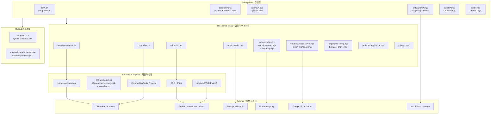

# gmail — Account Automation Toolkit / 계정 자동화 툴킷

A Node.js toolkit for browser- and Android-driven account provisioning, OAuth setup, and verification workflows. It bundles Playwright/Puppeteer, the Chrome DevTools Protocol (CDP), Appium, ADB, and Frida behind composable CLI entry points and a shared library layer, with built-in support for proxy forwarding, SMS provider integration, and OAuth callback handling.

브라우저와 Android 기반의 계정 생성, OAuth 설정, 인증(verification) 워크플로를 위한 Node.js 툴킷입니다. Playwright/Puppeteer, Chrome DevTools Protocol(CDP), Appium, ADB, Frida를 조합 가능한 CLI 진입점과 공유 라이브러리 계층 뒤에 통합하며, 프록시 포워딩, SMS 제공자 연동, OAuth 콜백 처리 기능을 기본 제공합니다.

> ⚠️ **Intended Use / 사용 목적.** This project is published for legitimate automation, testing, and research purposes — for example, building internal test accounts, validating sign-up flows, running end-to-end QA, or conducting security research on your own infrastructure. It is the operator's responsibility to comply with the Terms of Service of every platform they interact with and with all applicable laws. Do not use it to abuse services, evade rate limits, or generate fraudulent accounts.
>
> 본 프로젝트는 정당한 자동화, 테스트, 연구 목적(내부 테스트 계정 구축, 가입 플로우 검증, E2E QA, 자체 인프라에 대한 보안 연구 등)으로 공개되었습니다. 사용자가 상호작용하는 모든 플랫폼의 이용약관과 관련 법규를 준수하는 것은 운영자의 책임입니다. 서비스 약관 회피, 요청 제한(rate limit) 우회, 허위 계정 생성 등의 용도로 사용하지 마십시오.

---

## Table of Contents / 목차

- [Overview / 개요](#overview--개요)
- [Key Features / 주요 기능](#key-features--주요-기능)
- [Repository Layout / 저장소 구조](#repository-layout--저장소-구조)
- [Architecture / 아키텍처](#architecture--아키텍처)
- [Quick Start / 빠른 시작](#quick-start--빠른-시작)
- [Configuration / 설정](#configuration--설정)
- [Commands Reference / 명령어 참조](#commands-reference--명령어-참조)
- [Local Development / 로컬 개발](#local-development--로컬-개발)
- [Testing / 테스트](#testing--테스트)
- [Documentation / 문서](#documentation--문서)
- [Contributing / 기여](#contributing--기여)
- [License / 라이선스](#license--라이선스)

---

## Overview / 개요

The `gmail` package (as declared in `package.json`, version `1.0.0`, ISC-licensed) is a self-contained automation workspace. Its entry points cover four broad workflows:

1. **Google account provisioning** — Gmail / YouTube sign-up via Playwright, Puppeteer, raw CDP, Appium, and ADB on Android emulators or `redroid` containers. Includes age verification, family-group handling, and warm-up routines.
2. **OAuth infrastructure setup** — Google Cloud OAuth client configuration, callback server, and token exchange helpers used by the rest of the toolchain.
3. **OpenAI / Antigravity flows** — Parallel account creation and authentication pipelines for OpenAI services and the Antigravity feature surface, including token injection into `vscdb`-style storage.
4. **Diagnostics & verification** — Diagnostic logins, batch verification, SMS-capture debugging, and infrastructure health checks used while developing the above.

The shared `lib/` layer holds reusable modules: browser launchers, CDP utilities, ADB helpers, SMS provider adapters, proxy configuration/forwarders, OAuth callback servers, fingerprint profiles, and behavior profiles.

`package.json`에 선언된 `gmail` 패키지(버전 `1.0.0`, ISC 라이선스)는 단일 워크스페이스 형태의 자동화 도구입니다. 진입점은 다음 네 가지 워크플로를 다룹니다.

1. **Google 계정 프로비저닝** — Playwright, Puppeteer, raw CDP, Appium, ADB를 사용해 Android 에뮬레이터나 `redroid` 컨테이너에서 Gmail/YouTube 가입을 수행합니다. 나이 인증, 가족 그룹 처리, 워밍업 루틴을 포함합니다.
2. **OAuth 인프라 설정** — Google Cloud OAuth 클라이언트 구성, 콜백 서버, 토큰 교환 헬퍼를 제공합니다.
3. **OpenAI / Antigravity 플로우** — OpenAI 서비스와 Antigravity 기능 표면을 위한 계정 생성 및 인증 파이프라인으로, `vscdb` 형식 저장소에 토큰 주입 기능까지 포함합니다.
4. **진단 및 검증** — 위 자동화를 개발할 때 사용하는 진단 로그인, 배치 검증, SMS 캡처 디버깅, 인프라 상태 점검입니다.

`lib/` 계층은 브라우저 런처, CDP 유틸리티, ADB 헬퍼, SMS 제공자 어댑터, 프록시 설정/포워더, OAuth 콜백 서버, 핑거프린트 프로파일, 동작 프로파일 등 재사용 가능한 모듈을 제공합니다.

---

## Key Features / 주요 기능

- **Multi-engine browser automation.** Drive the same sign-up flow through `rebrowser-playwright`, Puppeteer, raw Chrome DevTools Protocol, or `@playwright/mcp` — choose the engine per environment. / 동일한 가입 플로우를 `rebrowser-playwright`, Puppeteer, raw CDP, `@playwright/mcp`로 구동할 수 있습니다.
- **Android device/automation support.** WebdriverIO / Appium plus ADB and Frida hooks for SMS interception (`frida-sms-hook.js`, `debug-sms-capture.mjs`). / WebdriverIO/Appium에 ADB와 Frida 훅을 결합해 SMS를 가로챕니다.
- **OAuth plumbing.** Built-in GCP OAuth client setup, a local callback server, and token-exchange helpers. / GCP OAuth 클라이언트 설정, 로컬 콜백 서버, 토큰 교환 헬퍼를 내장합니다.
- **Proxy forwarding & relay.** `proxy-config.mjs`, `proxy-forwarder.mjs`, and `proxy-relay.mjs` chain upstream proxies to outgoing connections for split routing. / 업스트림 프록시를 분할 라우팅으로 체이닝합니다.
- **SMS provider integration.** Pluggable SMS adapter (`sms-provider.mjs`) with documented alternative providers. / 문서화된 대체 제공자를 지원하는 플러그형 SMS 어댑터.
- **Behavior & fingerprint profiles.** Centralized profile modules (`behavior-profile.mjs`, `fingerprint-config.mjs`) keep automation signatures consistent. / 자동화 시그니처를 일관되게 유지하기 위한 중앙 집중식 프로파일 모듈.
- **MCP servers.** Includes `@gongrzhe/server-gmail-autoauth-mcp` and `@modelcontextprotocol/sdk` to expose flows through the Model Context Protocol. / Model Context Protocol을 통해 플로우를 노출합니다.
- **Warm-up & verification pipelines.** `warmup-account.mjs`, `verify-account.mjs`, `verify-all-accounts.mjs`, and `process-batch-verification.mjs` operate on the CSV outputs. / CSV 출력물을 대상으로 워밍업과 검증을 수행합니다.
- **Diagnostics.** Dedicated diagnostic scripts (`infrastructure-diagnostic.mjs`, `diagnostic-login.mjs`, `cdp-login-test.mjs`, `direct-login-test.mjs`) for debugging. / 디버깅 전용 진단 스크립트.

---

## Repository Layout / 저장소 구조

```
.
├── AGENTS.md                       # Agent / contributor operating notes
├── CONTRIBUTING.md                 # Contribution guidelines
├── LICENSE                         # ISC license
├── README.md                       # This file
├── complete.csv                    # Aggregated account output
├── openai-accounts.csv             # OpenAI account output
├── package.json                    # Node manifest, ISC license, deps
├── package-lock.json               # Locked dependency tree
├── bin/                            # Shell entry points & helpers
│   ├── create-gmail.sh
│   ├── setup-1password-service-account.sh
│   ├── setup-credentials.sh
│   ├── setup_frida.sh
│   └── xdg-open
├── oauth/                          # OAuth infrastructure setup
│   ├── oauth-login.mjs
│   └── setup-gcp-oauth.mjs
├── account/                        # Browser & Android account flows
│   ├── cdp-login-test.mjs
│   ├── check-account-exists.mjs
│   ├── create-accounts-adb.mjs
│   ├── create-accounts-appium.mjs
│   ├── create-accounts-cdp.mjs
│   ├── create-accounts.mjs
│   ├── debug-sms-capture.mjs
│   ├── diagnostic-login.mjs
│   ├── direct-login-test.mjs
│   ├── family-group.mjs
│   ├── frida-sms-hook.js
│   ├── gmail-creator-mcp.mjs
│   ├── infrastructure-diagnostic.mjs
│   ├── process-batch-verification.mjs
│   ├── puppeteer-gmail.mjs
│   ├── redroid-signup-cdp.mjs
│   ├── test-partner-oauth.mjs
│   ├── verify-account.mjs
│   ├── verify-age.mjs
│   ├── verify-all-accounts.mjs
│   ├── warmup-account.mjs
│   ├── youtube-signup-cdp.mjs
│   ├── youtube-signup.mjs
│   └── infrastructure/
│       └── setup-emulator.mjs
├── openai/                         # OpenAI account flows
│   ├── README.md
│   ├── check-accounts.mjs
│   ├── create-accounts.mjs
│   └── openai-creator-mcp.mjs
├── docs/                           # Long-form documentation
│   ├── ALTERNATIVE-SMS-PROVIDERS.md
│   ├── QUICKSTART.md
│   ├── adb-gmail-creation.md
│   └── verification-bypass-analysis.md
├── lib/                            # Shared library modules
│   ├── adb-utils.mjs
│   ├── antigravity-shared.mjs
│   ├── behavior-profile.mjs
│   ├── browser-launch.mjs
│   ├── cdp-utils.mjs
│   ├── cli-args.mjs
│   ├── fingerprint-config.mjs
│   ├── free-proxy.mjs
│   ├── google-auth-browser.mjs
│   ├── oauth-callback-server.mjs
│   ├── proxy-config.mjs
│   ├── proxy-forwarder.mjs
│   ├── proxy-relay.mjs
│   ├── sms-provider.mjs
│   ├── token-exchange.mjs
│   └── verification-pipeline.mjs
├── data/                           # State files (e.g. warmup progress)
│   └── warmup-progress.json
├── antigravity/                    # Antigravity auth pipeline
│   ├── antigravity-auth-results.json
│   ├── antigravity-auth.mjs
│   ├── antigravity-pipeline.mjs
│   ├── inject-vscdb-token.mjs
│   ├── manual-token-acquire.mjs
│   └── unlock-features.mjs
├── tests/                          # Smoke & manual QA scripts
│   ├── gmail-creator-mcp-smoke.mjs
│   └── qa-manual.mjs
└── tmp/                            # Scratch / debug space (not for production)
    ├── debug-selects.mjs
    ├── sms-fast-v2.mjs
    ├── sms-verify-fast.mjs
    ├── tmp-reauth.mjs
    └── ui.xml
```

---

## Architecture / 아키텍처

The toolkit is organized as a thin set of **CLI scripts** that import a thicker **shared library**. Each top-level script represents one end-to-end flow (create, verify, warm up, diagnose) and composes library modules to drive browsers, devices, proxies, and SMS providers.



**Layered responsibilities / 계층별 책임**

| Layer / 계층 | Responsibility / 책임 |
|---|---|
| `bin/`, `account/`, `openai/`, `antigravity/`, `oauth/`, `tests/` | Runnable flows. Each script wires the lower layers into one end-to-end task. / 실행 가능한 플로우 |
| `lib/` | Reusable primitives: launching browsers, talking to CDP, talking to ADB, fetching SMS codes, negotiating proxies, finishing OAuth, emitting fingerprints, parsing CLI args, running the verification pipeline. / 재사용 가능한 프리미티브 |
| Engines (Playwright, CDP, Appium, ADB/Frida) | External automation back-ends. / 외부 자동화 백엔드 |
| External systems | The destinations the toolkit talks to. / 툴킷이 통신하는 대상 |
| Outputs | CSV account records and JSON state files persisted alongside the run. / 실행 결과물 |

---

## Quick Start / 빠른 시작

> ⚠️ Most scripts touch third-party services. Read [Configuration](#configuration--설정) and the [intended-use notice](#overview--개요) before running anything against a real account. / 대부분의 스크립트는 외부 서비스에 영향을 미칩니다. 실제 계정에 대해 실행하기 전에 [설정](#configuration--설정)과 [사용 목적 안내](#overview--개요)를 읽어 주십시오.

### Prerequisites / 사전 준비

- **Node.js** compatible with the engines used (`rebrowser-playwright@^1.52`, `webdriverio@^9.27`, `@playwright/mcp@^0.0.76`). / 호환되는 Node.js 버전
- **Chromium / Chrome** installed and reachable on `PATH` (Playwright browsers can be installed via `npx playwright install`). / 시스템 PATH에서 접근 가능한 Chromium/Chrome
- **Android emulator** or a `redroid` container if you intend to run the ADB / Appium flows. / ADB/Appium 플로우를 사용할 경우 Android 에뮬레이터 또는 redroid 컨테이너
- **Frida** on the target device for SMS hooks (`bin/setup_frida.sh`). / SMS 훅용 Frida
- **Google Cloud project** with the OAuth APIs you intend to use, for the OAuth flows. / OAuth 플로우용 Google Cloud 프로젝트
- **1Password service account** credentials if you want the bundled credential helper (`bin/setup-1password-service-account.sh`). / 1Password 서비스 계정 자격 증명

### Install / 설치

```bash
git clone <your-fork-or-mirror-url> gmail
cd gmail
npm install
```

> The `package.json` declares a placeholder `main: "index.js"` and a no-op `npm test` script. There is no single entry point — run the scripts in `bin/`, `account/`, `openai/`, `antigravity/`, or `oauth/` directly via `node`. / `package.json`에는 자리표시자 `main: "index.js"`와 무동작 `npm test`만 정의되어 있습니다. 단일 진입점은 없으며, `bin/`, `account/`, `openai/`, `antigravity/`, `oauth/`의 스크립트를 `node`로 직접 실행합니다.

### First run / 첫 실행

1. Configure credentials (see [Configuration](#configuration--설정)).
2. Pick a flow. For example, the Gmail MCP creator:
   ```bash
   node account/gmail-creator-mcp.mjs
   ```
3. Or the OpenAI account flow:
   ```bash
   node openai/create-accounts.mjs
   ```
4. Read [`docs/QUICKSTART.md`](docs/QUICKSTART.md) for the bundled step-by-step guide. / 단계별 안내 문서 참조

---

## Configuration / 설정

There is no central configuration file. Each script reads what it needs (environment variables, CSV inputs, helper scripts in `bin/`) when it starts. The helpers in `bin/` exist to bootstrap credentials:

| Helper / 헬퍼 | Purpose / 용도 |
|---|---|
| `bin/setup-credentials.sh` | Bootstrap local credential storage. / 로컬 자격 증명 저장소 부트스트랩 |
| `bin/setup-1password-service-account.sh` | Configure a 1Password service account for secrets retrieval. / 비밀번호 검색용 1Password 서비스 계정 구성 |
| `bin/setup_frida.sh` | Install/configure Frida on the target device. / 대상 기기에 Frida 설치/구성 |
| `oauth/setup-gcp-oauth.mjs` | Configure a Google Cloud OAuth client (client ID/secret, scopes, redirect URIs). / Google Cloud OAuth 클라이언트 구성 |
| `account/infrastructure/setup-emulator.mjs` | Prepare an Android emulator or `redroid` container. / Android 에뮬레이터 또는 redroid 컨테이너 준비 |

**Profile modules** (`lib/fingerprint-config.mjs`, `lib/behavior-profile.mjs`) are the right place to centralize fingerprint and behavior parameters per target environment. **Per-script CSV inputs** (e.g. `complete.csv`, `openai-accounts.csv`) define the batch inputs the verification and warm-up scripts iterate over. **State files** such as `data/warmup-progress.json` and `antigravity/antigravity-auth-results.json` persist progress across runs.

`lib/proxy-config.mjs` plus `lib/proxy-forwarder.mjs` / `lib/proxy-relay.mjs` define outbound proxy chains — point them at your own proxy infrastructure. See [Notes on private addresses](#notes-on-private-addresses--개인-ip에-대한-주의) below. / 송신 프록시 체인 정의. 아래 개인 IP 관련 주의사항 참조.

---

## Commands Reference / 명령어 참조

> The exact flags and positional arguments are defined inside each script (`lib/cli-args.mjs` provides shared parsing). Run any script with `--help` where implemented, or read its source. Most scripts are invoked simply with `node <path>/<script>.mjs`.

### Setup helpers / 설정 헬퍼

| Command / 명령 | Purpose / 용도 |
|---|---|
| `bash bin/setup-credentials.sh` | Initialize local credential stores. |
| `bash bin/setup-1password-service-account.sh` | Configure 1Password service account access. |
| `bash bin/setup_frida.sh` | Install/configure Frida on the device. |
| `node oauth/setup-gcp-oauth.mjs` | Configure a Google Cloud OAuth client. |
| `node account/infrastructure/setup-emulator.mjs` | Prepare an Android emulator or `redroid` container. |
| `bash bin/create-gmail.sh` | Wrapper around the Gmail creation flows. |

### OAuth / OAuth

| Command / 명령 | Purpose / 용도 |
|---|---|
| `node oauth/oauth-login.mjs` | Drive an OAuth login against the configured GCP client. |

### Google account flows / Google 계정 플로우

| Command / 명령 | Purpose / 용도 |
|---|---|
| `node account/create-accounts.mjs` | Generic multi-engine account creator. |
| `node account/create-accounts-cdp.mjs` | Account creation over raw Chrome DevTools Protocol. |
| `node account/create-accounts-appium.mjs` | Account creation via Appium on an Android device. |
| `node account/create-accounts-adb.mjs` | Account creation driven by ADB alone. |
| `node account/puppeteer-gmail.mjs` | Puppeteer-based Gmail sign-up. |
| `node account/gmail-creator-mcp.mjs` | Gmail creation exposed via MCP. |
| `node account/redroid-signup-cdp.mjs` | Sign-up flow targeting a `redroid` container via CDP. |
| `node account/youtube-signup.mjs` | YouTube sign-up (browser). |
| `node account/youtube-signup-cdp.mjs` | YouTube sign-up via CDP. |
| `node account/family-group.mjs` | Family-group configuration on an existing account. |
| `node account/verify-age.mjs` | Age verification helper. |

### Verification, warm-up, diagnostics / 검증, 워밍업, 진단

| Command / 명령 | Purpose / 용도 |
|---|---|
| `node account/verify-account.mjs` | Verify a single account. |
| `node account/verify-all-accounts.mjs` | Verify every account in the batch. |
| `node account/process-batch-verification.mjs` | Run the verification pipeline across the batch CSV. |
| `node account/warmup-account.mjs` | Run warm-up activity on an account. |
| `node account/check-account-exists.mjs` | Probe whether an account exists. |
| `node account/diagnostic-login.mjs` | Diagnostic login flow. |
| `node account/direct-login-test.mjs` | Direct-login test path. |
| `node account/cdp-login-test.mjs` | Login test over CDP. |
| `node account/debug-sms-capture.mjs` | Debug the SMS capture / Frida hook path. |
| `node account/infrastructure-diagnostic.mjs` | Infrastructure health check. |
| `node account/test-partner-oauth.mjs` | Partner OAuth integration test. |

### OpenAI / OpenAI

| Command / 명령 | Purpose / 용도 |
|---|---|
| `node openai/create-accounts.mjs` | OpenAI account creation batch. |
| `node openai/check-accounts.mjs` | Check the status of OpenAI accounts. |
| `node openai/openai-creator-mcp.mjs` | OpenAI creator exposed via MCP. |

### Antigravity / Antigravity

| Command / 명령 | Purpose / 용도 |
|---|---|
| `node antigravity/antigravity-auth.mjs` | Run the Antigravity authentication flow. |
| `node antigravity/antigravity-pipeline.mjs` | End-to-end Antigravity pipeline. |
| `node antigravity/manual-token-acquire.mjs` | Acquire an Antigravity token manually. |
| `node antigravity/inject-vscdb-token.mjs` | Inject a token into the `vscdb` token store. |
| `node antigravity/unlock-features.mjs` | Unlock Antigravity features post-auth. |

---

## Local Development / 로컬 개발

- **Run any script directly.** `node <path>/<script>.mjs` is the standard invocation. The library is plain ESM (`.mjs`) and resolved through Node's module rules — no bundler is used. / 모든 스크립트는 `node`로 직접 실행하며 번들러를 사용하지 않습니다.
- **Shared parsing.** Use `lib/cli-args.mjs` for consistent CLI argument handling when adding new scripts. / 새 스크립트에는 `lib/cli-args.mjs`를 사용해 CLI 인자 처리를 일관되게 유지하십시오.
- **Adding a new engine.** Implement an adapter in `lib/` (following the patterns in `lib/browser-launch.mjs`, `lib/cdp-utils.mjs`, `lib/adb-utils.mjs`), then add a thin script under `account/`, `openai/`, or `antigravity/` that wires it together. / 새 엔진 어댑터를 `lib/`에 추가한 다음 얇은 스크립트를 작성해 연결합니다.
- **MCP integration.** The package depends on `@modelcontextprotocol/sdk`, `@playwright/mcp`, and `@gongrzhe/server-gmail-autoauth-mcp`. See those projects' documentation for transport options; the scripts `account/gmail-creator-mcp.mjs`, `openai/openai-creator-mcp.mjs`, and `oauth/oauth-login.mjs` are the entry points exposed through MCP. / MCP 전송 옵션은 해당 패키지 문서를 참조하십시오.
- **Lint/format.** No enforced linter or formatter is configured in `package.json`. Follow the existing module style (ESM, two-space indent, single-quoted strings). / `package.json`에 린터/포맷터가 설정되어 있지 않으므로 기존 모듈 스타일을 따르십시오.

---

## Testing / 테스트

The `tests/` directory contains smoke and manual QA scripts:

| Script / 스크립트 | Purpose / 용도 |
|---|---|
| `tests/gmail-creator-mcp-smoke.mjs` | Smoke test for the Gmail MCP creator. |
| `tests/qa-manual.mjs` | Manual QA walk-through. |

The default `npm test` script is a placeholder that exits with an error (`Error: no test specified`). Replace it with your preferred runner (e.g. add a real test framework under `tests/`) if you want a `npm test` entry point. / 기본 `npm test`는 자리표시자이므로 필요 시 실제 테스트 러너로 교체하십시오.

---

## Documentation / 문서

Long-form documentation lives in [`docs/`](docs/):

- [`docs/QUICKSTART.md`](docs/QUICKSTART.md) — Step-by-step first-run guide.
- [`docs/adb-gmail-creation.md`](docs/adb-gmail-creation.md) — ADB-based Gmail creation reference.
- [`docs/ALTERNATIVE-SMS-PROVIDERS.md`](docs/ALTERNATIVE-SMS-PROVIDERS.md) — How to plug alternative SMS providers into `lib/sms-provider.mjs`.
- [`docs/verification-bypass-analysis.md`](docs/verification-bypass-analysis.md) — Notes on verification flows.
- [`openai/README.md`](openai/README.md) — OpenAI-flow-specific notes.
- [`AGENTS.md`](AGENTS.md) — Operating notes for AI/automation agents working in the repo.
- [`CONTRIBUTING.md`](CONTRIBUTING.md) — Contribution guidelines.

---

## Notes on private addresses / 개인 IP에 대한 주의

The toolkit talks to upstream proxies, emulator hosts, and `redroid` containers. **Do not hardcode private network addresses** (RFC1918 ranges such as `192.168.x.x`, `10.x.x.x`, `172.16-31.x.x`) or specific LXC/container numbers in committed code or documentation — use placeholders such as `<emulator-host>` or `<proxy-host>` instead, or read them from environment variables. / 커밋된 코드나 문서에 RFC1918 사설 IP 대역(`192.168.x.x`, `10.x.x.x`, `172.16-31.x.x`)이나 LXC/컨테이너 번호를 하드코딩하지 말고, 자리표시자(`<emulator-host>`, `<proxy-host>`) 또는 환경 변수를 사용하십시오.

---

## Contributing / 기여

See [`CONTRIBUTING.md`](CONTRIBUTING.md). General guidelines:

- Keep new scripts thin; push reusable logic into `lib/`. / 새 스크립트는 얇게 유지하고 재사용 가능한 로직은 `lib/`에 추가하십시오.
- Follow the existing ESM module style. / 기존 ESM 스타일을 따르십시오.
- Avoid committing generated credentials, real account CSVs, or large JSON state files. Use the existing `complete.csv`, `openai-accounts.csv`, `data/warmup-progress.json`, and `antigravity/antigravity-auth-results.json` only as illustrative examples — replace them with empty/sanitized versions if you fork the project. / 생성된 자격 증명이나 실제 계정 CSV, 대용량 JSON 상태 파일은 커밋하지 마십시오.
- When you change a public script's CLI surface, update this README's **Commands Reference**. / CLI 표면을 변경할 때 본 README의 명령어 참조를 업데이트하십시오.

---

## License / 라이선스

ISC — see [`LICENSE`](LICENSE).