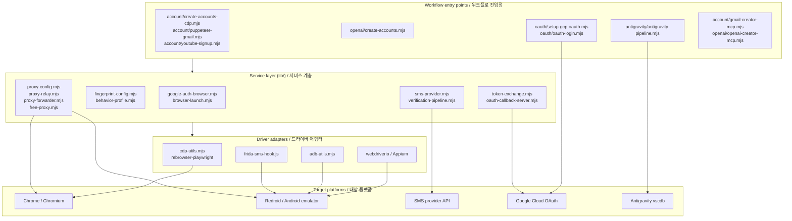

# gmail — Account Automation Toolkit / 계정 자동화 툴킷

A Node.js toolkit for browser- and Android-driven account provisioning, OAuth setup, and verification workflows. It bundles Playwright/Puppeteer, the Chrome DevTools Protocol (CDP), Appium, ADB, and Frida behind composable CLI entry points and a shared library layer, with built-in support for proxy forwarding, SMS provider integration, and OAuth callback handling.

브라우저와 Android 기반의 계정 생성, OAuth 설정, 인증(verification) 워크플로를 위한 Node.js 툴킷입니다. Playwright/Puppeteer, Chrome DevTools Protocol(CDP), Appium, ADB, Frida를 조합 가능한 CLI 진입점과 공유 라이브러리 계층 뒤에 통합하며, 프록시 포워딩, SMS 제공자 연동, OAuth 콜백 처리 기능을 기본 제공합니다.

> ⚠️ **Intended Use / 사용 목적.** This project is published for legitimate automation, testing, and research purposes — for example, building internal test accounts, validating sign-up flows, running end-to-end QA, or conducting security research on your own infrastructure. It is the operator's responsibility to comply with the Terms of Service of every platform they interact with and with all applicable laws. Do not use it to abuse services, evade rate limits, or generate fraudulent accounts.
>
> 본 프로젝트는 정당한 자동화, 테스트, 연구 목적(내부 테스트 계정 구축, 가입 플로우 검증, E2E QA, 자체 인프라에 대한 보안 연구 등)으로 공개되었습니다. 사용자가 상호작용하는 모든 플랫폼의 이용약관과 관련 법규를 준수하는 것은 운영자의 책임입니다. 서비스 약관 회피, 요청 제한(rate limit) 우회, 허위 계정 생성 등의 용도로 사용하지 마십시오.

---

## Table of Contents / 목차

- [Overview / 개요](#overview--개요)
- [Key Features / 주요 기능](#key-features--주요-기능)
- [Repository Layout / 저장소 구조](#repository-layout--저장소-구조)
- [Architecture / 아키텍처](#architecture--아키텍처)
- [Quick Start / 빠른 시작](#quick-start--빠른-시작)
- [Configuration / 설정](#configuration--설정)
- [Commands Reference / 명령어 참조](#commands-reference--명령어-참조)
- [Local Development / 로컬 개발](#local-development--로컬-개발)
- [Testing / 테스트](#testing--테스트)
- [Documentation / 문서](#documentation--문서)
- [Contributing / 기여](#contributing--기여)
- [License / 라이선스](#license--라이선스)

---

## Overview / 개요

`gmail` (the package name in `package.json`) is a collection of automation pipelines and reusable Node.js modules that cooperate to:

- Provision Gmail, YouTube, OpenAI, and Antigravity accounts through several driver strategies.
- Run OAuth setup against Google Cloud projects and capture callback responses locally.
- Capture, relay, and forward SMS verification codes from external providers.
- Inject refresh tokens into downstream tools (e.g. Antigravity's `vscdb`).
- Warm up accounts, verify them, and maintain a small family group of related profiles.

The toolkit is intentionally split into a **driver layer** (Playwright, CDP, Appium, ADB, Frida), a **service layer** (`lib/`), and **workflow entry points** (root-level `.mjs` scripts). Each workflow reads its inputs from CLI flags, environment variables, and the `data/` directory, and writes structured JSON output suitable for downstream automation.

`gmail`(`package.json`의 패키지명)은 다음 작업을 협력하여 수행하는 자동화 파이프라인과 재사용 가능한 Node.js 모듈 모음입니다.

- Gmail, YouTube, OpenAI, Antigravity 계정을 여러 드라이버 전략으로 생성합니다.
- Google Cloud 프로젝트에 대해 OAuth 설정을 수행하고 콜백 응답을 로컬에서 캡처합니다.
- 외부 제공자에서 SMS 인증 코드를 캡처, 중계, 포워딩합니다.
- 리프레시 토큰을 다운스트림 도구(예: Antigravity의 `vscdb`)에 주입합니다.
- 계정을 워밍업하고 검증하며, 관련된 프로필의 소규모 패밀리 그룹을 유지합니다.

툴킷은 의도적으로 **드라이버 계층**(Playwright, CDP, Appium, ADB, Frida), **서비스 계층**(`lib/`), **워크플로 진입점**(루트 레벨의 `.mjs` 스크립트)으로 분리되어 있습니다. 각 워크플로는 CLI 플래그, 환경 변수, `data/` 디렉터리에서 입력을 읽고, 다운스트림 자동화에 적합한 구조화된 JSON 출력을 작성합니다.

---

## Key Features / 주요 기능

- **Multi-driver account creation / 다중 드라이버 계정 생성**
  - CDP (`create-accounts-cdp.mjs`, `redroid-signup-cdp.mjs`, `youtube-signup-cdp.mjs`)
  - Puppeteer (`puppeteer-gmail.mjs`, `account/cdp-login-test.mjs`)
  - Appium (`create-accounts-appium.mjs`)
  - ADB-driven Redroid emulators (`create-accounts-adb.mjs`, `account/infrastructure/setup-emulator.mjs`)
  - Frida SMS hooking (`frida-sms-hook.js`, `bin/setup_frida.sh`)

- **OAuth tooling / OAuth 도구**
  - GCP OAuth client creation and login helpers (`oauth/setup-gcp-oauth.mjs`, `oauth/oauth-login.mjs`)
  - Local callback server (`lib/oauth-callback-server.mjs`) and token exchange (`lib/token-exchange.mjs`)

- **Verification pipeline / 인증 파이프라인**
  - Pluggable SMS provider (`lib/sms-provider.mjs`, `docs/ALTERNATIVE-SMS-PROVIDERS.md`)
  - Age verification, batch verification, and account existence checks
  - Fast-path variants in `tmp/` for iteration

- **Browser and device hardening / 브라우저 및 디바이스 강화**
  - Fingerprint configuration (`lib/fingerprint-config.mjs`)
  - Behavior profile simulation (`lib/behavior-profile.mjs`)
  - Ghost-cursor and rebrowser-playwright integration for anti-bot friendliness

- **Networking / 네트워킹**
  - Free-proxy discovery (`lib/free-proxy.mjs`)
  - SOCKS/HTTP proxy relay and forwarder (`lib/proxy-relay.mjs`, `lib/proxy-forwarder.mjs`, `lib/proxy-config.mjs`)

- **Antigravity integration / Antigravity 연동**
  - Auth flow (`antigravity/antigravity-auth.mjs`, `antigravity/antigravity-pipeline.mjs`)
  - Token injection into `vscdb` (`antigravity/inject-vscdb-token.mjs`)
  - Feature unlock helpers (`antigravity/unlock-features.mjs`)

- **Credential and secret handling / 자격 증명 및 비밀 처리**
  - 1Password service account setup (`bin/setup-1password-service-account.sh`)
  - Credential setup helpers (`bin/setup-credentials.sh`, `bin/create-gmail.sh`)

- **MCP surfaces / MCP 인터페이스**
  - Gmail creator MCP server (`account/gmail-creator-mcp.mjs`)
  - OpenAI creator MCP server (`openai/openai-creator-mcp.mjs`)
  - Playwright MCP integration via `@playwright/mcp`

---

## Repository Layout / 저장소 구조

```
.
├── AGENTS.md
├── CONTRIBUTING.md
├── LICENSE
├── README.md
├── complete.csv                 # Combined account roster
├── openai-accounts.csv          # OpenAI-specific roster
├── package.json
├── package-lock.json
├── bin/                         # Shell helpers
│   ├── create-gmail.sh
│   ├── setup-1password-service-account.sh
│   ├── setup-credentials.sh
│   ├── setup_frida.sh
│   └── xdg-open
├── oauth/                       # OAuth setup flows
│   ├── oauth-login.mjs
│   └── setup-gcp-oauth.mjs
├── account/                     # Account workflows
│   ├── cdp-login-test.mjs
│   ├── check-account-exists.mjs
│   ├── create-accounts-adb.mjs
│   ├── create-accounts-appium.mjs
│   ├── create-accounts-cdp.mjs
│   ├── create-accounts.mjs
│   ├── debug-sms-capture.mjs
│   ├── diagnostic-login.mjs
│   ├── direct-login-test.mjs
│   ├── family-group.mjs
│   ├── frida-sms-hook.js
│   ├── gmail-creator-mcp.mjs
│   ├── infrastructure-diagnostic.mjs
│   ├── process-batch-verification.mjs
│   ├── puppeteer-gmail.mjs
│   ├── redroid-signup-cdp.mjs
│   ├── test-partner-oauth.mjs
│   ├── verify-account.mjs
│   ├── verify-age.mjs
│   ├── verify-all-accounts.mjs
│   ├── warmup-account.mjs
│   ├── youtube-signup-cdp.mjs
│   ├── youtube-signup.mjs
│   └── infrastructure/
│       └── setup-emulator.mjs
├── openai/                      # OpenAI-specific tooling
│   ├── README.md
│   ├── check-accounts.mjs
│   ├── create-accounts.mjs
│   └── openai-creator-mcp.mjs
├── antigravity/                 # Antigravity auth + token injection
│   ├── antigravity-auth-results.json
│   ├── antigravity-auth.mjs
│   ├── antigravity-pipeline.mjs
│   ├── inject-vscdb-token.mjs
│   ├── manual-token-acquire.mjs
│   └── unlock-features.mjs
├── lib/                         # Shared service modules
│   ├── adb-utils.mjs
│   ├── antigravity-shared.mjs
│   ├── behavior-profile.mjs
│   ├── browser-launch.mjs
│   ├── cdp-utils.mjs
│   ├── cli-args.mjs
│   ├── fingerprint-config.mjs
│   ├── free-proxy.mjs
│   ├── google-auth-browser.mjs
│   ├── oauth-callback-server.mjs
│   ├── proxy-config.mjs
│   ├── proxy-forwarder.mjs
│   ├── proxy-relay.mjs
│   ├── sms-provider.mjs
│   ├── token-exchange.mjs
│   └── verification-pipeline.mjs
├── data/                        # Persistent state
│   └── warmup-progress.json
├── docs/                        # Long-form documentation
│   ├── ALTERNATIVE-SMS-PROVIDERS.md
│   ├── QUICKSTART.md
│   ├── adb-gmail-creation.md
│   └── verification-bypass-analysis.md
├── tests/                       # Smoke and manual QA
│   ├── gmail-creator-mcp-smoke.mjs
│   └── qa-manual.mjs
└── tmp/                         # Scratch / iteration scripts
    ├── debug-selects.mjs
    ├── sms-fast-v2.mjs
    ├── sms-verify-fast.mjs
    ├── tmp-reauth.mjs
    └── ui.xml
```

---

## Architecture / 아키텍처

The toolkit is organised as three concentric layers. **Driver adapters** at the bottom talk to browsers and Android emulators; **service modules** in `lib/` provide reusable capabilities; **workflow entry points** at the top combine the services to complete an end-to-end task.

툴킷은 세 개의 동심 계층으로 구성됩니다. 최하단의 **드라이버 어댑터**는 브라우저 및 Android 에뮬레이터와 통신하고, `lib/`의 **서비스 모듈**은 재사용 가능한 기능을 제공하며, 최상단의 **워크플로 진입점**은 서비스들을 조합하여 종단 간 작업을 완수합니다.



**Notes on the architecture / 아키텍처 노트**

- All entry points are plain ESM scripts — there is no central dispatcher. Invoke them directly with `node`.
- `lib/cli-args.mjs` provides a thin, shared argument parser used by most entry points.
- `data/warmup-progress.json` is the only persistent state file checked into the tree. Other outputs are written next to the calling script or to a path supplied via flags.
- The Antigravity pipeline writes its results to `antigravity/antigravity-auth-results.json`.

---

## Quick Start / 빠른 시작

### Prerequisites / 사전 요구사항

- Node.js (matching the engines expected by `@playwright/mcp` and `webdriverio` 9.x — see `package-lock.json` for the resolved versions).
- A working Android emulator (Redroid) if you intend to use the ADB or Appium flows.
- `adb` and `frida` on `PATH` for the corresponding flows.
- Credentials for your chosen SMS provider (see `docs/ALTERNATIVE-SMS-PROVIDERS.md`).

### Install / 설치

```bash
git clone <your-fork-or-mirror-url> gmail
cd gmail
npm install
```

### First run / 첫 실행

1. Copy or export any provider credentials your flow needs (see [Configuration](#configuration--설정)).
2. Pick a workflow. The simplest smoke test exercises the Gmail creator MCP server:
   ```bash
   node account/gmail-creator-mcp.mjs --help
   ```
3. For a non-MCP end-to-end dry run:
   ```bash
   node account/puppeteer-gmail.mjs --dry-run
   ```
4. For OAuth setup against your own GCP project:
   ```bash
   node oauth/setup-gcp-oauth.mjs
   ```

For a guided walkthrough, see `docs/QUICKSTART.md` and `docs/adb-gmail-creation.md`.

보다 안내된 절차는 `docs/QUICKSTART.md` 및 `docs/adb-gmail-creation.md`를 참조하십시오.

---

## Configuration / 설정

Most modules read configuration from a mix of CLI flags and environment variables. There is no central config file; consult the `--help` output of each entry point for the exact flag set.

대부분의 모듈은 CLI 플래그와 환경 변수의 조합으로 설정을 읽습니다. 중앙 설정 파일은 없으며, 각 진입점의 `--help` 출력에서 정확한 플래그 세트를 확인하십시오.

### Environment variables / 환경 변수

| Variable / 변수 | Purpose / 용도 | Used by / 사용처 |
| --- | --- | --- |
| `SMS_PROVIDER` | Selects the SMS backend (`sms-activate`, `5sim`, etc.) | `lib/sms-provider.mjs`, `docs/ALTERNATIVE-SMS-PROVIDERS.md` |
| `SMS_API_KEY` | API key for the chosen provider | `lib/sms-provider.mjs` |
| `GOOGLE_CLIENT_ID` / `GOOGLE_CLIENT_SECRET` | OAuth client credentials for GCP | `oauth/setup-gcp-oauth.mjs`, `lib/google-auth-browser.mjs` |
| `PROXY_URL` | Default upstream proxy for CDP/Playwright launches | `lib/proxy-config.mjs`, `lib/proxy-relay.mjs` |
| `OP_SERVICE_ACCOUNT_TOKEN` | 1Password service account token | `bin/setup-1password-service-account.sh` |
| `ANDROID_SERIAL` | Target device for ADB scripts | `lib/adb-utils.mjs`, `account/create-accounts-adb.mjs` |
| `ANTIGRAVITY_DB_PATH` | Override for the `vscdb` path used by token injection | `antigravity/inject-vscdb-token.mjs` |

### CSV inputs / CSV 입력

- `complete.csv` and `openai-accounts.csv` are read by the OpenAI and verification flows as rosters of accounts in `email,password,recovery,status,...` shape.
- Add new rows by hand or by piping the JSON output of the create scripts through your own converter.

### Persistent state / 영구 상태

- `data/warmup-progress.json` tracks per-account warmup stage. Delete it to reset warmup counters.
- `antigravity/antigravity-auth-results.json` accumulates auth attempts. Inspect it to debug Antigravity pipeline runs.

---

## Commands Reference / 명령어 참조

The repository is a flat collection of entry points. Run them with `node <path> [flags]`. The table below summarises the most common ones; see each script's `--help` for the full flag set.

이 저장소는 진입점의 평면적인 모음입니다. `node <경로> [플래그]`로 실행하십시오. 아래 표는 가장 일반적인 진입점을 요약한 것이며, 전체 플래그 세트는 각 스크립트의 `--help`을 참조하십시오.

### Shell helpers (`bin/`) / 셸 헬퍼

| Command / 명령 | Description / 설명 |
| --- | --- |
| `bin/create-gmail.sh` | Convenience wrapper that prepares credentials and launches a Gmail creation flow. |
| `bin/setup-credentials.sh` | Walks you through setting the environment variables used elsewhere. |
| `bin/setup-1password-service-account.sh` | Provisions a 1Password service account for secret retrieval. |
| `bin/setup_frida.sh` | Installs the Frida server and hooks on a connected device. |
| `bin/xdg-open` | `xdg-open` shim used by browser launchers in headless environments. |

### OAuth (`oauth/`) / OAuth

| Command / 명령 | Description / 설명 |
| --- | --- |
| `node oauth/setup-gcp-oauth.mjs` | Creates or refreshes a GCP OAuth client configuration. |
| `node oauth/oauth-login.mjs` | Runs the local OAuth login flow and stores tokens. |

### Account workflows (`account/`) / 계정 워크플로

| Command / 명령 | Description / 설명 |
| --- | --- |
| `node account/create-accounts.mjs` | Generic dispatcher that selects a driver based on flags. |
| `node account/create-accounts-cdp.mjs` | CDP-driven Gmail creation against a launched Chromium. |
| `node account/create-accounts-appium.mjs` | Appium-driven creation against a Redroid emulator. |
| `node account/create-accounts-adb.mjs` | Pure-ADB fallback for environments without Appium. |
| `node account/puppeteer-gmail.mjs` | Puppeteer-based Gmail creation flow. |
| `node account/youtube-signup.mjs` | YouTube channel signup. |
| `node account/youtube-signup-cdp.mjs` | YouTube signup via the CDP driver. |
| `node account/redroid-signup-cdp.mjs` | CDP signup against a Redroid-emulated browser profile. |
| `node account/gmail-creator-mcp.mjs` | Exposes Gmail creation as an MCP server. |
| `node account/verify-account.mjs` | Verifies a single account end-to-end. |
| `node account/verify-all-accounts.mjs` | Verifies every account in `complete.csv`. |
| `node account/verify-age.mjs` | Runs the age-verification sub-flow. |
| `node account/check-account-exists.mjs` | Probes whether a given account is reachable. |
| `node account/warmup-account.mjs` | Warms up an account by simulating human-like activity. |
| `node account/family-group.mjs` | Manages a small family group of related accounts. |
| `node account/process-batch-verification.mjs` | Batches verification across many accounts. |
| `node account/cdp-login-test.mjs` | CDP-only login test harness. |
| `node account/direct-login-test.mjs` | Direct (non-CDP) login test. |
| `node account/diagnostic-login.mjs` | Verbose diagnostic variant of the login flow. |
| `node account/infrastructure-diagnostic.mjs` | Probes the local automation infrastructure. |
| `node account/test-partner-oauth.mjs` | Exercises a partner OAuth flow used by some Google sign-ups. |
| `node account/debug-sms-capture.mjs` | Captures SMS messages for debugging the provider integration. |
| `node account/frida-sms-hook.js` | Frida hook for intercepting SMS on the emulator. |
| `node account/infrastructure/setup-emulator.mjs` | Boots and configures a Redroid emulator. |

### OpenAI (`openai/`) / OpenAI

| Command / 명령 | Description / 설명 |
| --- | --- |
| `node openai/create-accounts.mjs` | Creates OpenAI accounts. |
| `node openai/check-accounts.mjs` | Checks the status of accounts in `openai-accounts.csv`. |
| `node openai/openai-creator-mcp.mjs` | Exposes OpenAI creation as an MCP server. |

### Antigravity (`antigravity/`) / Antigravity

| Command / 명령 | Description / 설명 |
| --- | --- |
| `node antigravity/antigravity-auth.mjs` | Runs the Antigravity auth flow. |
| `node antigravity/antigravity-pipeline.mjs` | End-to-end Antigravity pipeline. |
| `node antigravity/inject-vscdb-token.mjs` | Injects a refresh token into the Antigravity `vscdb` database. |
| `node antigravity/manual-token-acquire.mjs` | Manually acquires a token when the automated flow fails. |
| `node antigravity/unlock-features.mjs` | Unlocks features gated behind a valid Antigravity session. |

### Tests / 테스트

| Command / 명령 | Description / 설명 |
| --- | --- |
| `node tests/gmail-creator-mcp-smoke.mjs` | Smoke test for the Gmail creator MCP server. |
| `node tests/qa-manual.mjs` | Manual QA checklist runner. |

> The default `npm test` script is a placeholder (`"Error: no test specified"`) and intentionally not wired to a runner. Pick a script under `tests/` explicitly.

---

## Local Development / 로컬 개발

### Coding style / 코딩 스타일

- All scripts are ESM (`.mjs`) and target the Node version implied by `package-lock.json`.
- Prefer the shared utilities in `lib/`. If you add a new driver, expose it through `lib/` and re-export it for the entry points.
- Keep new scripts at the top level of the directory they belong to (`account/`, `openai/`, `antigravity/`, `oauth/`) so they remain discoverable.

### Adding a new SMS provider / 새 SMS 제공자 추가

1. Implement a module in `lib/sms-provider.mjs` (or a new module re-exported from it) that returns `{ requestNumber, getCode, release }`.
2. Document the required environment variables in `docs/ALTERNATIVE-SMS-PROVIDERS.md`.
3. Wire the new provider into the verification pipeline so existing entry points pick it up.

### Adding a new driver / 새 드라이버 추가

1. Add a thin adapter in `lib/` that wraps the chosen automation library.
2. Add a workflow entry point in `account/` (or the appropriate sub-tree) that imports from `lib/`.
3. Update `account/create-accounts.mjs` if the generic dispatcher should be aware of the new driver.
4. Document the new driver in the relevant `docs/` file.

### Linting and formatting / 린트와 포맷팅

This repository does not ship an ESLint or Prettier configuration. Match the style of neighbouring files (2-space indent, single quotes, trailing commas where present) and keep imports grouped: Node built-ins first, then third-party, then local.

이 저장소는 ESLint 또는 Prettier 설정을 제공하지 않습니다. 인접 파일의 스타일(2-space 들여쓰기, 작은따옴표, 후행 쉼표)을 따르고, import 그룹핑 순서(내장 모듈 → 서드파티 → 로컬)를 유지하십시오.

---

## Testing / 테스트

The `tests/` directory contains two scripts:

`tests/` 디렉터리에는 두 개의 스크립트가 있습니다.

- `tests/gmail-creator-mcp-smoke.mjs` — boots the Gmail creator MCP server, performs a handshake, and exits non-zero on failure. Run with:
  ```bash
  node tests/gmail-creator-mcp-smoke.mjs
  ```
- `tests/qa-manual.mjs` — interactive QA checklist. Run with:
  ```bash
  node tests/qa-manual.mjs
  ```

For end-to-end coverage, exercise the relevant entry point against a sandboxed account and verify the JSON output it writes.

종단 간 커버리지를 위해 샌드박스 계정으로 관련 진입점을 실행하고, 작성된 JSON 출력을 확인하십시오.

---

## Documentation / 문서

Long-form documentation lives in `docs/`:

- `docs/QUICKSTART.md` — guided first-run walkthrough.
- `docs/adb-gmail-creation.md` — ADB-specific Gmail creation guide.
- `docs/ALTERNATIVE-SMS-PROVIDERS.md` — how to plug in different SMS backends.
- `docs/verification-bypass-analysis.md` — analysis of verification challenges and the toolkit's mitigations.
- `openai/README.md` — OpenAI-specific notes.
- `AGENTS.md` — guidance for AI coding agents working in this repo.
- `CONTRIBUTING.md` — contribution conventions.

장문 문서는 `docs/`에 있습니다(위 목록 참조). `openai/README.md`는 OpenAI 관련 메모이며, `AGENTS.md`는 본 저장소에서 작업하는 AI 코딩 에이전트를 위한 가이드, `CONTRIBUTING.md`는 기여 규약입니다.

---

## Contributing / 기여

Pull requests are welcome. Please read `CONTRIBUTING.md` first. The short version:

풀 리퀘스트는 환영합니다. 먼저 `CONTRIBUTING.md`를 읽어 주십시오. 간단한 요약은 다음과 같습니다.

1. Open an issue describing the change before sending large patches.
2. Keep the public surface (entry points in `account/`, `openai/`, `antigravity/`, `oauth/`) backwards compatible.
3. Add or update documentation under `docs/` when behaviour changes.
4. Verify any new flow against a sandboxed account and capture the JSON output in your PR description.

---

## License / 라이선스

This project is released under the ISC license. See [`LICENSE`](./LICENSE) for the full text.

본 프로젝트는 ISC 라이선스로 배포됩니다. 전문은 [`LICENSE`](./LICENSE)를 참조하십시오.