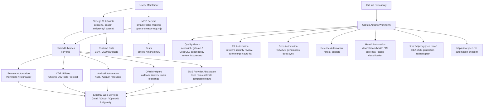

# 계정 자동화 워크스페이스 / Account Automation Workspace

[](../../actions/workflows/ci.yml)
[](../../actions/workflows/03_pr-checks.yml)
[](../../actions/workflows/05_gitleaks.yml)
[](../../actions/workflows/06_codeql.yml)
[](../../actions/workflows/20_readme-gen.yml)

## 개요 / Overview

이 저장소는 Gmail 계정 생성, OAuth 인증 흐름, Antigravity IDE 인증, OpenAI 계정 점검/생성 보조 작업을 위한 Node.js ESM 기반 자동화 워크스페이스입니다.

This repository is a Node.js ESM automation workspace for Gmail account creation, OAuth credential flows, Antigravity IDE authentication, and OpenAI account checking/creation helper workflows.

주요 자동화는 Playwright/Rebrowser, Chrome DevTools Protocol, ADB, Appium, MCP(Model Context Protocol), SMS provider abstraction을 기반으로 구성되어 있습니다.

The automation stack is built around Playwright/Rebrowser, Chrome DevTools Protocol, ADB, Appium, MCP Model Context Protocol, and a modular SMS provider abstraction.

## 사용 책임 / Responsible Use

이 프로젝트는 소유하거나 운영 권한이 있는 계정, 테스트 환경, 내부 QA, 승인된 자동화 실험에만 사용해야 합니다. 서비스 약관, 법률, 플랫폼 정책을 위반하는 대량 가입, 우회, 스팸, 오남용에는 사용하지 마십시오.

Use this project only for accounts, test environments, internal QA, or automation experiments that you own or are authorized to operate. Do not use it for bulk sign-up abuse, circumvention, spam, or any activity that violates laws, platform terms, or service policies.

## 기능 / Features

### 계정 및 인증 자동화 / Account and Authentication Automation

- Gmail 계정 생성 플로우
- Gmail 계정 존재 여부 점검
- Gmail 계정 로그인 진단 및 직접 로그인 테스트
- Gmail 계정 워밍업
- Gmail 가족 그룹 초대/수락 플로우
- Gmail 나이 인증 및 계정 검증 파이프라인
- OAuth 로그인 및 GCP OAuth credential setup
- Antigravity IDE OAuth/SMS 인증 파이프라인
- Antigravity 토큰 획득, VSCDB 토큰 주입, 기능 unlock 보조
- OpenAI 계정 생성 및 계정 상태 점검 스크립트

### 브라우저 및 디바이스 자동화 / Browser and Device Automation

- Playwright/Rebrowser 기반 브라우저 자동화
- Chrome DevTools Protocol 기반 WebView/CDP 자동화
- ADB 기반 Android Chrome 자동화
- Appium 기반 Android emulator 자동화
- ReDroid/CDP 기반 Android WebView 시나리오
- Frida SMS hook 보조 스크립트
- Docker/Android emulator setup helper

### MCP 및 도구 통합 / MCP and Tool Integration

- `account/gmail-creator-mcp.mjs` MCP 서버
- `openai/openai-creator-mcp.mjs` OpenAI 자동화 MCP 서버
- `@modelcontextprotocol/sdk`
- `@playwright/mcp`
- Gmail 자동 인증 MCP dependency
- Smoke/manual QA 테스트 스크립트

### CI/CD 및 GitHub 자동화 / CI/CD and GitHub Automation

- PR checks
- Actionlint
- Gitleaks secret scanning
- CodeQL analysis
- Dependency review
- OpenSSF Scorecard
- Semantic PR validation
- AI PR review
- Security PR review
- Dependabot auto-merge
- PR auto-merge
- Bot auto-fix
- Merged PR cleanup
- Issue classification/backfill
- README generation
- Documentation sync
- Release notes and publishing
- CI failure issue creation
- CI auto-healing
- Reusable workflow modules

## 아키텍처 / Architecture



## 저장소 구조 / Repository Structure

```text
/
├── AGENTS.md
├── CONTRIBUTING.md
├── LICENSE
├── README.md
├── complete.csv
├── openai-accounts.csv
├── package-lock.json
├── package.json
├── bin/
│   ├── create-gmail.sh
│   ├── setup-1password-service-account.sh
│   ├── setup-credentials.sh
│   ├── setup_frida.sh
│   └── xdg-open
├── oauth/
│   ├── oauth-login.mjs
│   └── setup-gcp-oauth.mjs
├── account/
│   ├── cdp-login-test.mjs
│   ├── check-account-exists.mjs
│   ├── create-accounts-adb.mjs
│   ├── create-accounts-appium.mjs
│   ├── create-accounts-cdp.mjs
│   ├── create-accounts.mjs
│   ├── debug-sms-capture.mjs
│   ├── diagnostic-login.mjs
│   ├── direct-login-test.mjs
│   ├── family-group.mjs
│   ├── frida-sms-hook.js
│   ├── gmail-creator-mcp.mjs
│   ├── infrastructure-diagnostic.mjs
│   ├── process-batch-verification.mjs
│   ├── puppeteer-gmail.mjs
│   ├── redroid-signup-cdp.mjs
│   ├── test-partner-oauth.mjs
│   ├── verify-account.mjs
│   ├── verify-age.mjs
│   ├── verify-all-accounts.mjs
│   ├── warmup-account.mjs
│   ├── youtube-signup-cdp.mjs
│   ├── youtube-signup.mjs
│   └── infrastructure/
│       └── setup-emulator.mjs
├── openai/
│   ├── README.md
│   ├── check-accounts.mjs
│   ├── create-accounts.mjs
│   └── openai-creator-mcp.mjs
├── docs/
│   ├── ALTERNATIVE-SMS-PROVIDERS.md
│   ├── QUICKSTART.md
│   ├── adb-gmail-creation.md
│   └── verification-bypass-analysis.md
├── lib/
│   ├── adb-utils.mjs
│   ├── antigravity-shared.mjs
│   ├── behavior-profile.mjs
│   ├── browser-launch.mjs
│   ├── cdp-utils.mjs
│   ├── cli-args.mjs
│   ├── fingerprint-config.mjs
│   ├── free-proxy.mjs
│   ├── google-auth-browser.mjs
│   ├── oauth-callback-server.mjs
│   ├── proxy-config.mjs
│   ├── proxy-forwarder.mjs
│   ├── proxy-relay.mjs
│   ├── sms-provider.mjs
│   ├── token-exchange.mjs
│   └── verification-pipeline.mjs
├── data/
│   └── warmup-progress.json
├── antigravity/
│   ├── antigravity-auth-results.json
│   ├── antigravity-auth.mjs
│   ├── antigravity-pipeline.mjs
│   ├── inject-vscdb-token.mjs
│   ├── manual-token-acquire.mjs
│   └── unlock-features.mjs
├── tests/
│   ├── gmail-creator-mcp-smoke.mjs
│   └── qa-manual.mjs
└── tmp/
    ├── debug-selects.mjs
    ├── sms-fast-v2.mjs
    ├── sms-verify-fast.mjs
    ├── tmp-reauth.mjs
    └── ui.xml
```

## 자동화 인벤토리 / Automation Inventory

### GitHub Actions Workflows

| File | Purpose |
|---|---|
| `01_branch-to-pr.yml` | Branch-to-PR automation |
| `02_issue-to-branch.yml` | Issue-to-branch automation |
| `03_pr-checks.yml` | Pull request checks |
| `04_actionlint.yml` | GitHub Actions workflow linting |
| `05_gitleaks.yml` | Secret scanning with Gitleaks |
| `06_codeql.yml` | CodeQL security analysis |
| `07_dependency-review.yml` | Dependency review for pull requests |
| `08_scorecard.yml` | OpenSSF Scorecard checks |
| `09_semantic-pr.yml` | Semantic pull request title validation |
| `10_pr-review.yml` | Automated PR review |
| `11_security-pr-review.yml` | Security-focused PR review |
| `12_dependabot-auto-merge.yml` | Dependabot auto-merge automation |
| `13_pr-auto-merge.yml` | Pull request auto-merge automation |
| `14_bot-auto-fix.yml` | Bot-driven auto-fix workflow |
| `15_merged-pr-cleanup.yml` | Cleanup after merged pull requests |
| `19_issue-backfill.yml` | Issue metadata/backfill automation |
| `20_readme-gen.yml` | README generation automation |
| `21_docs-sync.yml` | Documentation synchronization |
| `24_release-notes.yml` | Release notes generation |
| `25_release-publish.yml` | Release publishing |
| `29_downstream-health-check.yml` | Downstream health checks |
| `37_ci-failure-issues.yml` | Issue creation for CI failures |
| `42_reusable-docs-sync.yml` | Reusable documentation sync workflow |
| `44_reusable-pr-checks.yml` | Reusable PR checks workflow |
| `45_reusable-gitleaks.yml` | Reusable Gitleaks workflow |
| `60_ci-auto-heal.yml` | CI auto-healing automation |
| `91_issue-classification.yml` | Issue classification automation |
| `ci.yml` | Main CI workflow |

### CI and Review Tools

| Tool | Usage |
|---|---|
| Actionlint | Validates GitHub Actions workflow syntax and best practices |
| Gitleaks | Detects committed secrets |
| CodeQL | Static security analysis |
| Dependency Review | Reviews dependency changes in PRs |
| OpenSSF Scorecard | Repository security posture checks |
| Semantic PR | PR title convention validation |
| Qodo PR-Agent | AI-assisted PR review via [qodo-ai/pr-agent](https://github.com/qodo-ai/pr-agent) |
| README Generator | README regeneration using primary model `gpt-5.5`; fallback path uses `minimax-m3` via CLIProxy API |
| CLIProxy API | Public endpoint: <https://cliproxy.jclee.me/v1> |
| Bot Endpoint | Public endpoint: <https://bot.jclee.me> |

### Go Automation Tools

No Go automation tools are present in this repository.

### MCP Tools

The Gmail MCP server is implemented in:

```text
account/gmail-creator-mcp.mjs
```

Known Gmail MCP tools:

| Tool Name | Purpose |
|---|---|
| `create_accounts` | Start account creation jobs |
| `get_creation_job` | Query account creation job status |
| `list_accounts` | List created or tracked accounts |
| `get_account_status` | Inspect an account status |

The OpenAI MCP server is implemented in:

```text
openai/openai-creator-mcp.mjs
```

### Node.js Automation Entry Points

| Area | File |
|---|---|
| Gmail primary creation | `account/create-accounts.mjs` |
| Gmail ADB creation | `account/create-accounts-adb.mjs` |
| Gmail Appium creation | `account/create-accounts-appium.mjs` |
| Gmail CDP creation | `account/create-accounts-cdp.mjs` |
| ReDroid signup via CDP | `account/redroid-signup-cdp.mjs` |
| YouTube signup | `account/youtube-signup.mjs` |
| YouTube signup via CDP | `account/youtube-signup-cdp.mjs` |
| Account existence check | `account/check-account-exists.mjs` |
| Account verification | `account/verify-account.mjs` |
| Age verification | `account/verify-age.mjs` |
| Batch verification | `account/process-batch-verification.mjs` |
| Verify all accounts | `account/verify-all-accounts.mjs` |
| Account warmup | `account/warmup-account.mjs` |
| Family group workflow | `account/family-group.mjs` |
| Diagnostic login | `account/diagnostic-login.mjs` |
| Direct login test | `account/direct-login-test.mjs` |
| CDP login test | `account/cdp-login-test.mjs` |
| SMS capture debug | `account/debug-sms-capture.mjs` |
| Partner OAuth test | `account/test-partner-oauth.mjs` |
| Infrastructure diagnostic | `account/infrastructure-diagnostic.mjs` |
| Emulator setup | `account/infrastructure/setup-emulator.mjs` |
| OAuth login | `oauth/oauth-login.mjs` |
| GCP OAuth setup | `oauth/setup-gcp-oauth.mjs` |
| Antigravity auth | `antigravity/antigravity-auth.mjs` |
| Antigravity pipeline | `antigravity/antigravity-pipeline.mjs` |
| Antigravity VSCDB token injection | `antigravity/inject-vscdb-token.mjs` |
| Antigravity manual token acquisition | `antigravity/manual-token-acquire.mjs` |
| Antigravity unlock features | `antigravity/unlock-features.mjs` |
| OpenAI account creation | `openai/create-accounts.mjs` |
| OpenAI account check | `openai/check-accounts.mjs` |
| MCP smoke test | `tests/gmail-creator-mcp-smoke.mjs` |
| Manual QA | `tests/qa-manual.mjs` |

## 빠른 시작 / Quick Start

### 요구사항 / Requirements

- Node.js 18 or newer
- npm
- Playwright browser dependencies
- Optional: ADB for Android automation
- Optional: Appium and Android emulator support
- Optional: Frida for SMS hook experiments
- Optional: SMS provider API key for authorized verification flows

### 설치 / Installation

```bash
npm install
npx playwright install
```

### 환경 변수 / Environment Variables

환경 변수 이름은 실행 스크립트와 운영 환경에 맞게 설정하십시오. 비밀 값은 저장소에 커밋하지 마십시오.

Configure environment variables according to the script and runtime environment. Never commit secrets to the repository.

Common examples:

```bash
export FIVESIM_API_KEY="<your-sms-provider-api-key>"
export SMS_ACTIVATE_API_KEY="<your-alternative-sms-provider-api-key>"
```

### Gmail 계정 생성 드라이런 / Gmail Creation Dry Run

```bash
node account/create-accounts.mjs --dry-run --start 1 --end 3
```

### Gmail 계정 생성 / Gmail Account Creation

```bash
node account/create-accounts.mjs --start 1 --end 5 --api-key "$FIVESIM_API_KEY" --region russia
```

### ADB Android 모드 / ADB Android Mode

```bash
node account/create-accounts-adb.mjs --dry-run --count 1
node account/create-accounts-adb.mjs --count 1 --api-key "$FIVESIM_API_KEY" --region indonesia
```

### CDP 모드 / CDP Mode

```bash
node account/create-accounts-cdp.mjs --dry-run --count 1
```

### Appium 모드 / Appium Mode

```bash
node account/create-accounts-appium.mjs --dry-run --count 1
```

### 나이 인증 / Age Verification

```bash
node account/verify-age.mjs --dry-run --start 1 --end 5
node account/verify-age.mjs --start 1 --end 5 --api-key "$FIVESIM_API_KEY" --region russia
```

### Gmail MCP 서버 / Gmail MCP Server

```bash
node account/gmail-creator-mcp.mjs
```

### OpenAI MCP 서버 / OpenAI MCP Server

```bash
node openai/openai-creator-mcp.mjs
```

### OAuth 로그인 / OAuth Login

```bash
node oauth/oauth-login.mjs --help
node oauth/oauth-login.mjs --headed
```

### GCP OAuth 설정 / GCP OAuth Setup

```bash
node oauth/setup-gcp-oauth.mjs
```

### Antigravity 인증 / Antigravity Authentication

```bash
node antigravity/antigravity-auth.mjs
node antigravity/antigravity-pipeline.mjs
```

## 로컬 개발 / Local Development

### 패키지 설치 / Install Packages

```bash
npm install
```

### 브라우저 설치 / Install Browsers

```bash
npx playwright install
```

### 테스트 / Tests

현재 `package.json`의 기본 `npm test`는 placeholder이며 실패하도록 설정되어 있습니다.

The current `npm test` script in `package.json` is a placeholder and exits with an error.

```bash
npm test
```

MCP smoke test와 manual QA 스크립트는 직접 실행할 수 있습니다.

MCP smoke and manual QA scripts can be run directly:

```bash
node tests/gmail-creator-mcp-smoke.mjs
node tests/qa-manual.mjs
```

### GitHub Actions 로컬 점검 / Local Workflow Checks

Workflow syntax and security checks are primarily handled by GitHub Actions:

- `04_actionlint.yml`
- `05_gitleaks.yml`
- `06_codeql.yml`
- `07_dependency-review.yml`
- `08_scorecard.yml`

로컬에서 동일 도구를 사용하는 경우 각 도구의 공식 설치 방식에 맞춰 실행하십시오.

If you run equivalent tools locally, install and execute them according to each tool’s official documentation.

### 데이터 파일 주의 / Data File Caution

이 저장소에는 CSV/JSON 기반 runtime artifact가 포함될 수 있습니다.

Runtime artifacts may include CSV/JSON files.

Examples:

```text
complete.csv
openai-accounts.csv
data/warmup-progress.json
antigravity/antigravity-auth-results.json
tmp/ui.xml
```

실제 계정, 토큰, 세션, API key, SMS provider 응답, OAuth credential이 포함된 파일은 커밋하지 마십시오.

Do not commit files containing real accounts, tokens, sessions, API keys, SMS provider responses, or OAuth credentials.

## 명령어 참조 / Commands Reference

### npm

| Command | Description |
|---|---|
| `npm install` | Install dependencies |
| `npm test` | Placeholder test command; currently exits with an error |
| `npx playwright install` | Install Playwright browser binaries |

### Shell Helpers

| Command | Description |
|---|---|
| `bin/create-gmail.sh` | Shell helper for Gmail creation |
| `bin/setup-1password-service-account.sh` | 1Password service account setup helper |
| `bin/setup-credentials.sh` | Credential setup helper |
| `bin/setup_frida.sh` | Frida setup helper |
| `bin/xdg-open` | URL interceptor/helper for OAuth callback capture |

### Gmail and Account Scripts

| Command | Description |
|---|---|
| `node account/create-accounts.mjs` | Primary Gmail account creation flow |
| `node account/create-accounts-adb.mjs` | ADB + Android Chrome account creation |
| `node account/create-accounts-appium.mjs` | Appium + Android emulator account creation |
| `node account/create-accounts-cdp.mjs` | CDP/WebView account creation |
| `node account/check-account-exists.mjs` | Check whether an account exists |
| `node account/verify-account.mjs` | Verify a single account |
| `node account/verify-age.mjs` | Run age verification flow |
| `node account/verify-all-accounts.mjs` | Verify all tracked accounts |
| `node account/process-batch-verification.mjs` | Process batch verification |
| `node account/warmup-account.mjs` | Run account warmup automation |
| `node account/family-group.mjs` | Run family group invite/accept workflow |
| `node account/diagnostic-login.mjs` | Run diagnostic login flow |
| `node account/direct-login-test.mjs` | Run direct login test |
| `node account/cdp-login-test.mjs` | Run CDP login test |
| `node account/debug-sms-capture.mjs` | Debug SMS capture |
| `node account/infrastructure-diagnostic.mjs` | Run infrastructure diagnostics |

### Android and Emulator Scripts

| Command | Description |
|---|---|
| `node account/infrastructure/setup-emulator.mjs` | Setup emulator infrastructure |
| `node account/redroid-signup-cdp.mjs` | Run ReDroid signup through CDP |
| `node account/frida-sms-hook.js` | Frida SMS hook helper |

### OAuth Scripts

| Command | Description |
|---|---|
| `node oauth/oauth-login.mjs` | OAuth consent/login helper |
| `node oauth/setup-gcp-oauth.mjs` | GCP OAuth credential setup automation |

### Antigravity Scripts

| Command | Description |
|---|---|
| `node antigravity/antigravity-auth.mjs` | Antigravity OAuth/SMS authentication |
| `node antigravity/antigravity-pipeline.mjs` | End-to-end Antigravity activation pipeline |
| `node antigravity/inject-vscdb-token.mjs` | Inject token into VSCDB artifact |
| `node antigravity/manual-token-acquire.mjs` | Manual-assisted OAuth token acquisition |
| `node antigravity/unlock-features.mjs` | Feature unlock helper |

### OpenAI Scripts

| Command | Description |
|---|---|
| `node openai/create-accounts.mjs` | OpenAI account creation helper |
| `node openai/check-accounts.mjs` | OpenAI account status checker |
| `node openai/openai-creator-mcp.mjs` | OpenAI MCP server |

### Test Scripts

| Command | Description |
|---|---|
| `node tests/gmail-creator-mcp-smoke.mjs` | Gmail MCP smoke test suite |
| `node tests/qa-manual.mjs` | Manual QA validation script |

## 설정 및 보안 / Configuration and Security

### Secrets

다음 값은 절대 커밋하지 마십시오.

Never commit the following:

- API keys
- SMS provider credentials
- OAuth client secrets
- OAuth refresh/access tokens
- Session cookies
- Browser profiles containing authenticated sessions
- Real account lists
- Generated credential JSON files

### Network and Host Placeholders

내부 host, homelab host, private network 값은 문서에 직접 기록하지 마십시오. 필요한 경우 다음과 같은 placeholder를 사용하십시오.

Do not document private hosts or internal network values directly. Use placeholders such as:

```text
<homelab-host>
<homelab-elk>
```

Public automation endpoints used by repository automation:

```text
https://cliproxy.jclee.me/v1
https://bot.jclee.me
```

## 문서 / Documentation

Additional documentation is available under `docs/`:

| File | Description |
|---|---|
| `docs/QUICKSTART.md` | Quick start guide |
| `docs/ALTERNATIVE-SMS-PROVIDERS.md` | Alternative SMS provider notes |
| `docs/adb-gmail-creation.md` | ADB Gmail creation notes |
| `docs/verification-bypass-analysis.md` | Verification analysis document |

OpenAI-specific documentation is available at:

```text
openai/README.md
```

## 기여 가이드 / Contribution Guide

### 기본 흐름 / Basic Workflow

1. Issue를 생성하거나 기존 issue를 확인합니다.
2. 새 branch를 생성합니다.
3. 변경 사항을 작게 유지하고 목적을 명확히 합니다.
4. 민감 정보가 포함되지 않았는지 확인합니다.
5. 테스트 또는 수동 검증 결과를 PR 설명에 포함합니다.
6. Pull request를 생성합니다.
7. CI, 보안 검사, 리뷰 자동화를 통과시킵니다.

English workflow:

1. Create or select an issue.
2. Create a new branch.
3. Keep changes focused and minimal.
4. Ensure no sensitive data is included.
5. Include test or manual validation notes in the PR description.
6. Open a pull request.
7. Pass CI, security checks, and automated review gates.

### PR 체크리스트 / PR Checklist

- [ ] 변경 목적이 명확합니다.
- [ ] 실제 계정, 토큰, API key, session artifact를 커밋하지 않았습니다.
- [ ] 관련 스크립트를 로컬에서 실행하거나 dry-run으로 확인했습니다.
- [ ] 문서가 필요한 경우 README 또는 `docs/`를 업데이트했습니다.
- [ ] 신규 workflow 파일을 추가한 경우 actionlint 대상입니다.
- [ ] 보안 관련 변경은 PR 설명에 영향 범위를 명시했습니다.
- [ ] 자동화가 외부 서비스 약관과 내부 정책을 준수합니다.

### Commit and PR Style

- Use descriptive commit messages.
- Keep PRs reviewable and focused.
- Prefer dry-run examples when documenting automation.
- Include rollback notes for workflow or credential-related changes.
- Do not add generated secrets, runtime browser profiles, or private infrastructure details.

## 라이선스 / License

This project is licensed according to the repository `LICENSE` file.