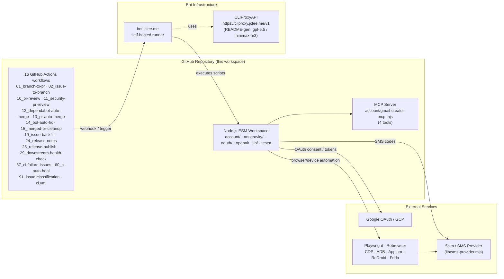

# 계정 자동화 워크스페이스 / Account Automation Workspace

[](../../actions/workflows/ci.yml)
[](../../actions/workflows/10_pr-review.yml)
[](../../actions/workflows/11_security-pr-review.yml)
[](../../actions/workflows/12_dependabot-auto-merge.yml)
[](../../actions/workflows/13_pr-auto-merge.yml)
[](../../actions/workflows/60_ci-auto-heal.yml)
[](../../actions/workflows/91_issue-classification.yml)

## 개요 / Overview

이 저장소는 Gmail 계정 생성, OAuth 인증 흐름, Antigravity IDE 인증, OpenAI 계정 점검/생성 보조 작업을 위한 **Node.js ESM** 기반 자동화 워크스페이스입니다. Playwright/Rebrowser, Chrome DevTools Protocol (CDP), ADB, Appium, MCP(Model Context Protocol) 서버, 그리고 모듈형 SMS provider 추상화(5sim 등)를 결합한 단일 저장소입니다.

This repository is a **Node.js ESM** automation workspace for Gmail account creation, OAuth credential flows, Antigravity IDE authentication, and OpenAI account checking/creation helper workflows. It unifies Playwright/Rebrowser, Chrome DevTools Protocol (CDP), ADB, Appium, an MCP (Model Context Protocol) server, and a modular SMS provider abstraction (5sim, etc.) into a single workspace.

자동화 스택은 사람이 수행하던 가입/검증 흐름을 재현할 수 있도록 설계되어 있으나, **반드시 본인이 소유하거나 운영 권한이 있는 계정·테스트 환경에서만** 사용해야 합니다.

The automation stack is designed to reproduce flows that humans normally perform. **It must be used only against accounts and test environments that you own or are authorized to operate.**

> README 생성 모델 / README generation model: `gpt-5.5` (fallback: `minimax-m3` via `https://cliproxy.jclee.me/v1`)

## 책임감 있는 사용 / Responsible Use

- 이 프로젝트는 **소유하거나 합법적으로 운영 권한이 있는** 계정, 테스트 환경, 내부 QA, 승인된 자동화 실험에만 사용하십시오.
- 서비스 약관(ToS), 지역 법령, 플랫폼 정책(Google, OpenAI, Antigravity 등)을 위반하는 대량 가입·우회·스팸·오남용 행위에 사용하지 마십시오.
- `account/`, `antigravity/`, `openai/` 하위의 모든 스크립트는 운영자가 명시적으로 활성화한 경우에만 실행해야 하며, 민감한 자격 증명은 1Password 서비스 계정 또는 환경 변수를 통해 주입하십시오.
- Use this project **only** for accounts, test environments, internal QA, or approved automation experiments that you own or are explicitly authorized to operate.
- Do **not** use it for bulk sign-up abuse, ToS circumvention, spam, or any activity that violates laws, platform terms, or service policies (Google, OpenAI, Antigravity, etc.).
- All scripts under `account/`, `antigravity/`, and `openai/` must only be run with explicit operator authorization, and secrets must be injected through 1Password service accounts or environment variables.

## 주요 기능 / Features

### 계정 및 인증 자동화 / Account & Authentication Automation

- Gmail 계정 생성 (`account/create-*.mjs` 4종: 메인 / ADB / CDP / Appium)
- Gmail 계정 존재 여부 점검 (`account/check-account-exists.mjs`)
- Gmail 로그인 진단·직접 로그인 테스트 (`account/diagnostic-login.mjs`, `account/direct-login-test.mjs`, `account/cdp-login-test.mjs`)
- Gmail 워밍업 (`account/warmup-account.mjs`)
- Gmail 가족 그룹 초대/수락 (`account/family-group.mjs`)
- 나이 인증 및 검증 파이프라인 (`account/verify-age.mjs`, `account/verify-account.mjs`, `account/verify-all-accounts.mjs`, `account/process-batch-verification.mjs`)
- OAuth 로그인 / GCP OAuth credential 자동 설정 (`oauth/oauth-login.mjs`, `oauth/setup-gcp-oauth.mjs`)
- Antigravity IDE OAuth + SMS 인증 파이프라인 (`antigravity/antigravity-auth.mjs`, `antigravity/antigravity-pipeline.mjs`)
- Antigravity VSCDB protobuf 토큰 주입 / 기능 unlock (`antigravity/inject-vscdb-token.mjs`, `antigravity/unlock-features.mjs`)
- OpenAI 계정 생성·점검 (`openai/create-accounts.mjs`, `openai/check-accounts.mjs`, `openai/openai-creator-mcp.mjs`)

### 브라우저 및 디바이스 자동화 / Browser & Device Automation

- Playwright / Rebrowser Playwright 기반 headed/headless 브라우저
- Chrome DevTools Protocol(CDP) 직접 제어 (`lib/cdp-utils.mjs`)
- ADB + Android Chrome (`lib/adb-utils.mjs`, `account/create-accounts-adb.mjs`)
- Appium + Docker 기반 Android 에뮬레이터 (`account/create-accounts-appium.mjs`)
- ReDroid + WebView 기반 CDP 가입 (`account/create-accounts-cdp.mjs`, `account/redroid-signup-cdp.mjs`)
- Frida SMS 후킹 (`account/frida-sms-hook.js`, `bin/setup_frida.sh`)
- 사람 행동 시뮬레이션 (`lib/behavior-profile.mjs`, `lib/fingerprint-config.mjs`)

### 인프라·유틸리티 / Infrastructure & Utilities

- 모듈형 SMS provider (`lib/sms-provider.mjs`: 5sim / sms-activate 추상화)
- OAuth 콜백 로컬 서버 (`lib/oauth-callback-server.mjs`, `lib/token-exchange.mjs`)
- Google 인증 브라우저 헬퍼 (`lib/google-auth-browser.mjs`)
- 프록시/릴레이/포워더 (`lib/proxy-config.mjs`, `lib/proxy-relay.mjs`, `lib/proxy-forwarder.mjs`, `lib/free-proxy.mjs`)
- Antigravity 공유 로직 (`lib/antigravity-shared.mjs`)
- 자격 증명 설정 도우미 (`bin/setup-credentials.sh`, `bin/setup-1password-service-account.sh`)
- MCP 서버 (`account/gmail-creator-mcp.mjs`: 4 tools — `create_accounts`, `get_creation_job`, `list_accounts`, `get_account_status`)

## 아키텍처 / Architecture



핵심 흐름 / Key flow: GitHub 이벤트 → 16개의 Actions 워크플로우 → 셀프 호스트 러너(`bot.jclee.me`) → 저장소 내 ESM 스크립트 실행 → Playwright/CDP/ADB/Appium/ReDroid + 5sim + Google OAuth 연동. 봇은 `CLIProxyAPI`(`https://cliproxy.jclee.me/v1`)를 통해 보조 LLM 호출(예: README 재생성)을 수행합니다.

GitHub events → 16 Actions workflows → self-hosted runner (`bot.jclee.me`) → ESM scripts in this repo → Playwright/CDP/ADB/Appium/ReDroid + 5sim + Google OAuth. The bot calls auxiliary LLMs (e.g. README regeneration) through `CLIProxyAPI` at `https://cliproxy.jclee.me/v1`.

## 저장소 구조 / Repository Structure

```text
.
├── AGENTS.md                       # machine-readable project knowledge base
├── CONTRIBUTING.md
├── LICENSE
├── README.md
├── package.json
├── package-lock.json
├── complete.csv                    # generated account state (output)
├── openai-accounts.csv
├── bin/                            # shell helpers
│   ├── create-gmail.sh
│   ├── setup-1password-service-account.sh
│   ├── setup-credentials.sh
│   ├── setup_frida.sh
│   └── xdg-open                    # URL interceptor for OAuth callback capture
├── oauth/                          # OAuth credential flows
│   ├── oauth-login.mjs
│   └── setup-gcp-oauth.mjs
├── account/                        # Gmail account automation
│   ├── cdp-login-test.mjs
│   ├── check-account-exists.mjs
│   ├── create-accounts.mjs         # primary flow
│   ├── create-accounts-adb.mjs     # ADB + Android Chrome
│   ├── create-accounts-appium.mjs  # Appium + Docker emulator
│   ├── create-accounts-cdp.mjs     # CDP + ReDroid WebView
│   ├── debug-sms-capture.mjs
│   ├── diagnostic-login.mjs
│   ├── direct-login-test.mjs
│   ├── family-group.mjs
│   ├── frida-sms-hook.js
│   ├── gmail-creator-mcp.mjs       # MCP server (4 tools)
│   ├── infrastructure-diagnostic.mjs
│   ├── process-batch-verification.mjs
│   ├── puppeteer-gmail.mjs
│   ├── redroid-signup-cdp.mjs
│   ├── test-partner-oauth.mjs
│   ├── verify-account.mjs
│   ├── verify-age.mjs
│   ├── verify-all-accounts.mjs
│   ├── warmup-account.mjs
│   ├── youtube-signup-cdp.mjs
│   ├── youtube-signup.mjs
│   └── infrastructure/
│       └── setup-emulator.mjs
├── openai/                         # OpenAI account helpers
│   ├── README.md
│   ├── check-accounts.mjs
│   ├── create-accounts.mjs
│   └── openai-creator-mcp.mjs
├── docs/
│   ├── ALTERNATIVE-SMS-PROVIDERS.md
│   ├── QUICKSTART.md
│   ├── adb-gmail-creation.md
│   └── verification-bypass-analysis.md
├── lib/                            # shared utilities
│   ├── adb-utils.mjs
│   ├── antigravity-shared.mjs
│   ├── behavior-profile.mjs
│   ├── browser-launch.mjs
│   ├── cdp-utils.mjs
│   ├── cli-args.mjs
│   ├── fingerprint-config.mjs
│   ├── free-proxy.mjs
│   ├── google-auth-browser.mjs
│   ├── oauth-callback-server.mjs
│   ├── proxy-config.mjs
│   ├── proxy-forwarder.mjs
│   ├── proxy-relay.mjs
│   ├── sms-provider.mjs
│   ├── token-exchange.mjs
│   └── verification-pipeline.mjs
├── data/
│   └── warmup-progress.json
├── antigravity/                    # Antigravity IDE auth & verification
│   ├── antigravity-auth-results.json
│   ├── antigravity-auth.mjs
│   ├── antigravity-pipeline.mjs
│   ├── inject-vscdb-token.mjs
│   ├── manual-token-acquire.mjs
│   └── unlock-features.mjs
├── tests/                          # smoke + manual QA
│   ├── gmail-creator-mcp-smoke.mjs # 29-assertion MCP smoke test
│   └── qa-manual.mjs               # 6-test manual QA validation
└── tmp/                            # scratch / debug
    ├── debug-selects.mjs
    ├── sms-fast-v2.mjs
    ├── sms-verify-fast.mjs
    ├── tmp-reauth.mjs
    └── ui.xml
```

## 자동화 인벤토리 / Automation Inventory

### GitHub Actions 워크플로우 / GitHub Actions Workflows (16)

| # | File | Purpose |
|---|------|---------|
| 1 | `01_branch-to-pr.yml` | 브랜치 → PR 자동 변환 / Branch → PR automation |
| 2 | `02_issue-to-branch.yml` | 이슈 → 브랜치 자동 생성 / Issue → branch creation |
| 3 | `10_pr-review.yml` | PR 리뷰 (qodo-ai/pr-agent) / PR review via `qodo-ai/pr-agent` |
| 4 | `11_security-pr-review.yml` | 보안 관점 PR 리뷰 / Security-focused PR review |
| 5 | `12_dependabot-auto-merge.yml` | Dependabot PR 자동 머지 / Dependabot auto-merge |
| 6 | `13_pr-auto-merge.yml` | 일반 PR 자동 머지 / Generic PR auto-merge |
| 7 | `14_bot-auto-fix.yml` | 봇 자동 수정 / Bot self-fix on failure |
| 8 | `15_merged-pr-cleanup.yml` | 머지된 PR 정리 / Cleanup of merged PRs |
| 9 | `19_issue-backfill.yml` | 이슈 백필 / Issue backfill |
| 10 | `24_release-notes.yml` | 릴리스 노트 생성 / Release notes generation |
| 11 | `25_release-publish.yml` | 릴리스 게시 / Release publishing |
| 12 | `29_downstream-health-check.yml` | 다운스트림 헬스 체크 / Downstream health check |
| 13 | `37_ci-failure-issues.yml` | CI 실패 → 이슈 자동 생성 / CI failure → issue |
| 14 | `60_ci-auto-heal.yml` | CI 자동 복구 / CI auto-heal |
| 15 | `91_issue-classification.yml` | 이슈 자동 분류 / Issue auto-classification |
| 16 | `ci.yml` | 기본 CI 파이프라인 / Baseline CI pipeline |

### Go 자동화 도구 / Go Automation Tools (0)

이 저장소에는 Go 기반 자동화 도구가 포함되어 있지 않습니다. 모든 자동화 로직은 Node.js ESM 스크립트 + GitHub Actions YAML로 구성됩니다.

This repository contains **no** Go-based automation tools. All automation is implemented as Node.js ESM scripts + GitHub Actions YAML.

### 보조 자동화 자산 / Auxiliary Automation Assets

- **MCP 서버 / MCP server**: `account/gmail-creator-mcp.mjs` — 4 tools (`create_accounts`, `get_creation_job`, `list_accounts`, `get_account_status`)
- **SMS provider 어댑터 / SMS provider adapter**: `lib/sms-provider.mjs` (5sim / sms-activate)
- **OAuth 콜백 서버 / OAuth callback server**: `lib/oauth-callback-server.mjs` + `lib/token-exchange.mjs`
- **셀프 호스트 러너 / self-hosted runner**: `bot.jclee.me`
- **CLIProxyAPI**: `https://cliproxy.jclee.me/v1` (LLM 라우팅, README-gen 백업 모델 포함)

## 빠른 시작 / Quick Start

### 사전 요구 사항 / Prerequisites

- Node.js 18+ (ESM, `type: "module"` 가정)
- npm 9+
- (선택) Android 디바이스 또는 에뮬레이터(ReDroid / Appium) — `account/create-accounts-adb.mjs` 등 사용 시
- (선택) `adb` (Android Debug Bridge)
- (선택) `frida` / `frida-server` — SMS 후킹 사용 시
- (선택) `mcphub` 또는 호환 MCP 클라이언트 — MCP 서버 연동 시

### 설치 / Install

```bash
# 1) 클론 & 의존성 설치
git clone <this-repo> account-automation
cd account-automation
npm install

# 2) 자격 증명 설정 (1Password 서비스 계정 또는 환경 변수)
bin/setup-credentials.sh
# 또는 1Password 서비스 계정 사용 시
bin/setup-1password-service-account.sh

# 3) GCP OAuth credentials 발급 (최초 1회)
node oauth/setup-gcp-oauth.mjs
```

### 환경 변수 / Environment Variables

| Variable | Required by | Description |
|----------|-------------|-------------|
| `FIVESIM_API_KEY` | `account/create-*.mjs`, `account/verify-age.mjs`, `antigravity/unlock-features.mjs` | 5sim API 키 (없으면 `--dry-run`) |
| `GCP_OAUTH_KEYS_PATH` | `oauth/*` | `gcp-oauth.keys.json` 경로 |
| `ADB_DEVICE_SERIAL` | `account/create-accounts-adb.mjs` | 타깃 Android 디바이스 시리얼 |
| `PROXY_URL` | `lib/proxy-config.mjs` | 선택적 outbound 프록시 |
| `OPENAI_API_KEY` | `openai/*` | OpenAI 점검/생성 스크립트 |
| `ANTIGRAVITY_DB_PATH` | `antigravity/inject-vscdb-token.mjs` | VSCDB 경로 |

## 로컬 개발 / Local Development

### 일반적인 워크플로우 / Typical Workflow

```bash
# 1) Dry-run으로 가입 흐름 검증 (5sim 키 없이 가능)
node account/create-accounts.mjs --dry-run

# 2) 실제 가입 실행 (5sim 키 필요)
FIVESIM_API_KEY=*** node account/create-accounts.mjs

# 3) 가족 그룹 초대/수락
node account/family-group.mjs

# 4) 계정 검증
node account/verify-all-accounts.mjs

# 5) Antigravity 인증 파이프라인
node antigravity/antigravity-pipeline.mjs

# 6) OpenAI 계정 점검
node openai/check-accounts.mjs
```

### MCP 서버 실행 / Run the MCP Server

```bash
# MCP 서버를 standalone으로 기동
node account/gmail-creator-mcp.mjs
# mcphub 또는 호환 클라이언트에서 stdio로 연결
```

### 테스트 / Tests

```bash
# MCP 서버 smoke test (29 assertion)
node tests/gmail-creator-mcp-smoke.mjs

# Manual QA (6 tests)
node tests/qa-manual.mjs
```

## 명령어 레퍼런스 / Commands Reference

### `account/` — Gmail

| Command | Purpose |
|---------|---------|
| `node account/create-accounts.mjs [--dry-run] [--count N]` | 메인 가입 플로우 (Playwright/Rebrowser) |
| `node account/create-accounts-adb.mjs` | ADB + Android Chrome |
| `node account/create-accounts-cdp.mjs` | CDP + ReDroid WebView |
| `node account/create-accounts-appium.mjs` | Appium + Docker 에뮬레이터 |
| `node account/check-account-exists.mjs --email <addr>` | 계정 존재 여부 |
| `node account/verify-age.mjs` | 5sim 기반 나이 인증 |
| `node account/verify-account.mjs` | 단일 계정 검증 |
| `node account/verify-all-accounts.mjs` | 일괄 검증 |
| `node account/process-batch-verification.mjs` | 배치 검증 처리 |
| `node account/warmup-account.mjs` | 워밍업 |
| `node account/family-group.mjs` | 가족 그룹 |
| `node account/gmail-creator-mcp.mjs` | MCP 서버 (4 tools) |
| `node account/diagnostic-login.mjs` | 로그인 진단 |
| `node account/direct-login-test.mjs` | 직접 로그인 테스트 |
| `node account/cdp-login-test.mjs` | CDP 로그인 테스트 |
| `node account/infrastructure-diagnostic.mjs` | 인프라 진단 |
| `node account/youtube-signup.mjs` / `youtube-signup-cdp.mjs` | YouTube 가입 변형 |
| `node account/redroid-signup-cdp.mjs` | ReDroid CDP 가입 |
| `node account/test-partner-oauth.mjs` | 파트너 OAuth 테스트 |
| `node account/puppeteer-gmail.mjs` | Puppeteer 변형 |
| `node account/debug-sms-capture.mjs` | SMS 캡처 디버그 |
| `node account/account/infrastructure/setup-emulator.mjs` | 에뮬레이터 셋업 |

### `antigravity/` — Antigravity IDE

| Command | Purpose |
|---------|---------|
| `node antigravity/antigravity-pipeline.mjs` | End-to-end 계정 활성화 오케스트레이터 |
| `node antigravity/antigravity-auth.mjs` | OAuth + SMS 인증 |
| `node antigravity/unlock-features.mjs` | 5sim 기반 기능 unlock |
| `node antigravity/inject-vscdb-token.mjs` | VSCDB protobuf 토큰 주입 |
| `node antigravity/manual-token-acquire.mjs` | 수동 보조 OAuth 토큰 획득 |

### `oauth/` — OAuth

| Command | Purpose |
|---------|---------|
| `node oauth/setup-gcp-oauth.mjs` | GCP OAuth credential 자동 설정 |
| `node oauth/oauth-login.mjs [--help] [--headed]` | OAuth consent/login |

### `openai/` — OpenAI

| Command | Purpose |
|---------|---------|
| `node openai/check-accounts.mjs` | 계정 상태 점검 |
| `node openai/create-accounts.mjs` | 계정 생성 |
| `node openai/openai-creator-mcp.mjs` | OpenAI MCP 서버 |

### `lib/`

공유 유틸리티 — 직접 실행되는 스크립트가 아닌 다른 스크립트에서 import 됩니다.

Shared utilities — imported by other scripts, not run directly.

## 기여 가이드 / Contributing

1. **이슈 먼저 / Open an issue first**: 새 기능, 새 provider 추가, 대규모 리팩터링은 이슈로 먼저 논의합니다.
   New features, new providers, or large refactors must be discussed in an issue first.
2. **브랜치 명명 / Branch naming**: `02_issue-to-branch.yml`이 자동 생성하는 형식(`<번호>/<slug>`)을 따르거나 `feature/<slug>`, `fix/<slug>`를 사용합니다.
   Use the format auto-generated by `02_issue-to-branch.yml` (`<num>/<slug>`) or `feature/<slug>` / `fix/<slug>`.
3. **PR 리뷰 / PR review**: `10_pr-review.yml`(qodo-ai/pr-agent) + `11_security-pr-review.yml` + `91_issue-classification.yml`이 자동 실행됩니다. 머지는 `13_pr-auto-merge.yml`이 처리합니다.
   `10_pr-review.yml` (qodo-ai/pr-agent), `11_security-pr-review.yml`, and `91_issue-classification.yml` run automatically. Merging is handled by `13_pr-auto-merge.yml`.
4. **Dependabot**: `12_dependabot-auto-merge.yml`이 무중단 업데이트를 자동 머지합니다.
   `12_dependabot-auto-merge.yml` auto-merges non-breaking dependency updates.
5. **CI 자동 복구 / CI auto-heal**: `60_ci-auto-heal.yml` + `14_bot-auto-fix.yml`이 일시적 실패에 대해 자동 재시도/수정을 시도합니다. 디버깅이 필요하면 `[bot-fix-skip]` 라벨을 사용하세요.
   `60_ci-auto-heal.yml` + `14_bot-auto-fix.yml` retry/auto-fix transient failures. Use the `[bot-fix-skip]` label to opt out.
6. **테스트 / Tests**: PR 전 `tests/gmail-creator-mcp-smoke.mjs`를 통과해야 하며, 동작 변경 시 `tests/qa-manual.mjs`도 함께 갱신합니다.
   `tests/gmail-creator-mcp-smoke.mjs` must pass before a PR. If behavior changes, also update `tests/qa-manual.mjs`.
7. **시크릿 / Secrets**: API 키, OAuth 클라이언트 시크릿, VSCDB 토큰 등은 절대 커밋하지 마세요. `gcp-oauth.keys.json`, `antigravity-auth-results.json`, `data/warmup-progress.json`은 모두 `.gitignore` 대상입니다.
   Never commit API keys, OAuth client secrets, or VSCDB tokens. `gcp-oauth.keys.json`, `antigravity-auth-results.json`, and `data/warmup-progress.json` must be git-ignored.
8. **AGENTS.md 동기화 / Keep AGENTS.md in sync**: 구조가 바뀌면 `AGENTS.md`의 `STRUCTURE` 섹션도 함께 갱신합니다.
   When the structure changes, update the `STRUCTURE` section in `AGENTS.md` as well.
9. **한국어/영어 이중 문서 / Bilingual docs**: 사용자-facing 문서는 한국어 + 영어를 함께 제공합니다.
   User-facing docs must be bilingual (Korean + English).
10. **책임감 있는 사용 / Responsible use**: 모든 PR은 `Responsible Use` 정책을 준수해야 하며, 이를 위반하는 코드는 머지되지 않습니다.
    All PRs must comply with the `Responsible Use` policy; non-compliant code will not be merged.

---

## 외부 링크 / External Links

- PR 리뷰 엔진 / PR review engine: [qodo-ai/pr-agent](https://github.com/qodo-ai/pr-agent)
- 봇 운영 / bot ops: `https://bot.jclee.me`
- LLM 프록시 / LLM proxy: `https://cliproxy.jclee.me/v1`
- 저장소 내부 knowledge base: [`AGENTS.md`](./AGENTS.md)
- 기여 규칙: [`CONTRIBUTING.md`](./CONTRIBUTING.md)