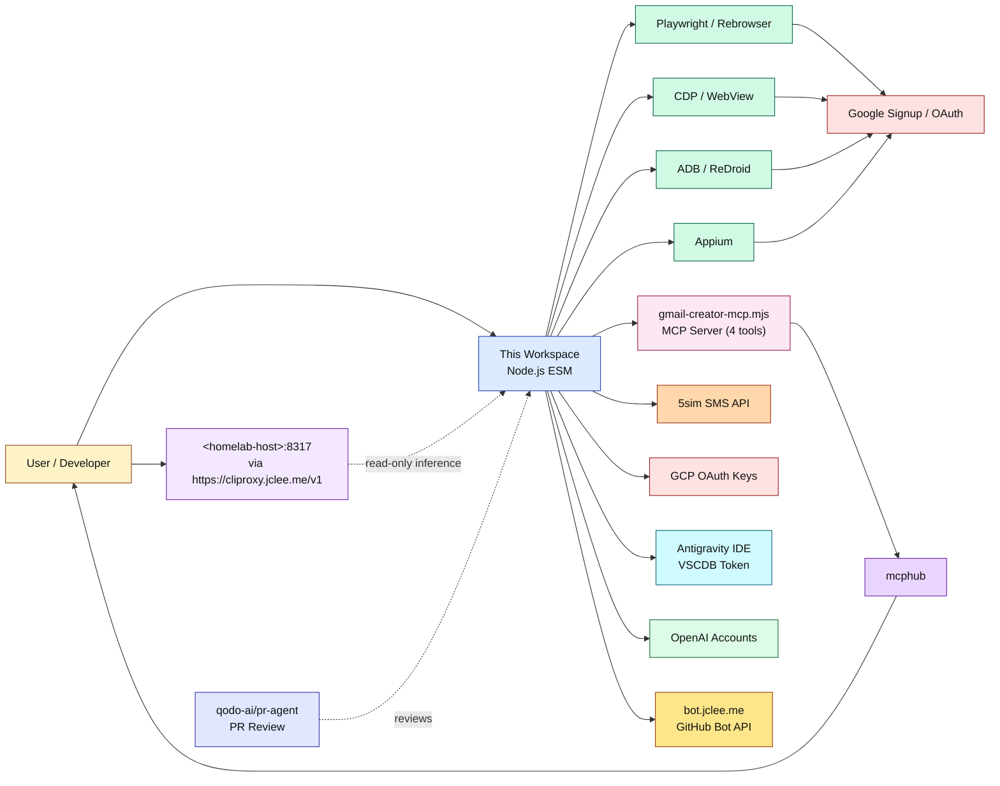

# 계정 자동화 워크스페이스 / Account Automation Workspace

[](../../actions/workflows/ci.yml)
[](../../actions/workflows/10_pr-review.yml)
[](../../actions/workflows/11_security-pr-review.yml)
[](../../actions/workflows/12_dependabot-auto-merge.yml)
[](../../actions/workflows/13_pr-auto-merge.yml)
[](../../actions/workflows/14_bot-auto-fix.yml)
[](../../actions/workflows/60_ci-auto-heal.yml)
[](../../actions/workflows/91_issue-classification.yml)

> README 생성 모델 / README generation model: `gpt-5.5` (fallback: `minimax-m3` via `https://cliproxy.jclee.me/v1`)

---

## 개요 / Overview

이 저장소는 Gmail 계정 생성, OAuth 인증 흐름, Antigravity IDE 인증/토큰 주입, OpenAI 계정 점검·생성 보조 작업을 위한 **Node.js ESM** 기반 자동화 워크스페이스입니다. Playwright/Rebrowser, Chrome DevTools Protocol (CDP), ADB, Appium, MCP(Model Context Protocol) 서버, 그리고 모듈형 SMS provider 추상화(5sim 등)를 결합한 단일 저장소입니다.

This repository is a **Node.js ESM** automation workspace for Gmail account creation, OAuth credential flows, Antigravity IDE authentication / token injection, and OpenAI account inspection / creation helper workflows. It unifies **Playwright/Rebrowser**, the **Chrome DevTools Protocol (CDP)**, **ADB**, **Appium**, an **MCP (Model Context Protocol) server**, and a modular **SMS provider abstraction** (5sim, sms-activate, …) into a single, script-first workspace.

자동화 스택은 사람이 수행하던 가입/검증 흐름을 재현할 수 있도록 설계되어 있으나, **반드시 본인이 소유하거나 운영 권한이 있는 계정·테스트 환경에서만** 사용해야 합니다.

The automation stack is designed to reproduce flows a human operator would normally perform. **It must be used only against accounts and test environments that you own or are explicitly authorized to operate.**

---

## 책임감 있는 사용 / Responsible Use

- 본 저장소의 모든 스크립트는 **연구·테스트·내부 QA 자동화** 목적입니다.
- 타인의 계정을 무단으로 생성하거나, 서비스 약관(ToS)을 위반하는 자동화는 금지됩니다.
- 5sim 등 SMS provider, ReDroid/Android 에뮬레이터, Google OAuth 클라이언트 자격 증명은 모두 **본인 명의**로 발급된 것만 사용하세요.
- 본 프로젝트의 저자는 이 도구의 오용으로 발생하는 모든 문제에 대해 책임을 지지 않습니다.

- All scripts in this repository are intended for **research, testing, and internal QA automation**.
- Do not use them to create accounts for third parties or to violate any service's Terms of Service.
- SMS providers (5sim, …), Android emulators (ReDroid), and Google OAuth client credentials must all be **issued in your own name**.
- The authors disclaim all responsibility for misuse of these tools.

---

## 주요 기능 / Features

### 핵심 기능 / Core

- **Gmail 계정 생성 파이프라인** — 브라우저 자동화, Android(ADB/CDP/Appium) 자동화, MCP 서버를 통한 4가지 진입 경로 제공
- **OAuth 인증 흐름** — Google OAuth consent, GCP OAuth 클라이언트 키 자동 발급, localhost 콜백 서버, 토큰 교환 유틸리티
- **Antigravity IDE 인증** — OAuth + SMS 검증 파이프라인, VSCDB protobuf 토큰 주입, 5sim 기반 feature unlock
- **OpenAI 계정 점검** — `openai/check-accounts.mjs`, `openai/create-accounts.mjs`, OpenAI Creator MCP 서버
- **MCP(Model Context Protocol) 서버** — `account/gmail-creator-mcp.mjs`가 4개 도구 노출: `create_accounts`, `get_creation_job`, `list_accounts`, `get_account_status`
- **모듈형 SMS Provider** — 5sim, sms-activate 등을 플러그인 방식으로 추상화 (`lib/sms-provider.mjs`)
- **사람처럼 행동하는 브라우저 프로파일** — `lib/behavior-profile.mjs`의 자연스러운 타이핑/마우스 시뮬레이션

### 자동화 인프라 / Automation Infrastructure

- **16개의 GitHub Actions 워크플로** — 브랜치→PR, 이슈→브랜치, PR 리뷰(Qodo PR-Agent 기반), 보안 리뷰, Dependabot 자동 머지, CI 자동 치유, 이슈 분류 등
- **원격 LLM 프록시** — `https://cliproxy.jclee.me/v1`을 통한 OpenAI 호환 추론 엔드포인트
- **봇 백엔드** — `https://bot.jclee.me` GitHub 봇 오케스트레이션
- **PR 자동 리뷰** — [qodo-ai/pr-agent](https://github.com/qodo-ai/pr-agent) 기반

---

## 아키텍처 / Architecture



> 모든 외부 endpoint는 placeholder입니다. 실제 배포 환경에서는 `<homelab-host>` 자리에 본인 호스트를, `https://cliproxy.jclee.me/v1` 자리에 본인의 OpenAI 호환 프록시 URL을 사용하세요.
> All external endpoints shown are placeholders. In production, substitute `<homelab-host>` with your host and `https://cliproxy.jclee.me/v1` with your own OpenAI-compatible proxy URL.

---

## 저장소 구조 / Repository Structure

```text
.
├── account/                       # Gmail account automation
│   ├── create-accounts.mjs          # primary account creation flow
│   ├── create-accounts-adb.mjs      # ADB + Android Chrome automation
│   ├── create-accounts-cdp.mjs      # CDP mode using WebView on ReDroid
│   ├── create-accounts-appium.mjs   # Appium + Docker Android emulator
│   ├── family-group.mjs             # invite/accept family flow
│   ├── gmail-creator-mcp.mjs        # MCP server: 4 tools for automation
│   ├── verify-age.mjs               # age verification via 5sim SMS
│   ├── verify-account.mjs           # single-account verification
│   ├── verify-all-accounts.mjs      # bulk verification runner
│   ├── warmup-account.mjs           # account warm-up behaviour
│   ├── check-account-exists.mjs     # existence check helper
│   ├── puppeteer-gmail.mjs          # legacy Puppeteer flow
│   ├── youtube-signup.mjs           # YouTube signup flow
│   ├── youtube-signup-cdp.mjs       # YouTube signup via CDP
│   ├── redroid-signup-cdp.mjs       # ReDroid signup via CDP
│   ├── cdp-login-test.mjs           # CDP login smoke test
│   ├── direct-login-test.mjs        # direct-login diagnostic
│   ├── diagnostic-login.mjs         # login diagnostic
│   ├── debug-sms-capture.mjs        # SMS capture debugging
│   ├── process-batch-verification.mjs
│   ├── test-partner-oauth.mjs       # partner OAuth test
│   ├── frida-sms-hook.js            # Frida hook for SMS interception
│   ├── infrastructure/
│   │   └── setup-emulator.mjs       # emulator bootstrap
├── antigravity/                   # Antigravity IDE auth & verification
│   ├── antigravity-auth.mjs         # OAuth + SMS verification pipeline
│   ├── antigravity-pipeline.mjs     # end-to-end activation orchestrator
│   ├── inject-vscdb-token.mjs       # VSCDB protobuf token injection
│   ├── manual-token-acquire.mjs     # manual-assisted OAuth token acquire
│   ├── unlock-features.mjs          # 5sim SMS feature unlock
│   ├── antigravity-auth-results.json
├── oauth/                         # OAuth credential flows
│   ├── oauth-login.mjs              # OAuth consent/login helper
│   └── setup-gcp-oauth.mjs          # GCP OAuth credential setup
├── openai/                        # OpenAI account helpers
│   ├── check-accounts.mjs           # bulk account inspection
│   ├── create-accounts.mjs          # account creation helper
│   ├── openai-creator-mcp.mjs       # OpenAI creator MCP server
│   └── README.md
├── lib/                           # shared utilities
│   ├── adb-utils.mjs                # ADB wrappers for Android automation
│   ├── antigravity-shared.mjs       # Antigravity helpers
│   ├── behavior-profile.mjs         # human-like typing/mouse simulation
│   ├── browser-launch.mjs           # browser launch helpers
│   ├── cdp-utils.mjs                # Chrome DevTools Protocol utilities
│   ├── cli-args.mjs                 # CLI argument parser
│   ├── fingerprint-config.mjs       # browser fingerprint config
│   ├── free-proxy.mjs               # free proxy discovery
│   ├── google-auth-browser.mjs      # Google auth browser automation
│   ├── oauth-callback-server.mjs    # localhost OAuth callback server
│   ├── proxy-config.mjs             # proxy configuration
│   ├── proxy-forwarder.mjs          # proxy forwarding helpers
│   ├── proxy-relay.mjs              # proxy relay helpers
│   ├── sms-provider.mjs             # modular SMS provider (5sim/sms-activate)
│   ├── token-exchange.mjs           # OAuth code→token exchange
│   └── verification-pipeline.mjs    # 3-stage account verification pipeline
├── bin/                           # one-off shell helpers
│   ├── create-gmail.sh
│   ├── setup-1password-service-account.sh
│   ├── setup-credentials.sh
│   ├── setup_frida.sh
│   └── xdg-open                    # URL interceptor for OAuth callback
├── tests/                         # smoke + manual QA tests
│   ├── gmail-creator-mcp-smoke.mjs  # 29-assertion smoke test suite
│   └── qa-manual.mjs                # 6-test manual QA validation
├── docs/                          # additional documentation
│   ├── ALTERNATIVE-SMS-PROVIDERS.md
│   ├── QUICKSTART.md
│   ├── adb-gmail-creation.md
│   └── verification-bypass-analysis.md
├── tmp/                           # scratch / transient debugging scripts
│   ├── debug-selects.mjs
│   ├── sms-fast-v2.mjs
│   ├── sms-verify-fast.mjs
│   ├── tmp-reauth.mjs
│   └── ui.xml
├── data/
│   └── warmup-progress.json
├── .github/
│   └── workflows/                  # 16 automation workflows (see below)
├── complete.csv                   # generated account state (output)
├── openai-accounts.csv             # generated OpenAI account state (output)
├── AGENTS.md                      # machine-readable project knowledge base
├── CONTRIBUTING.md                # contribution guide
├── package.json                   # root dependencies
└── package-lock.json
```

> ⚠️ 저장소 트리는 실제 디스크 레이아웃을 그대로 반영합니다. `_bot-scripts/` 같은 디렉토리는 존재하지 않으며, 해당 경로는 일부 CI 체크아웃에서 일시적으로 보이는 경로일 뿐입니다.
> ⚠️ The tree above reflects the actual on-disk layout. Directories like `_bot-scripts/` do **not** exist — that path only ever appears as a transient CI checkout path.

---

## 자동화 인벤토리 / Automation Inventory

### GitHub Actions 워크플로 / GitHub Actions Workflows (16)

| # | 파일 / File | 목적 / Purpose |
|---|---|---|
| 01 | `01_branch-to-pr.yml` | 브랜치를 PR로 자동 변환 / Auto-converts a branch into a PR |
| 02 | `02_issue-to-branch.yml` | 이슈를 브랜치로 변환 / Auto-creates a branch from an issue |
| 10 | `10_pr-review.yml` | PR 자동 리뷰 (Qodo PR-Agent 기반) / Automated PR review (Qodo PR-Agent) |
| 11 | `11_security-pr-review.yml` | PR 보안 리뷰 / Security-focused PR review |
| 12 | `12_dependabot-auto-merge.yml` | Dependabot PR 자동 머지 / Auto-merge Dependabot PRs |
| 13 | `13_pr-auto-merge.yml` | 일반 PR 자동 머지 / Auto-merge regular PRs |
| 14 | `14_bot-auto-fix.yml` | 봇 자동 수정 / Bot auto-fix on review feedback |
| 15 | `15_merged-pr-cleanup.yml` | 머지된 PR의 브랜치 정리 / Cleanup merged-PR branches |
| 19 | `19_issue-backfill.yml` | 이슈 백필 / Issue backfill |
| 24 | `24_release-notes.yml` | 릴리스 노트 자동 생성 / Auto-generate release notes |
| 25 | `25_release-publish.yml` | 릴리스 게시 / Publish release artifacts |
| 29 | `29_downstream-health-check.yml` | 다운스트림 헬스 체크 / Downstream consumer health check |
| 37 | `37_ci-failure-issues.yml` | CI 실패 시 이슈 자동 생성 / Auto-open issue on CI failure |
| 60 | `60_ci-auto-heal.yml` | CI 자동 복구 / CI auto-heal / self-repair |
| 91 | `91_issue-classification.yml` | 이슈 자동 분류·라벨링 / Auto-classify and label issues |
| — | `ci.yml` | 기본 CI / Main CI pipeline |

### Go 자동화 도구 / Go Automation Tools (0)

본 저장소에는 Go 기반 자동화 도구가 포함되어 있지 않습니다. 모든 자동화는 Node.js (ESM) 스크립트와 GitHub Actions YAML로 구성됩니다.

This repository does **not** contain Go-based automation tools. All automation is delivered as Node.js (ESM) scripts and GitHub Actions YAML.

---

## 빠른 시작 / Quick Start

### 1. 요구 사항 / Prerequisites

- **Node.js ≥ 20** (ESM + `node --watch` 지원)
- **npm ≥ 10**
- (선택 / optional) Android 에뮬레이터: ReDroid 또는 `appium`-호환 컨테이너
- (선택 / optional) Google Chrome / Chromium (Playwright/Rebrowser용)
- (선택 / optional) `adb` (Android 디바이스/에뮬레이터 디버깅용)
- (선택 / optional) Frida (SMS 인터셉트 hook용)

### 2. 설치 / Install

```bash
git clone <repo-url>
cd <repo-dir>
npm ci
npx playwright install chromium    # Playwright/Rebrowser용 Chromium
```

### 3. 환경 변수 / Environment Variables

대부분의 스크립트는 다음 변수를 참조합니다. `.env` 또는 셸 환경에 설정하세요.

Most scripts read the following variables. Configure them in `.env` or your shell environment.

| 변수 / Var | 용도 / Purpose |
|---|---|
| `FIVESIM_API_KEY` | 5sim API 키 / 5sim API key |
| `SMS_ACTIVATE_API_KEY` | (대안) sms-activate API 키 / alternative SMS provider |
| `OPENAI_BASE_URL` | OpenAI 호환 엔드포인트 (예: `https://cliproxy.jclee.me/v1`) |
| `OPENAI_API_KEY` | OpenAI 호환 API 키 |
| `GOOGLE_OAUTH_CLIENT_ID` | GCP OAuth 클라이언트 ID |
| `GOOGLE_OAUTH_CLIENT_SECRET` | GCP OAuth 클라이언트 시크릿 |
| `PROXY_URL` | (선택) HTTP/SOCKS 프록시 (`http://<user>:<pass>@<host>:<port>`) |
| `ANDROID_SERIAL` | (선택) ADB 타겟 디바이스 일련번호 |
| `APPIUM_HOST` / `APPIUM_PORT` | (선택) Appium 서버 |

### 4. 첫 실행 / First Run

```bash
# Gmail 계정 생성 (대화형)
node account/create-accounts.mjs

# MCP 서버 (stdio transport)
node account/gmail-creator-mcp.mjs

# OAuth 로그인 헬퍼
node oauth/oauth-login.mjs --help
```

---

## 로컬 개발 / Local Development

### 권장 워크플로 / Recommended Workflow

1. **기능 브랜치 생성** — `02_issue-to-branch.yml` 또는 수동: `git checkout -b feat/<name>`
2. **로컬에서 스크립트 반복** — `node --watch account/create-accounts.mjs` 또는 `--dry-run` 플래그로 안전 실행
3. **PR 생성** — `01_branch-to-pr.yml`이 브랜치 변경 사항을 감지해 PR 초안 자동 생성
4. **자동 리뷰 대기** — `10_pr-review.yml`이 Qodo PR-Agent로 리뷰 자동 실행
5. **머지** — `13_pr-auto-merge.yml`이 조건 충족 시 자동 머지
6. **정리** — `15_merged-pr-cleanup.yml`이 머지된 브랜치 자동 삭제

### 일반 작업 위치 / Where to Look

| 작업 / Task | 위치 / Location | 비고 / Notes |
|---|---|---|
| Gmail 계정 생성 (현재) | `account/create-accounts.mjs` | `--dry-run` 외에는 5sim 키 필요 |
| MCP 서버 (툴 기반) | `account/gmail-creator-mcp.mjs` | 도구 4종: `create_accounts`, `get_creation_job`, `list_accounts`, `get_account_status` |
| MCP 서버 테스트 | `tests/` | Smoke 29개 assertion + 수동 QA 6종 |
| 가족 초대 워크플로 | `account/family-group.mjs` | `accounts.csv` → `family-results.csv` |
| OAuth consent 실행 | `oauth/oauth-login.mjs` | `--help`, `--headed` 지원 |
| GCP OAuth 키 생성 | `oauth/setup-gcp-oauth.mjs` | GCP 프로젝트 콘솔 자동화 |
| Antigravity 인증 | `antigravity/antigravity-auth.mjs` | OAuth + SMS 검증 |
| Antigravity 토큰 주입 | `antigravity/inject-vscdb-token.mjs` | VSCDB protobuf |
| OpenAI 계정 점검 | `openai/check-accounts.mjs` | `openai-accounts.csv` 입력/출력 |
| SMS provider 변경 | `lib/sms-provider.mjs` | 5sim → sms-activate 스왑 |
| 행동 프로파일 | `lib/behavior-profile.mjs` | 사람처럼 보이는 입력 패턴 |
| 에뮬레이터 부트스트랩 | `account/infrastructure/setup-emulator.mjs` | ReDroid 컨테이너 기동 |

---

## 명령어 레퍼런스 / Commands Reference

> ⚠️ `package.json`에는 `npm test` 외에 사전 정의된 npm 스크립트가 없습니다. 모든 도구는 `node`로 직접 실행합니다.
> ⚠️ `package.json` defines no pre-baked npm scripts other than `npm test`. Run every tool with `node` directly.

### Account / Gmail

```bash
# 기본 계정 생성 (5sim 사용)
node account/create-accounts.mjs

# ADB 기반 Android Chrome 자동화
node account/create-accounts-adb.mjs

# CDP + ReDroid WebView
node account/create-accounts-cdp.mjs

# Appium + Docker Android 에뮬레이터
node account/create-accounts-appium.mjs

# 가족 그룹 초대/수락
node account/family-group.mjs

# MCP 서버 시작 (stdio transport)
node account/gmail-creator-mcp.mjs

# 연령 검증 (5sim SMS)
node account/verify-age.mjs

# 단일 계정 검증
node account/verify-account.mjs

# 전체 계정 검증
node account/verify-all-accounts.mjs

# 계정 워밍업 (사람처럼 활동)
node account/warmup-account.mjs

# 계정 존재 여부 확인
node account/check-account-exists.mjs
```

### Antigravity IDE

```bash
# Antigravity OAuth + SMS 검증 파이프라인
node antigravity/antigravity-auth.mjs

# 전체 활성화 오케스트레이션
node antigravity/antigravity-pipeline.mjs

# VSCDB protobuf 토큰 주입
node antigravity/inject-vscdb-token.mjs

# 수동 OAuth 토큰 획득 (사람 보조 모드)
node antigravity/manual-token-acquire.mjs

# 5sim SMS feature unlock
node antigravity/unlock-features.mjs
```

### OAuth

```bash
# OAuth consent/login 헬퍼
node oauth/oauth-login.mjs --help
node oauth/oauth-login.mjs --headed

# GCP OAuth 자격 증명 자동 발급
node oauth/setup-gcp-oauth.mjs
```

### OpenAI

```bash
# OpenAI 계정 점검
node openai/check-accounts.mjs

# OpenAI 계정 생성 보조
node openai/create-accounts.mjs

# OpenAI Creator MCP 서버
node openai/openai-creator-mcp.mjs
```

### Tests

```bash
# MCP 서버 smoke 테스트 (29 assertion)
node tests/gmail-creator-mcp-smoke.mjs

# 수동 QA 검증 (6 테스트)
node tests/qa-manual.mjs
```

### Shell Helpers

```bash
# 새 Gmail 계정 생성 진입점
./bin/create-gmail.sh

# GCP 자격 증명 설정
./bin/setup-credentials.sh

# 1Password 서비스 계정 설정
./bin/setup-1password-service-account.sh

# Frida 설치
./bin/setup_frida.sh
```

---

## 설정 / Configuration

### SMS Provider 교체 / Switching SMS Provider

기본 SMS provider는 5sim입니다. `lib/sms-provider.mjs`에서 추상화된 인터페이스를 사용해 sms-activate 등 다른 provider로 교체할 수 있습니다. 자세한 내용은 [`docs/ALTERNATIVE-SMS-PROVIDERS.md`](docs/ALTERNATIVE-SMS-PROVIDERS.md)를 참조하세요.

The default SMS provider is 5sim. `lib/sms-provider.mjs` exposes a modular abstraction so you can swap in sms-activate or another provider. See [`docs/ALTERNATIVE-SMS-PROVIDERS.md`](docs/ALTERNATIVE-SMS-PROVIDERS.md).

### Proxy 설정 / Proxy Configuration

`lib/proxy-config.mjs`, `lib/proxy-forwarder.mjs`, `lib/proxy-relay.mjs`, `lib/free-proxy.mjs`가 다음 시나리오를 지원합니다.

`lib/proxy-config.mjs`, `lib/proxy-forwarder.mjs`, `lib/proxy-relay.mjs`, and `lib/free-proxy.mjs` together support:

- 정적 proxy (`PROXY_URL`)
- 무료 proxy 로테이션
- 로컬 relay를 통한 트래픽 프록시

### 원격 LLM / Remote LLM

README 생성, 봇 자동 수정(14_bot-auto-fix.yml), 자동 코드리뷰 등은 `https://cliproxy.jclee.me/v1`을 OpenAI 호환 endpoint로 가정합니다. 자체 호스팅 환경에서는 `<homelab-host>:8317` 같은 형태로 교체하세요.

README generation, bot auto-fix (`14_bot-auto-fix.yml`), and automated code review assume `https://cliproxy.jclee.me/v1` as an OpenAI-compatible endpoint. In a self-hosted setup, replace it with `<homelab-host>:8317` (or your own URL).

---

## 테스트 / Testing

```bash
node tests/gmail-creator-mcp-smoke.mjs     # MCP 서버 smoke (29 assertion)
node tests/qa-manual.mjs                   # 수동 QA 검증 (6 테스트)
```

> 일부 진단 스크립트(`tmp/`, `account/debug-*.mjs`)는 일회성 디버깅 도구입니다. 영구 테스트로 간주하지 마세요.
> A handful of diagnostic scripts live under `tmp/` and as `account/debug-*.mjs` — they are throwaway debugging helpers, not part of the permanent test suite.

---

## 문서 / Documentation

- [`docs/QUICKSTART.md`](docs/QUICKSTART.md) — 5분 안에 시작하기
- [`docs/adb-gmail-creation.md`](docs/adb-gmail-creation.md) — ADB 기반 Gmail 생성 상세 가이드
- [`docs/ALTERNATIVE-SMS-PROVIDERS.md`](docs/ALTERNATIVE-SMS-PROVIDERS.md) — SMS provider 교체
- [`docs/verification-bypass-analysis.md`](docs/verification-bypass-analysis.md) — 검증 단계 분석
- [`openai/README.md`](openai/README.md) — OpenAI 도구 전용 안내
- [`AGENTS.md`](AGENTS.md) — 머신이 읽는 프로젝트 지식 베이스

---

## 기여 가이드 / Contributing

기여 전에 [`CONTRIBUTING.md`](CONTRIBUTING.md)와 [`AGENTS.md`](AGENTS.md)를 반드시 읽어 주세요. 주요 규칙:

Before opening a PR, please read [`CONTRIBUTING.md`](CONTRIBUTING.md) and [`AGENTS.md`](AGENTS.md). Key rules:

1. **이슈 우선** — 새 기능·버그는 먼저 이슈로 등록. `02_issue-to-branch.yml`이 브랜치를 만들어 줍니다.
   *Open an issue first. `02_issue-to-branch.yml` will create a branch for you.*
2. **스크립트 스타일** — 모든 자동화는 Node.js ESM (`.mjs`), 들여쓰기 2 spaces, 세미콜론 사용.
   *All automation must be Node.js ESM (`.mjs`), 2-space indent, semicolons.*
3. **테스트** — MCP 서버 변경 시 `tests/gmail-creator-mcp-smoke.mjs`에 최소 1개 assertion 추가.
   *If you touch the MCP server, add at least one assertion to `tests/gmail-creator-mcp-smoke.mjs`.*
4. **시크릿** — `gcp-oauth.keys.json`, `accounts.csv` 등 비밀 산출물은 절대 커밋 금지. GitHub Actions의 OIDC secret만 사용.
   *Never commit `gcp-oauth.keys.json`, `accounts.csv`, or any other secret artifact. Use only GitHub Actions OIDC-backed secrets.*
5. **워크플로 수정** — `.github/workflows/`의 파일을 변경할 때는 파일명의 숫자 prefix(`01_`, `02_`, …, `91_`)와 책임을 일치시킬 것. 새 워크플로는 번호 구간(`90_*` 헬스, `9x_*` 분류 등)에 맞춰 추가.
   *When modifying `.github/workflows/`, keep the numeric prefix (`01_`, `02_`, …, `91_`) consistent with the responsibility. New workflows should land in an appropriate numeric band (e.g. `90_*` health, `9x_*` classification).*
6. **PR 리뷰 자동화** — PR을 열면 `10_pr-review.yml`이 [qodo-ai/pr-agent](https://github.com/qodo-ai/pr-agent)로 자동 리뷰를 남깁니다. `11_security-pr-review.yml`은 보안 측면만 별도 검토합니다.
   *On PR open, `10_pr-review.yml` posts an automated review via [qodo-ai/pr-agent](https://github.com/qodo-ai/pr-agent). `11_security-pr-review.yml` runs a security-focused pass on top.*

### PR 자동 머지 규칙 / Auto-Merge Rules

- **Dependabot PR** → `12_dependabot-auto-merge.yml`이 패치/마이너 업데이트를 자동 머지
- **일반 PR** → `13_pr-auto-merge.yml`이 모든 체크 통과 + 최소 1 승인 시 자동 머지
- **머지 후** → `15_merged-pr-cleanup.yml`이 브랜치 자동 삭제

- **Dependabot PRs** → `12_dependabot-auto-merge.yml` auto-merges patch/minor bumps
- **Regular PRs** → `13_pr-auto-merge.yml` auto-merges when all checks pass + ≥ 1 approval
- **After merge** → `15_merged-pr-cleanup.yml` removes the source branch

---

## 라이선스 / License

이 저장소는 [`LICENSE`](LICENSE) 파일의 조건에 따라 배포됩니다. 사용 전 반드시 확인하세요.

This repository is distributed under the terms described in [`LICENSE`](LICENSE). Please review it before use.

---

## 부록 / Appendix — 워크플로 책임 매핑 / Workflow Responsibility Map

| 번호대 / Band | 책임 / Responsibility |
|---|---|
| `01_–02_` | 브랜치/PR/이슈 ↔ 브랜치 변환 / Branch ↔ PR ↔ Issue bridges |
| `10_–11_` | PR 리뷰 / PR review (일반 + 보안) |
| `12_–15_` | 머지 자동화 + 사후 정리 / Auto-merge & post-merge cleanup |
| `19_` | 이슈 백필 / Issue backfill |
| `24_–25_` | 릴리스 노트 + 게시 / Release notes & publishing |
| `29_` | 다운스트림 헬스 체크 / Downstream consumer health |
| `37_` | CI 실패 이슈 자동 생성 / Auto-issue on CI failure |
| `60_` | CI 자동 치유 / CI self-heal |
| `91_` | 이슈 분류·라벨링 / Issue classification & labelling |
| `ci.yml` | 기본 CI 진입점 / Main CI entrypoint |

---

> 본 README는 `gpt-5.5` 모델로 자동 생성되었습니다. fallback은 `minimax-m3`이며, 모두 `https://cliproxy.jclee.me/v1`을 통해 호출됩니다.
> This README was auto-generated by the `gpt-5.5` model. Fallback is `minimax-m3`; both are served through `https://cliproxy.jclee.me/v1`.