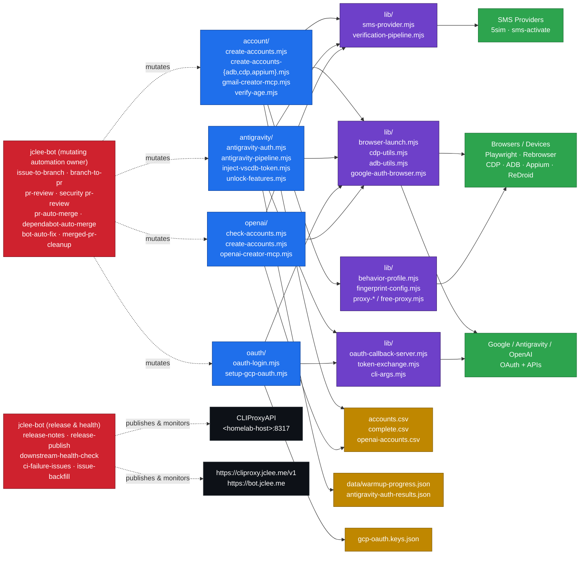

# 계정 자동화 워크스페이스 / Account Automation Workspace

[](../../actions/workflows/ci.yml)
[](../../actions/workflows/02_issue-to-branch.yml)
[](../../actions/workflows/01_branch-to-pr.yml)
[](../../actions/workflows/10_pr-review.yml)
[](../../actions/workflows/11_security-pr-review.yml)
[](../../actions/workflows/12_dependabot-auto-merge.yml)
[](../../actions/workflows/13_pr-auto-merge.yml)
[](../../actions/workflows/14_bot-auto-fix.yml)
[](../../actions/workflows/25_release-publish.yml)

> README 생성 모델 / README generation model: `gpt-5.5` · fallback: `minimax-m3` via [`https://cliproxy.jclee.me/v1`](https://cliproxy.jclee.me)

---

## 1. 개요 / Overview

이 저장소는 **Gmail 계정 생성, OAuth 인증 흐름, Antigravity IDE 인증·토큰 주입, OpenAI 계정 점검·생성 보조** 작업을 위한 Node.js ESM 기반 자동화 워크스페이스입니다. Playwright / Rebrowser, Chrome DevTools Protocol(CDP), ADB, Appium, MCP(Model Context Protocol) 서버, 그리고 모듈형 SMS provider 추상화(5sim, sms-activate 등)를 단일 저장소에서 결합합니다.

This repository is a **Node.js ESM** automation workspace for **Gmail account creation**, **OAuth credential flows**, **Antigravity IDE authentication / token injection**, and **OpenAI account inspection / creation helpers**. It unifies **Playwright / Rebrowser**, the **Chrome DevTools Protocol (CDP)**, **ADB**, **Appium**, an **MCP (Model Context Protocol) server**, and a modular **SMS provider abstraction** (5sim, sms-activate, …) inside a single workspace, with CSV-backed state and JSON run artifacts for downstream automation owned by `jclee-bot`.

---

## 2. 주요 기능 / Features

- **Gmail 계정 생성 파이프라인** — `account/create-accounts.mjs` 본 스크립트와 ADB / CDP / Appium 변형(`create-accounts-adb.mjs`, `create-accounts-cdp.mjs`, `create-accounts-appium.mjs`)을 통해 데스크톱·Android 양쪽 흐름을 지원합니다.
- **MCP 서버** — `account/gmail-creator-mcp.mjs`가 4개의 tool(`create_accounts`, `get_creation_job`, `list_accounts`, `get_account_status`)을 노출하여 mcphub 같은 MCP 클라이언트에서 도구 기반으로 호출할 수 있습니다.
- **Antigravity IDE 인증** — `antigravity/` 디렉터리의 OAuth + SMS 인증 파이프라인, VSCDB protobuf 토큰 주입, 5sim SMS 기반 feature unlock 스크립트.
- **OAuth 자격 증명 자동화** — `oauth/oauth-login.mjs`, `oauth/setup-gcp-oauth.mjs`, `lib/oauth-callback-server.mjs`로 GCP OAuth 클라이언트 생성·로그인 콜백을 자동화합니다.
- **OpenAI 계정 점검·생성 보조** — `openai/` 디렉터리의 `check-accounts.mjs`, `create-accounts.mjs`, `openai-creator-mcp.mjs`로 OpenAI 계정 상태 확인 및 생성을 보조합니다.
- **모듈형 SMS provider** — `lib/sms-provider.mjs` 하나로 5sim, sms-activate 등 복수 provider를 추상화하고, `lib/verification-pipeline.mjs`로 3단계 인증 파이프라인을 제공합니다.
- **인간형 행동 프로파일** — `lib/behavior-profile.mjs`(타이핑·마우스 시뮬레이션), `lib/fingerprint-config.mjs`(브라우저 핑거프린트), `lib/proxy-config.mjs` + `proxy-forwarder.mjs` + `proxy-relay.mjs` + `free-proxy.mjs`(프록시 우회)로 디텍션 저항성을 강화합니다.
- **테스트 스위트** — `tests/gmail-creator-mcp-smoke.mjs`(29개 단언)와 `tests/qa-manual.mjs`(6개 수동 QA) 스모크 테스트로 회귀를 방지합니다.

---

## 3. 아키텍처 / Architecture

워크스페이스는 **scripts → lib utilities → 외부 provider/디바이스 → 산출물** 방향으로 흐르며, `jclee-bot`이 모든 mutating 자동화(PR·이슈·릴리스·봇 자동수정)를 소유합니다. 아래 다이어그램은 데이터 흐름과 자동화 소유 경계를 한 눈에 보여줍니다.



핵심 경계:

- **App-owned automation surfaces** — 계정/토큰/CSV/JSON 산출물은 본 워크스페이스 스크립트가 직접 소유합니다.
- **jclee-bot owned automation** — 이슈 → 브랜치, 브랜치 → PR, PR 리뷰/자동병합, 의존성 자동병합, 봇 자동수정, 머지된 PR 정리, 릴리스 노트/게시, 다운스트림 헬스체크, CI 실패 이슈 생성, 이슈 백필은 모두 `jclee-bot`이 소유합니다(워크플로 파일은 단순 트리거).
- **External LLM proxy** — README 생성 및 PR 리뷰 등 자동화 모델 호출은 `https://cliproxy.jclee.me/v1`(호스트: `&lt;homelab-host&gt;:8317`)을 경유합니다.

---

## 4. jclee-bot 자동화 영역 / jclee-bot Automation Surfaces

`jclee-bot`은 본 저장소의 모든 **mutating automation** 단일 소유자입니다. 각 GitHub Actions 워크플로 파일은 트리거일 뿐이며, 실제 자동화 의사결정·기록·게시는 `jclee-bot`이 담당합니다.

- **이슈 → 브랜치 자동 생성** — 이슈가 라벨링되거나 명령이 달리면 `jclee-bot`이 브랜치를 만들고 작업 트리를 준비합니다. 신규 이슈 자동 라벨링은 `jclee-bot에의해자동화됨` 마커로 추적됩니다.
- **브랜치 → PR 자동 개시** — 작업 브랜치 푸시를 감지하여 `jclee-bot`이 PR을 열고 템플릿을 채워넣습니다.
- **PR 리뷰(일반 + 보안)** — `qodo-ai/pr-agent`을 통해 일반 리뷰를, 자체 보안 규칙으로 보안 리뷰를 `jclee-bot`이 수행합니다.
- **PR 자동 병합 / Dependabot 자동 병합** — 리뷰 결과가 통과 기준을 충족하면 `jclee-bot`이 squash 병합을 수행합니다.
- **봇 자동 수정** — CI 실패 또는 리뷰 코멘트 기반 수정안은 `jclee-bot`이 커밋으로 푸시합니다.
- **머지된 PR 정리 / CI 실패 이슈 생성 / 이슈 백필** — 보관 정책과 운영 추적성 모두 `jclee-bot` 책임입니다.
- **릴리스 노트 / 릴리스 게시** — `jclee-bot`이 시맨틱 버전과 changelog를 작성해 GitHub Release를 게시합니다.
- **다운스트림 헬스체크** — 공개 엔드포인트 `https://cliproxy.jclee.me`과 `https://bot.jclee.me`의 상태를 `jclee-bot`이 주기적으로 점검합니다.

> 외부 참고 링크 / External references: [qodo-ai/pr-agent](https://github.com/qodo-ai/pr-agent) · [`https://cliproxy.jclee.me`](https://cliproxy.jclee.me) · [`https://bot.jclee.me`](https://bot.jclee.me)

---

## 5. Go 자동화 도구 / Go Automation Tools

본 저장소에는 **Go 기반 자동화 도구가 0개** 있습니다. 모든 자동화 스크립트는 Node.js ESM(`*.mjs`) 및 셸 스크립트(`bin/*.sh`)로 작성되어 있습니다. 향후 Go 도구가 추가되면 본 섹션과 `AGENTS.md`의 `## STRUCTURE` 블록을 함께 갱신해야 합니다.

This repository contains **zero Go-based automation tools**. All automation scripts are written as Node.js ESM (`*.mjs`) and shell scripts (`bin/*.sh`). When a Go tool is introduced, this section and the `## STRUCTURE` block in `AGENTS.md` must be updated together.

---

## 6. 빠른 시작 / Quick Start

```bash
# 1. 의존성 설치 / Install dependencies
npm ci

# 2. 1Password 서비스 계정 및 GCP OAuth 자격 증명 준비 (1Password Service Account 권장)
bin/setup-1password-service-account.sh
bin/setup-credentials.sh
bin/setup-gcp-oauth.mjs   # 또는 oauth/setup-gcp-oauth.mjs 직접 호출

# 3. Gmail 계정 생성 (드라이런)
node account/create-accounts.mjs --dry-run

# 4. MCP 서버 기동 (mcphub에서 연결)
node account/gmail-creator-mcp.mjs

# 5. Antigravity 인증 파이프라인
node antigravity/antigravity-pipeline.mjs
```

전제 조건 / Prerequisites:

- Node.js 18+ (ESM, `type: module` 가정)
- ADB가 PATH에 노출된 Android 디바이스 또는 ReDroid 컨테이너
- Playwright / Rebrowser용 Chromium
- 5sim API 키 (SMS 인증이 필요한 플로우)

---

## 7. 로컬 개발 / Local Development

```bash
# 린트/포맷 (프로젝트 정책에 따라 eslint/prettier 추가 예정)
node --check account/create-accounts.mjs
node --check antigravity/antigravity-pipeline.mjs

# 스모크 테스트
node tests/gmail-creator-mcp-smoke.mjs
node tests/qa-manual.mjs

# 디버그용 임시 스크립트
node tmp/debug-selects.mjs
node tmp/sms-fast-v2.mjs
```

샌드박스 / Sandbox:

- 외부 provider에 부작용을 주지 않으려면 `--dry-run`을 우선 사용하세요.
- SMS 비용이 발생하므로 5sim 잔액과 provider별 한도를 사전에 확인하세요.
- `data/warmup-progress.json`은 워밍업 진행 상태의 단일 출처(SSOT)이므로 직접 편집하지 마세요.

---

## 8. 명령어 레퍼런스 / Commands Reference

| 명령 | 용도 |
| --- | --- |
| `node account/create-accounts.mjs [--dry-run] [--count N]` | 기본 Gmail 계정 생성 |
| `node account/create-accounts-adb.mjs` | ADB + Android Chrome 기반 생성 |
| `node account/create-accounts-cdp.mjs` | ReDroid WebView + CDP 모드 |
| `node account/create-accounts-appium.mjs` | Appium + Docker Android 에뮬레이터 |
| `node account/gmail-creator-mcp.mjs` | MCP 서버 기동 (4 tool 노출) |
| `node account/verify-age.mjs` | 5sim SMS 연동 나이 인증 |
| `node account/family-group.mjs` | 가족 그룹 초대/수락 |
| `node account/warmup-account.mjs` | 계정 워밍업 |
| `node account/process-batch-verification.mjs` | 배치 검증 처리 |
| `node account/verify-all-accounts.mjs` | 전체 계정 검증 |
| `node account/infrastructure/setup-emulator.mjs` | 에뮬레이터 인프라 셋업 |
| `node antigravity/antigravity-auth.mjs` | Antigravity OAuth + SMS 인증 |
| `node antigravity/antigravity-pipeline.mjs` | Antigravity 엔드투엔드 활성화 |
| `node antigravity/inject-vscdb-token.mjs` | VSCDB protobuf 토큰 주입 |
| `node antigravity/unlock-features.mjs` | 5sim SMS feature unlock |
| `node antigravity/manual-token-acquire.mjs` | 수동 보조 OAuth 토큰 획득 |
| `node oauth/oauth-login.mjs` | OAuth 동의/로그인 헬퍼 |
| `node oauth/setup-gcp-oauth.mjs` | GCP OAuth 자격 증명 자동 셋업 |
| `node openai/check-accounts.mjs` | OpenAI 계정 점검 |
| `node openai/create-accounts.mjs` | OpenAI 계정 생성 보조 |
| `node openai/openai-creator-mcp.mjs` | OpenAI MCP 서버 |
| `bin/create-gmail.sh` | Gmail 생성 셸 래퍼 |
| `bin/setup-credentials.sh` | 자격 증명 셋업 |
| `bin/setup_frida.sh` | Frida 환경 셋업 |
| `bin/xdg-open` | OAuth 콜백 인터셉터 (`lib/xdg-open`로 노출) |
| `node tests/gmail-creator-mcp-smoke.mjs` | MCP 스모크 (29 단언) |
| `node tests/qa-manual.mjs` | 수동 QA (6 케이스) |

---

## 9. 저장소 구조 / Repository Structure

```text
.
├── AGENTS.md                          # 프로젝트 지식 베이스 (자동화 인벤토리 SSOT)
├── CONTRIBUTING.md                    # 기여 가이드
├── LICENSE                            # 라이선스
├── README.md                          # 본 문서
├── package.json                       # 루트 의존성
├── package-lock.json                  # 의존성 잠금
├── complete.csv                       # 계정 상태 산출물
├── openai-accounts.csv                # OpenAI 계정 산출물
├── bin/                               # 셸 래퍼 및 환경 셋업
│   ├── create-gmail.sh
│   ├── setup-1password-service-account.sh
│   ├── setup-credentials.sh
│   ├── setup_frida.sh
│   └── xdg-open                       # OAuth 콜백 인터셉터 (lib과 연동)
├── oauth/                             # OAuth 자격 증명 흐름
│   ├── oauth-login.mjs
│   └── setup-gcp-oauth.mjs
├── account/                           # Gmail 계정 자동화
│   ├── cdp-login-test.mjs
│   ├── check-account-exists.mjs
│   ├── create-accounts.mjs            # 주 생성 플로우
│   ├── create-accounts-adb.mjs
│   ├── create-accounts-appium.mjs
│   ├── create-accounts-cdp.mjs
│   ├── create-accounts.mjs
│   ├── debug-sms-capture.mjs
│   ├── diagnostic-login.mjs
│   ├── direct-login-test.mjs
│   ├── family-group.mjs
│   ├── frida-sms-hook.js
│   ├── gmail-creator-mcp.mjs          # MCP 서버 (4 tool)
│   ├── infrastructure-diagnostic.mjs
│   ├── process-batch-verification.mjs
│   ├── puppeteer-gmail.mjs
│   ├── redroid-signup-cdp.mjs
│   ├── test-partner-oauth.mjs
│   ├── verify-account.mjs
│   ├── verify-age.mjs
│   ├── verify-all-accounts.mjs
│   ├── warmup-account.mjs
│   ├── youtube-signup-cdp.mjs
│   ├── youtube-signup.mjs
│   └── infrastructure/
│       └── setup-emulator.mjs
├── openai/                            # OpenAI 계정 점검/생성
│   ├── README.md
│   ├── check-accounts.mjs
│   ├── create-accounts.mjs
│   └── openai-creator-mcp.mjs
├── docs/                              # 운영 문서
│   ├── ALTERNATIVE-SMS-PROVIDERS.md
│   ├── QUICKSTART.md
│   ├── adb-gmail-creation.md
│   └── verification-bypass-analysis.md
├── lib/                               # 공유 유틸리티
│   ├── adb-utils.mjs
│   ├── antigravity-shared.mjs
│   ├── behavior-profile.mjs
│   ├── browser-launch.mjs
│   ├── cdp-utils.mjs
│   ├── cli-args.mjs
│   ├── fingerprint-config.mjs
│   ├── free-proxy.mjs
│   ├── google-auth-browser.mjs
│   ├── oauth-callback-server.mjs
│   ├── proxy-config.mjs
│   ├── proxy-forwarder.mjs
│   ├── proxy-relay.mjs
│   ├── sms-provider.mjs               # 5sim / sms-activate 추상화
│   ├── token-exchange.mjs
│   └── verification-pipeline.mjs
├── data/
│   └── warmup-progress.json           # 워밍업 진행 상태 SSOT
├── antigravity/                       # Antigravity IDE 인증/토큰 주입
│   ├── antigravity-auth-results.json
│   ├── antigravity-auth.mjs
│   ├── antigravity-pipeline.mjs
│   ├── inject-vscdb-token.mjs
│   ├── manual-token-acquire.mjs
│   └── unlock-features.mjs
├── tests/                             # 스모크 + 수동 QA
│   ├── gmail-creator-mcp-smoke.mjs
│   └── qa-manual.mjs
└── tmp/                               # 일회성 디버그/실험 스크립트
    ├── debug-selects.mjs
    ├── sms-fast-v2.mjs
    ├── sms-verify-fast.mjs
    ├── tmp-reauth.mjs
    └── ui.xml
```

> 참고: 워크플로 파일(`.github/workflows/*.yml`)은 mutating 자동화 자체가 아니라 jclee-bot 자동화의 **트리거**이므로 본 트리에서 별도 디렉터리로 노출하지 않습니다. 자동화 동작의 SSOT는 `AGENTS.md`와 본 README의 §4입니다.

---

## 10. 기여 가이드 / Contribution Guide

- **기여 전 확인** — [`CONTRIBUTING.md`](./CONTRIBUTING.md)와 [`AGENTS.md`](./AGENTS.md)의 `## STRUCTURE` / `## WHERE TO LOOK` 표를 먼저 읽어 주세요.
- **브랜치 규칙** — 모든 변경은 `jclee-bot`의 이슈 → 브랜치 자동화를 통해 시작합니다(`jclee-bot에의해자동화됨` 마커가 붙은 이슈). 수동 브랜치는 자동 병합 대상에서 제외됩니다.
- **커밋 규약** — `feat:`, `fix:`, `chore:`, `docs:`, `refactor:` 접두사를 사용하고, 본문에는 `Refs #<issue-number>`를 포함하세요.
- **PR 리뷰** — 일반 리뷰는 `qodo-ai/pr-agent`을, 보안 리뷰는 `jclee-bot` 보안 워크플로가 수행합니다. 두 리뷰 모두 통과해야 자동 병합 대상이 됩니다.
- **Dependabot PR** — `jclee-bot`이 자동 병합 여부를 결정하며, CI 통과가 필수입니다.
- **테스트** — `tests/gmail-creator-mcp-smoke.mjs`와 `tests/qa-manual.mjs`를 모두 통과시켜 주세요. 새 tool을 MCP 서버에 추가하면 스모크 단언도 함께 늘려 주세요.
- **자동화 모델** — PR 리뷰·README 자동 생성에 사용되는 모델은 `gpt-5.5`이며, 폴백은 `minimax-m3`(`https://cliproxy.jclee.me/v1` 경유)입니다.

라이선스 / License: 저장소 루트의 [`LICENSE`](./LICENSE) 파일을 참조하세요.