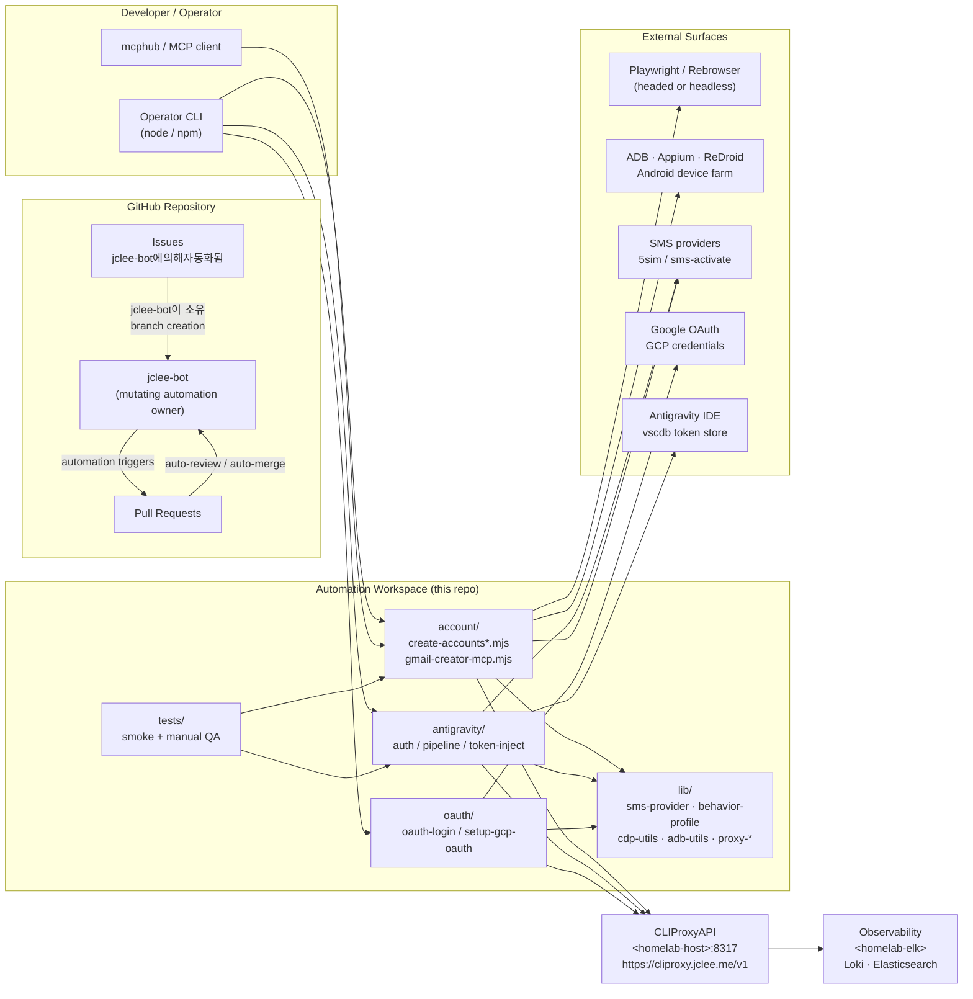

# 계정 자동화 워크스페이스 / Account Automation Workspace

[](../../actions/workflows/ci.yml)
[](../../actions/workflows/02_issue-to-branch.yml)
[](../../actions/workflows/01_branch-to-pr.yml)
[](../../actions/workflows/10_pr-review.yml)
[](../../actions/workflows/11_security-pr-review.yml)
[](../../actions/workflows/12_dependabot-auto-merge.yml)
[](../../actions/workflows/13_pr-auto-merge.yml)
[](../../actions/workflows/14_bot-auto-fix.yml)
[](../../actions/workflows/25_release-publish.yml)

> README 생성 모델 / README generation model: `gpt-5.5` · fallback: `minimax-m3` via `https://cliproxy.jclee.me/v1`

---

## 1. 개요 / Overview

이 저장소는 **Gmail 계정 생성, OAuth 인증 흐름, Antigravity IDE 인증·토큰 주입, OpenAI 계정 점검·생성 보조** 작업을 위한 Node.js ESM 기반 자동화 워크스페이스입니다. Playwright / Rebrowser, Chrome DevTools Protocol(CDP), ADB, Appium, MCP(Model Context Protocol) 서버, 그리고 모듈형 SMS provider 추상화(5sim, sms-activate 등)를 단일 저장소에서 결합합니다.

This repository is a **Node.js ESM** automation workspace for **Gmail account creation**, **OAuth credential flows**, **Antigravity IDE authentication / token injection**, and **OpenAI account inspection / creation helpers**. It unifies **Playwright / Rebrowser**, the **Chrome DevTools Protocol (CDP)**, **ADB**, **Appium**, an **MCP (Model Context Protocol) server**, and a modular **SMS provider abstraction** (5sim, sms-activate, …) inside a single, scripted workspace.

모든 변경은 GitHub 이슈 → 브랜치 → PR → 자동 리뷰 → 자동 머지 → 릴리스 노트의 파이프라인을 따라 흐르며, 변경을 만드는 모든 mutating 자동화는 **jclee-bot이 소유**합니다.

All changes flow through an `Issue → Branch → PR → Auto-review → Auto-merge → Release notes` pipeline. Every mutating automation surface is **owned by jclee-bot**.

---

## 2. 주요 기능 / Features

- **Gmail 계정 자동 생성** — `account/create-accounts.mjs`, `create-accounts-adb.mjs`, `create-accounts-appium.mjs`, `create-accounts-cdp.mjs` 의 다중 트랜스포트(데스크톱 브라우저 / ADB Android Chrome / Appium 도커 에뮬레이터 / ReDroid WebView CDP).
- **MCP 서버** — `account/gmail-creator-mcp.mjs` 가 4개의 도구(`create_accounts`, `get_creation_job`, `list_accounts`, `get_account_status`)를 노출하여 mcphub 와의 통합 지원.
- **OAuth 자격 증명 흐름** — `oauth/oauth-login.mjs`, `oauth/setup-gcp-oauth.mjs` 와 `lib/oauth-callback-server.mjs`, `lib/token-exchange.mjs`, `lib/google-auth-browser.mjs` 기반.
- **Antigravity IDE 인증·토큰 주입** — `antigravity/antigravity-auth.mjs`, `antigravity-pipeline.mjs`, `inject-vscdb-token.mjs`, `manual-token-acquire.mjs`, `unlock-features.mjs`.
- **모듈형 SMS provider** — `lib/sms-provider.mjs` 가 5sim / sms-activate 등 백엔드를 추상화하고 5sim 키 없이도 동작하는 `--dry-run` 모드를 지원.
- **행동 프로파일링** — `lib/behavior-profile.mjs`(인간형 타이핑 / 마우스 시뮬레이션), `lib/fingerprint-config.mjs`, `lib/free-proxy.mjs` 기반의 지문·프록시 회피.
- **OpenAI 계정 헬퍼** — `openai/check-accounts.mjs`, `openai/create-accounts.mjs`, `openai/openai-creator-mcp.mjs`.
- **테스트 스위트** — `tests/gmail-creator-mcp-smoke.mjs`(29 어서션) + `tests/qa-manual.mjs`(6 케이스).
- **운영 자동화** — 이슈 백필, PR 리뷰·보안 리뷰·자동 머지, 의존성 업데이트 머지, 머지된 PR 정리, 릴리스 노트/게시, 다운스트림 헬스 체크, CI 실패 이슈 자동 생성 — **모든 mutating 표면은 jclee-bot이 소유**.

---

## 3. 아키텍처 / Architecture

아래 다이어그램은 워크스페이스의 주요 구성 요소와 데이터 흐름을 보여 줍니다. 모든 라벨의 `<...>` 플레이스홀더는 실제 환경 변수 또는 호스트명으로 치환됩니다.



> 각 노드의 `<homelab-host>`, `<homelab-elk>` 와 같은 플레이스홀더는 배포 환경의 실제 값으로 대체되며, 본 README 에서는 하드코딩된 사설 IP 나 컨테이너 번호를 노출하지 않습니다.

---

## 4. jclee-bot 자동화 표면 / jclee-bot Automation Surfaces

본 저장소의 모든 mutating 자동화는 단일 GitHub App — **jclee-bot** — 이 소유합니다. 워크플로우 파일은 트리거 구현체이며, 자동화의 진실의 원천(source of truth)은 **App 과 그에 부여된 권한**입니다.

The single GitHub App **jclee-bot** owns every mutating automation surface in this repository. Workflow files are implementation triggers; the source of truth for automation is the App and its granted permissions.

### 4.1 jclee-bot 이 소유하는 표면 / Surfaces owned by jclee-bot

| 표면 / Surface | 동작 / Behavior | 소유 / Owner |
| --- | --- | --- |
| Issue triage & branching | 이슈 라벨에 따라 브랜치를 생성하고 작업 보드에 연결 / Creates branches from labeled issues | jclee-bot |
| PR creation | 브랜치에서 PR 을 열고 Draft / Ready 상태를 관리 / Opens PRs from branches | jclee-bot |
| Auto-review | 일반 PR 리뷰를 자동 작성 / Auto-reviews PRs | jclee-bot |
| Security PR review | 보안 관점 PR 리뷰 (qodo-ai/pr-agent 연동) / Security-flavored PR review | jclee-bot |
| Dependabot auto-merge | 의존성 업데이트 PR 자동 머지 / Auto-merges dependency updates | jclee-bot |
| PR auto-merge | 조건 충족 시 일반 PR 자동 머지 / Auto-merges qualifying PRs | jclee-bot |
| Bot auto-fix | 리뷰 피드백 기반 자동 수정 패치 적용 / Applies auto-fix patches | jclee-bot |
| Merged PR cleanup | 머지된 PR 의 정리 / Cleans up merged PR branches | jclee-bot |
| Issue backfill | 누락된 메타데이터 / 라벨을 이슈에 백필 / Backfills missing issue metadata | jclee-bot |
| Release notes | 변경 로그 / 릴리스 노트 생성 / Generates release notes | jclee-bot |
| Release publish | 릴리스 아티팩트 게시 / Publishes release artifacts | jclee-bot |
| Downstream health-check | 다운스트림 의존성 헬스 체크 / Downstream health probes | jclee-bot |
| CI failure issues | CI 실패를 자동으로 이슈로 변환 / Auto-files issues for CI failures | jclee-bot |

### 4.2 이슈 자동화 마커 / Issue automation marker

이 저장소에서 jclee-bot이 자동으로 생성·관리하는 이슈에는 다음 마커가 부여됩니다:

Issues automatically created or managed by jclee-bot in this repository carry the following marker:

```
jclee-bot에의해자동화됨
```

이 마커는 자동화 출처를 명확히 하기 위해 사용되며, 수동 작성 이슈에는 부여되지 않습니다.

This marker is used to make the automation provenance explicit and is **not** assigned to human-authored issues.

### 4.3 PR 리뷰 공급자 / PR review providers

- 일반 리뷰 — jclee-bot (소유 / owned)
- 보안 리뷰 — [qodo-ai/pr-agent](https://github.com/qodo-ai/pr-agent) 기반, jclee-bot 이 트리거
- LLM 추론 — `https://cliproxy.jclee.me/v1` (CLIProxyAPI, `<homelab-host>:8317`)

---

## 5. Go 자동화 도구 / Go Automation Tools

이 저장소는 **Go 기반 자동화 도구를 포함하지 않습니다** (Go tools count: 0). 모든 자동화는 다음 두 레이어로 구성됩니다:

This repository ships **no Go-based automation tools** (Go tools count: `0`). All automation is composed of two layers:

1. **GitHub App / jclee-bot** — 이슈, PR, 릴리스에 대한 모든 mutating 작업을 수행.
2. **Node.js ESM 스크립트** — Gmail / Antigravity / OAuth / OpenAI 도메인의 런타임 자동화.

향후 Go 도구가 추가될 경우 본 섹션은 도구 이름, 바이너리 경로(`bin/`), CLI 인터페이스를 기준으로 갱신됩니다.

If Go tools are added later, this section will be updated with tool names, binary paths (`bin/`), and CLI interfaces.

---

## 6. 빠른 시작 / Quick Start

```bash
# 1. 클론 및 의존성 설치 / Clone and install
git clone <repo-url>
cd <repo-dir>
npm ci

# 2. 환경 변수 / Environment variables
cp .env.example .env   # 5SIM_API_KEY, GCP_OAUTH_CLIENT_ID/SECRET, ...

# 3. 1Password 서비스 계정 설정 (선택) / Optional 1Password setup
./bin/setup-1password-service-account.sh

# 4. Gmail 자격 증명 설정 / Gmail credentials
./bin/setup-credentials.sh

# 5. MCP 서버 실행 (tool-based 생성) / Run MCP server
node account/gmail-creator-mcp.mjs

# 6. 일반 계정 생성 / Standard account creation
node account/create-accounts.mjs --count 1 --dry-run   # first
node account/create-accounts.mjs --count 1             # real
```

> `--dry-run` 은 5sim / SMS provider 호출 없이 전체 파이프라인을 검증합니다. 첫 실행 시 반드시 사용하세요.

`--dry-run` validates the entire pipeline without contacting 5sim or any SMS provider. Always run it first.

---

## 7. 로컬 개발 / Local Development

### 7.1 디렉터리 구조 / Repository structure

```text
./
├── account/                       # Gmail account automation
│   ├── create-accounts.mjs        # primary creation flow (3,727L)
│   ├── create-accounts-adb.mjs    # ADB + Android Chrome (871L)
│   ├── create-accounts-appium.mjs # Appium + Docker Android (1,576L)
│   ├── create-accounts-cdp.mjs    # CDP over ReDroid WebView (965L)
│   ├── family-group.mjs           # family invite/accept (496L)
│   ├── gmail-creator-mcp.mjs      # MCP server: 4 tools (681L)
│   ├── verify-age.mjs             # 5sim age verification (814L)
│   └── infrastructure/setup-emulator.mjs
├── antigravity/                   # Antigravity IDE auth & verification
│   ├── antigravity-auth.mjs       # OAuth + SMS pipeline (710L)
│   ├── antigravity-pipeline.mjs   # end-to-end orchestrator (755L)
│   ├── inject-vscdb-token.mjs     # VSCDB protobuf injection (467L)
│   ├── manual-token-acquire.mjs   # manual-assisted OAuth (286L)
│   └── unlock-features.mjs        # 5sim feature unlock (757L)
├── oauth/                         # OAuth credential flows
│   ├── oauth-login.mjs            # OAuth consent/login helper (219L)
│   └── setup-gcp-oauth.mjs        # GCP OAuth setup automation (208L)
├── openai/                        # OpenAI account helpers
│   ├── check-accounts.mjs
│   ├── create-accounts.mjs
│   └── openai-creator-mcp.mjs
├── lib/                           # shared utilities
│   ├── oauth-callback-server.mjs
│   ├── token-exchange.mjs
│   ├── google-auth-browser.mjs
│   ├── browser-launch.mjs
│   ├── cli-args.mjs
│   ├── adb-utils.mjs
│   ├── cdp-utils.mjs
│   ├── sms-provider.mjs
│   ├── verification-pipeline.mjs
│   ├── behavior-profile.mjs
│   ├── fingerprint-config.mjs
│   ├── free-proxy.mjs
│   ├── proxy-config.mjs
│   ├── proxy-forwarder.mjs
│   └── proxy-relay.mjs
├── bin/                           # shell helpers (gmail, 1password, frida, xdg-open)
├── docs/                          # design notes and quick-starts
├── data/                          # warmup-progress.json (state)
├── tests/                         # smoke + manual QA
└── tmp/                           # transient debug scripts (not shipped)
```

### 7.2 환경 변수 / Environment variables

| 이름 / Name | 용도 / Purpose |
| --- | --- |
| `5SIM_API_KEY` | 5sim SMS provider 인증 키 |
| `GCP_OAUTH_CLIENT_ID` / `GCP_OAUTH_CLIENT_SECRET` | GCP OAuth 자격 증명 |
| `PROXY_URL` | (선택) 외부 프록시 / Optional outbound proxy |
| `HOMELAB_HOST` | CLIProxyAPI 호스트명 (예: `<homelab-host>`) |
| `HOMELAB_ELK` | 관측 스택 엔드포인트 (예: `<homelab-elk>`) |

### 7.3 MCP 통합 / MCP integration

`account/gmail-creator-mcp.mjs` 는 4개 도구를 노출합니다:

- `create_accounts(count, dry_run?)` — 일괄 생성 작업 시작
- `get_creation_job(job_id)` — 작업 상태 조회
- `list_accounts(filter?)` — 결과 CSV 조회
- `get_account_status(email)` — 단일 계정의 검증 상태

mcphub 와의 연동 예시:

```jsonc
{
  "mcpServers": {
    "gmail-creator": {
      "command": "node",
      "args": ["account/gmail-creator-mcp.mjs"],
      "env": { "5SIM_API_KEY": "..." }
    }
  }
}
```

---

## 8. 명령어 레퍼런스 / Commands Reference

### 8.1 Gmail 계정 / Gmail accounts

```bash
node account/create-accounts.mjs --count 5 --dry-run
node account/create-accounts.mjs --count 1 --headed
node account/create-accounts-adb.mjs --device <serial>
node account/create-accounts-appium.mjs --image redroid:14
node account/create-accounts-cdp.mjs --host <homelab-host>
node account/family-group.mjs --inviter alice@example.com --invitee bob@example.com
node account/verify-age.mjs --email alice@example.com
node account/verify-all-accounts.mjs
```

### 8.2 Antigravity IDE

```bash
node antigravity/antigravity-auth.mjs
node antigravity/antigravity-pipeline.mjs --count 3
node antigravity/inject-vscdb-token.mjs --target <path>
node antigravity/manual-token-acquire.mjs
node antigravity/unlock-features.mjs --feature beta
```

### 8.3 OAuth

```bash
node oauth/oauth-login.mjs --help
node oauth/oauth-login.mjs --headed --scopes "openid,email,profile"
node oauth/setup-gcp-oauth.mjs --project <gcp-project>
```

### 8.4 OpenAI 헬퍼

```bash
node openai/check-accounts.mjs --file openai-accounts.csv
node openai/create-accounts.mjs --count 2 --dry-run
node openai/openai-creator-mcp.mjs
```

### 8.5 진단·테스트 / Diagnostics & tests

```bash
node account/diagnostic-login.mjs --email alice@example.com
node account/infrastructure-diagnostic.mjs
node tests/gmail-creator-mcp-smoke.mjs
node tests/qa-manual.mjs --case family-invite
```

### 8.6 셸 헬퍼 / Shell helpers (`bin/`)

```bash
./bin/setup-credentials.sh
./bin/setup-1password-service-account.sh
./bin/setup_frida.sh
./bin/create-gmail.sh --count 1
./bin/xdg-open https://example.com   # URL interceptor for OAuth callback capture
```

---

## 9. 기여 가이드 / Contributing

### 9.1 워크플로우 / Workflow

1. 이슈 생성 — 자동 라벨링·백필은 jclee-bot이 수행합니다.
2. 이슈에 `jclee-bot에의해자동화됨` 마커가 붙는다면 자동화 산출물임을 인지하세요.
3. 브랜치 생성 — jclee-bot이 라벨 기반으로 브랜치를 생성합니다.
4. PR 오픈 — jclee-bot이 PR 을 열고 상태를 관리합니다.
5. 리뷰 — 일반 리뷰는 jclee-bot, 보안 리뷰는 qodo-ai/pr-agent.
6. 자동 머지 — 조건 충족 시 jclee-bot 이 머지합니다.
7. 릴리스 — 릴리스 노트/게시는 jclee-bot이 발행합니다.

### 9.2 코딩 규약 / Coding conventions

- Node.js ESM (`.mjs`) 만 사용 / Use Node.js ESM (`.mjs`) only.
- 새로운 공유 유틸리티는 `lib/` 에 모듈로 추가 / New shared utilities live in `lib/`.
- 도메인 스크립트는 목적별 디렉터리에 배치:
  - `account/` — Gmail 도메인
  - `antigravity/` — Antigravity IDE 도메인
  - `oauth/` — OAuth 흐름
  - `openai/` — OpenAI 도메인
- 자동화 행동 변경 시 `AGENTS.md` 와 본 README 의 해당 섹션을 함께 갱신.
- 사설 IP / 내부 컨테이너 번호를 커밋하지 말 것 — 플레이스홀더(`<homelab-host>`, `<homelab-elk>`)를 사용.

### 9.3 보안 / Security

- 5sim / OAuth / GCP 자격 증명을 커밋 금지. 1Password 서비스 계정 또는 환경 변수를 사용.
- 보안 PR 리뷰 트리거는 jclee-bot이 소유 — 별도 호출 불필요.
- 취약점 보고는 비공개 채널을 우선 사용하고, 공개 이슈에는 마커 `jclee-bot에의해자동화됨` 이 부착되지 않도록 주의.

### 9.4 라이선스 / License

본 저장소는 저장소 루트의 `LICENSE` 파일에 명시된 라이선스를 따릅니다.

This repository is licensed under the terms stated in the `LICENSE` file at the repository root.

---

## 10. 부록 / Appendix

### 10.1 외부 링크 / External links

- 코드 리뷰 어시스턴트 — [qodo-ai/pr-agent](https://github.com/qodo-ai/pr-agent)
- LLM 추론 엔드포인트 — `https://cliproxy.jclee.me/v1` (CLIProxyAPI, `<homelab-host>:8317`)
- 봇 운영 콘솔 — `https://bot.jclee.me`

### 10.2 메타데이터 / Metadata

- README 생성 모델 / README generation model: `gpt-5.5`
- Fallback 모델 / Fallback model: `minimax-m3` (via CLIProxyAPI)
- 자동화 소유자 / Automation owner: **jclee-bot**
- Go 도구 수 / Go tools count: `0`
- 이슈 자동화 마커 / Issue automation marker: `jclee-bot에의해자동화됨`