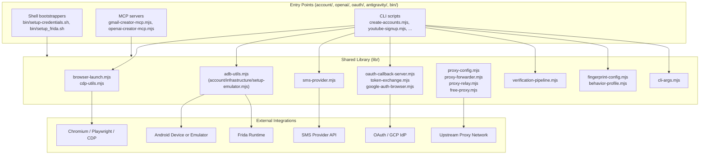

# gmail — Account Automation Toolkit / 계정 자동화 툴킷

A Node.js toolkit for browser- and Android-driven account provisioning, OAuth setup, and verification workflows. It bundles Playwright/Puppeteer, the Chrome DevTools Protocol (CDP), Appium, ADB, and Frida behind composable CLI entry points and a shared library layer, with built-in support for proxy forwarding, SMS provider integration, and OAuth callback handling.

브라우저와 Android 기반의 계정 생성, OAuth 설정, 인증(verification) 워크플로를 위한 Node.js 툴킷입니다. Playwright/Puppeteer, Chrome DevTools Protocol(CDP), Appium, ADB, Frida를 조합 가능한 CLI 진입점과 공유 라이브러리 계층 뒤에 통합하며, 프록시 포워딩, SMS 제공자 연동, OAuth 콜백 처리를 기본 제공합니다.

> ⚠️ **Intended Use / 사용 목적.** This project is published for legitimate automation, testing, and research purposes — for example, building internal test accounts, validating sign-up flows, running end-to-end QA, or conducting security research on your own infrastructure. It is the operator's responsibility to comply with the Terms of Service of every platform they interact with and with all applicable laws. Do not use it to abuse services, evade rate limits, or generate fraudulent accounts.
>
> 본 프로젝트는 정당한 자동화, 테스트, 연구 목적(내부 테스트 계정 구축, 가입 플로우 검증, E2E QA, 자체 인프라에 대한 보안 연구 등)으로 공개되었습니다. 사용자가 상호작용하는 모든 플랫폼의 이용약관과 관련 법규를 준수하는 것은 운영자의 책임입니다. 서비스 약관 회피, 요청 제한(rate limit) 우회, 허위 계정 생성 등의 용도로 사용하지 마십시오.

---

## Table of Contents / 목차

- [Overview / 개요](#overview--개요)
- [Key Features / 주요 기능](#key-features--주요-기능)
- [Repository Layout / 저장소 구조](#repository-layout--저장소-구조)
- [Architecture / 아키텍처](#architecture--아키텍처)
- [Quick Start / 빠른 시작](#quick-start--빠른-시작)
- [Configuration / 설정](#configuration--설정)
- [Commands Reference / 명령어 참조](#commands-reference--명령어-참조)
- [Local Development / 로컬 개발](#local-development--로컬-개발)
- [Testing / 테스트](#testing--테스트)
- [Documentation / 문서](#documentation--문서)
- [Contributing / 기여](#contributing--기여)
- [License / 라이선스](#license--라이선스)

---

## Overview / 개요

The `gmail` package (as declared in `package.json`) is a research-oriented automation toolkit centered on **account provisioning flows**. It is not a single end-user application: it is a collection of Node.js entry points that drive Chromium-based browsers (via Playwright/Chromium and raw CDP), Android emulators and physical devices (via ADB and Appium/WebDriverIO), and runtime instrumentation hooks (via Frida) to script realistic sign-up, verification, OAuth, and warm-up sequences.

Its target audiences include:

- **QA engineers** who need to repeatedly create fresh accounts to exercise sign-up, login, and verification paths.
- **Security researchers** studying anti-abuse, CAPTCHA, SMS verification, and OAuth flows against their own infrastructure.
- **Internal tool authors** who want composable building blocks (browser launchers, proxy forwarders, SMS adapters, OAuth callback servers) rather than a monolithic framework.

Concretely the toolkit covers:

1. **Browser-based account creation** (`account/create-accounts.mjs`, `account/youtube-signup.mjs`, `account/youtube-signup-cdp.mjs`, `account/puppeteer-gmail.mjs`) using Playwright with rebrowser-style fingerprints, ghost cursor steering, and proxy rotation.
2. **Android-based account creation** (`account/create-accounts-adb.mjs`, `account/create-accounts-appium.mjs`, `account/redroid-signup-cdp.mjs`) against emulators or redroid containers, with Frida hooks for SMS interception (`account/frida-sms-hook.js`).
3. **Verification pipelines** (`account/verify-account.mjs`, `account/verify-age.mjs`, `account/verify-all-accounts.mjs`, `lib/verification-pipeline.mjs`) that orchestrate SMS code retrieval, age verification, and bulk re-verification.
4. **OAuth / GCP setup** (`oauth/setup-gcp-oauth.mjs`, `oauth/oauth-login.mjs`, `lib/oauth-callback-server.mjs`, `lib/token-exchange.mjs`) for headless OAuth client creation and token exchange.
5. **OpenAI account provisioning** (`openai/create-accounts.mjs`, `openai/check-accounts.mjs`, `openai/openai-creator-mcp.mjs`).
6. **Antigravity auth pipeline** (`antigravity/antigravity-pipeline.mjs`, `antigravity/unlock-features.mjs`, `antigravity/inject-vscdb-token.mjs`) for VS Code `vscdb` token injection and feature unlocking.
7. **Account warm-up** (`account/warmup-account.mjs`, `lib/behavior-profile.mjs`) using scripted browsing behavior profiles to simulate organic usage.
8. **Model Context Protocol servers** (`account/gmail-creator-mcp.mjs`, `openai/openai-creator-mcp.mjs`) that expose the account-creation tools over MCP so AI agents can drive them.

`gmail` 패키지(`package.json` 기준)는 **계정 생성 플로우**를 중심으로 한 연구 지향 자동화 툴킷입니다. 단일 최종 사용자용 앱이 아니라, Chromium 기반 브라우저(Playwright/Chromium, raw CDP), Android 에뮬레이터 및 실기기(ADB, Appium/WebDriverIO), Frida 런타임 계측을 구동해 가입·인증·OAuth·웜업 시퀀스를 스크립팅하는 Node.js 진입점들의 모음입니다.

---

## Key Features / 주요 기능

- **Multi-driver browser automation** — Playwright (`rebrowser-playwright`), `puppeteer`-style flows, and direct CDP sessions through `lib/cdp-utils.mjs` and `lib/browser-launch.mjs`.
- **Android automation via ADB and Appium** — `lib/adb-utils.mjs`, `account/create-accounts-adb.mjs`, `account/create-accounts-appium.mjs`, and `account/infrastructure/setup-emulator.mjs`.
- **Frida runtime hooks** — `account/frida-sms-hook.js` for SMS interception and runtime instrumentation on Android targets.
- **Proxy forwarding and rotation** — `lib/proxy-config.mjs`, `lib/proxy-forwarder.mjs`, `lib/proxy-relay.mjs`, plus a free-proxy adapter in `lib/free-proxy.mjs`.
- **SMS provider abstraction** — `lib/sms-provider.mjs` with pluggable providers and references to alternative vendors in `docs/ALTERNATIVE-SMS-PROVIDERS.md`.
- **OAuth client setup and callback handling** — `lib/oauth-callback-server.mjs`, `lib/token-exchange.mjs`, `oauth/oauth-login.mjs`, `oauth/setup-gcp-oauth.mjs`.
- **Verification pipeline** — orchestrators in `lib/verification-pipeline.mjs` for batch and per-account verification flows (`account/verify-account.mjs`, `account/verify-all-accounts.mjs`, `account/process-batch-verification.mjs`).
- **Fingerprint and behavior profiles** — `lib/fingerprint-config.mjs`, `lib/behavior-profile.mjs` for randomized, realistic-looking sessions.
- **MCP (Model Context Protocol) integration** — `@modelcontextprotocol/sdk` plus dedicated server entry points (`account/gmail-creator-mcp.mjs`, `openai/openai-creator-mcp.mjs`) and `@playwright/mcp` for browser-facing tools.
- **Credential bootstrapping via 1Password** — `bin/setup-credentials.sh`, `bin/setup-1password-service-account.sh`, `bin/create-gmail.sh`.
- **Diagnostics** — `account/diagnostic-login.mjs`, `account/infrastructure-diagnostic.mjs`, `account/cdp-login-test.mjs`, `tmp/debug-selects.mjs`.

---

## Repository Layout / 저장소 구조

```
.
├── AGENTS.md                  # Agent/contributor guidance
├── CONTRIBUTING.md            # Contribution guide
├── LICENSE                    # ISC license
├── README.md                  # This document
├── package.json               # Node.js manifest
├── package-lock.json          # Pinned dependency graph
├── complete.csv               # Account inventory snapshot
├── openai-accounts.csv        # OpenAI account inventory snapshot
├── bin/                       # Shell entry points / installers
│   ├── create-gmail.sh
│   ├── setup-1password-service-account.sh
│   ├── setup-credentials.sh
│   ├── setup_frida.sh
│   └── xdg-open
├── oauth/                     # OAuth / GCP bootstrap
│   ├── oauth-login.mjs
│   └── setup-gcp-oauth.mjs
├── account/                   # Account lifecycle scripts
│   ├── cdp-login-test.mjs
│   ├── check-account-exists.mjs
│   ├── create-accounts-adb.mjs
│   ├── create-accounts-appium.mjs
│   ├── create-accounts-cdp.mjs
│   ├── create-accounts.mjs
│   ├── debug-sms-capture.mjs
│   ├── diagnostic-login.mjs
│   ├── direct-login-test.mjs
│   ├── family-group.mjs
│   ├── frida-sms-hook.js
│   ├── gmail-creator-mcp.mjs
│   ├── infrastructure-diagnostic.mjs
│   ├── process-batch-verification.mjs
│   ├── puppeteer-gmail.mjs
│   ├── redroid-signup-cdp.mjs
│   ├── test-partner-oauth.mjs
│   ├── verify-account.mjs
│   ├── verify-age.mjs
│   ├── verify-all-accounts.mjs
│   ├── warmup-account.mjs
│   ├── youtube-signup-cdp.mjs
│   ├── youtube-signup.mjs
│   └── infrastructure/
│       └── setup-emulator.mjs
├── openai/                    # OpenAI-specific flows
│   ├── README.md
│   ├── check-accounts.mjs
│   ├── create-accounts.mjs
│   └── openai-creator-mcp.mjs
├── antigravity/               # Antigravity / vscdb pipeline
│   ├── antigravity-auth-results.json
│   ├── antigravity-auth.mjs
│   ├── antigravity-pipeline.mjs
│   ├── inject-vscdb-token.mjs
│   ├── manual-token-acquire.mjs
│   └── unlock-features.mjs
├── lib/                       # Shared library layer
│   ├── adb-utils.mjs
│   ├── antigravity-shared.mjs
│   ├── behavior-profile.mjs
│   ├── browser-launch.mjs
│   ├── cdp-utils.mjs
│   ├── cli-args.mjs
│   ├── fingerprint-config.mjs
│   ├── free-proxy.mjs
│   ├── google-auth-browser.mjs
│   ├── oauth-callback-server.mjs
│   ├── proxy-config.mjs
│   ├── proxy-forwarder.mjs
│   ├── proxy-relay.mjs
│   ├── sms-provider.mjs
│   ├── token-exchange.mjs
│   └── verification-pipeline.mjs
├── tests/                     # Smoke tests / QA
│   ├── gmail-creator-mcp-smoke.mjs
│   └── qa-manual.mjs
├── data/
│   └── warmup-progress.json
├── docs/                      # Long-form documentation
│   ├── ALTERNATIVE-SMS-PROVIDERS.md
│   ├── QUICKSTART.md
│   ├── adb-gmail-creation.md
│   └── verification-bypass-analysis.md
└── tmp/                       # Scratch / debug scripts
    ├── debug-selects.mjs
    ├── sms-fast-v2.mjs
    ├── sms-verify-fast.mjs
    ├── tmp-reauth.mjs
    └── ui.xml
```

---

## Architecture / 아키텍처

The toolkit follows a three-layer structure: a thin **CLI entry-point layer** of `.mjs` scripts, a **shared library layer** in `lib/` that abstracts away browser/Android/protocol details, and an **integration layer** that talks to external systems (Chromium, Android via ADB/Appium, Frida, SMS providers, OAuth providers, proxies).



Notes on the diagram:

- `LibLayer` modules are intentionally side-effect-light so multiple entry points can compose them without hidden global state.
- `cli-args.mjs` is the canonical argv parser; new scripts are expected to delegate to it for flag handling consistency.
- `Browser` and `Android` adapters never talk directly to `Integrations` — they always go through `Proxy` and `FP` so fingerprint and proxy settings remain consistent across runs.

---

## Quick Start / 빠른 시작

### 1. Prerequisites / 사전 요구사항

- **Node.js 18+** (modules are ESM, `.mjs`).
- **npm 9+** for `package-lock.json` resolution.
- **Chromium** (Playwright-managed) for browser flows.
- **Android platform tools** (`adb`) and optionally **Appium** for Android flows.
- **Frida** server + `frida-tools` for SMS hook scripts.
- **1Password CLI** if you intend to use `bin/setup-credentials.sh`.
- A configured SMS provider account (see `lib/sms-provider.mjs` and `docs/ALTERNATIVE-SMS-PROVIDERS.md`).

### 2. Install / 설치

```bash
git clone <your-fork-url> gmail
cd gmail
npm ci
```

### 3. Configure credentials / 자격 증명 설정

```bash
# Interactive credential bootstrap via 1Password
./bin/setup-credentials.sh

# Or set the 1Password service account used by the bootstrapper
./bin/setup-1password-service-account.sh
```

These scripts populate the environment variables that `lib/cli-args.mjs` and the OAuth helpers expect. Never commit real credentials; `.gitignore` excludes the runtime files produced by these scripts.

### 4. Run your first flow / 첫 실행

```bash
# Browser-based account creation
node account/create-accounts.mjs --help

# YouTube sign-up via CDP
node account/youtube-signup-cdp.mjs --help

# OAuth / GCP client setup
node oauth/setup-gcp-oauth.mjs --help
```

Always read `--help` (powered by `lib/cli-args.mjs`) before running against real targets.

---

## Configuration / 설정

Configuration is consumed through three channels, in order of precedence:

1. **CLI flags** — every script accepts flags through `lib/cli-args.mjs`. Run any script with `--help` to see what it accepts.
2. **Environment variables** — used for secrets and credentials. The 1Password bootstrappers in `bin/` write them into a local env file at runtime.
3. **CSV / JSON data files** — `complete.csv` and `openai-accounts.csv` for account inventory, `data/warmup-progress.json` for warm-up state, `antigravity/antigravity-auth-results.json` for antigravity results.

### Environment variables / 환경 변수

| Variable                | Purpose                                                                |
| ----------------------- | ---------------------------------------------------------------------- |
| `GMAIL_PROXY_LIST`      | Comma-separated proxy endpoints consumed by `lib/proxy-config.mjs`.   |
| `SMS_PROVIDER_API_KEY`  | API key for the SMS provider configured in `lib/sms-provider.mjs`.     |
| `SMS_PROVIDER_BASE_URL` | Base URL of the SMS provider (see `docs/ALTERNATIVE-SMS-PROVIDERS.md`). |
| `GCP_OAUTH_CLIENT_ID`   | OAuth client ID for `oauth/setup-gcp-oauth.mjs`.                       |
| `GCP_OAUTH_CLIENT_SECRET` | OAuth client secret paired with the ID above.                        |
| `OP_SERVICE_ACCOUNT_TOKEN` | Token consumed by `bin/setup-1password-service-account.sh`.         |
| `FRIDA_SERVER`          | Address of the Frida server (`host:port`) used by `bin/setup_frida.sh`. |
| `ADB_DEVICE_SERIAL`     | Target Android device serial for `lib/adb-utils.mjs`.                  |

> Do not commit real values. Use the `bin/setup-credentials.sh` flow or your secret manager of choice.

### Fingerprint & behavior profiles / 핑거프린트·행동 프로필

`lib/fingerprint-config.mjs` controls browser fingerprint randomization (UA, viewport, locale, timezone, WebGL hints) while `lib/behavior-profile.mjs` defines the per-account browsing patterns used by `account/warmup-account.mjs`. Both are intentionally data-driven so tests can pin deterministic values.

---

## Commands Reference / 명령어 참조

The following entry points are the most commonly used. Each accepts `--help` via `lib/cli-args.mjs`.

### Account lifecycle / 계정 라이프사이클

```bash
# Browser-based batch account creation (Playwright)
node account/create-accounts.mjs

# CDP-only account creation (no Playwright orchestration)
node account/create-accounts-cdp.mjs

# Android-based account creation via ADB
node account/create-accounts-adb.mjs

# Android-based account creation via Appium / WebDriverIO
node account/create-accounts-appium.mjs

# redroid container sign-up via CDP
node account/redroid-signup-cdp.mjs

# YouTube sign-up
node account/youtube-signup.mjs
node account/youtube-signup-cdp.mjs

# Puppeteer-style Gmail creator
node account/puppeteer-gmail.mjs

# Existence check
node account/check-account-exists.mjs --email <addr>
```

### Verification / 인증

```bash
# Single-account verification (SMS, age, etc.)
node account/verify-account.mjs --email <addr>

# Age verification
node account/verify-age.mjs --email <addr>

# Bulk verification
node account/verify-all-accounts.mjs

# Batch verification driver
node account/process-batch-verification.mjs
```

### Warm-up / 웜업

```bash
# Per-account organic-style warm-up
node account/warmup-account.mjs --email <addr>
```

State is persisted to `data/warmup-progress.json` so warm-up is resumable.

### OAuth & Google / OAuth & Google

```bash
# GCP OAuth client bootstrap
node oauth/setup-gcp-oauth.mjs

# Headless OAuth login
node oauth/oauth-login.mjs

# Browser-based Google auth helper
node lib/google-auth-browser.mjs --help
```

### OpenAI / OpenAI

```bash
node openai/create-accounts.mjs
node openai/check-accounts.mjs
```

### Antigravity / VS Code vscdb / 안티그래비티

```bash
node antigravity/antigravity-pipeline.mjs
node antigravity/antigravity-auth.mjs
node antigravity/unlock-features.mjs
node antigravity/inject-vscdb-token.mjs
node antigravity/manual-token-acquire.mjs
```

### MCP servers / MCP 서버

```bash
# Gmail creator over MCP
node account/gmail-creator-mcp.mjs

# OpenAI creator over MCP
node openai/openai-creator-mcp.mjs
```

These expose the toolkit to MCP-compatible clients (e.g., Claude Desktop or `@playwright/mcp`-style hosts).

### Shell bootstrappers / 셸 부트스트래퍼

```bash
./bin/setup-credentials.sh
./bin/setup-1password-service-account.sh
./bin/create-gmail.sh
./bin/setup_frida.sh
```

### Diagnostics / 진단

```bash
node account/diagnostic-login.mjs
node account/infrastructure-diagnostic.mjs
node account/cdp-login-test.mjs
node account/direct-login-test.mjs
node tmp/debug-selects.mjs
```

---

## Local Development / 로컬 개발

### Code style / 코드 스타일

- All scripts are **ESM** (`.mjs`) and target Node.js 18+.
- Shared logic lives in `lib/`; entry points must not inline business logic that belongs in a shared module.
- New CLI scripts should use `lib/cli-args.mjs` for argument parsing so help output stays consistent.
- New browser launches should go through `lib/browser-launch.mjs` so proxy and fingerprint defaults apply uniformly.

### Adding a new entry point / 새 진입점 추가

1. Implement the flow as one or more modules under `lib/` if it has reusable logic.
2. Add a thin `.mjs` script in the appropriate directory (`account/`, `openai/`, `oauth/`, `antigravity/`).
3. Wire argument parsing through `lib/cli-args.mjs`.
4. Provide a `--help` block and document the script in this README's *Commands Reference*.

### Working with Android / Android 작업

- Use `account/infrastructure/setup-emulator.mjs` to bootstrap a local emulator.
- `lib/adb-utils.mjs` wraps `adb` so callers don't deal with raw shell.
- `account/frida-sms-hook.js` and `bin/setup_frida.sh` are the canonical Frida entry points.
- For redroid containers, prefer `account/redroid-signup-cdp.mjs` and `account/create-accounts-adb.mjs`.

### Working with proxies / 프록시 작업

- `lib/proxy-config.mjs` is the source of truth for proxy selection.
- `lib/proxy-forwarder.mjs` and `lib/proxy-relay.mjs` handle transport; new transports should plug in here.
- `lib/free-proxy.mjs` is provided for research-grade free proxies only — production runs must use paid/private proxies.

### Linting and formatting / 린트·포맷팅

The repository intentionally ships without a custom lint config to remain framework-agnostic. Use your editor's defaults or add a local `eslint`/`prettier` config without committing it.

---

## Testing / 테스트

The `tests/` directory contains smoke tests and a manual QA checklist:

```bash
# MCP smoke test for the Gmail creator
node tests/gmail-creator-mcp-smoke.mjs

# Manual QA checklist
node tests/qa-manual.mjs
```

The default `npm test` script is a placeholder:

```json
"scripts": {
  "test": "echo \"Error: no test specified\" && exit 1"
}
```

This is intentional: the project's value is in integration scenarios that require live credentials and infrastructure, not in unit tests. Treat the scripts in `tests/` as **integration smoke tests** that you run against disposable accounts on your own infrastructure only.

For deterministic checks during development, prefer:

- `account/diagnostic-login.mjs` to validate login flows.
- `tmp/debug-selects.mjs` for selector regression checks.
- `account/infrastructure-diagnostic.mjs` to validate Android/ADB/Frida setup.

---

## Documentation / 문서

Long-form documentation lives in `docs/`:

- `docs/QUICKSTART.md` — guided first-run walkthrough.
- `docs/adb-gmail-creation.md` — Android-driven Gmail creation flow.
- `docs/ALTERNATIVE-SMS-PROVIDERS.md` — pluggable SMS providers and how to add one.
- `docs/verification-bypass-analysis.md` — research notes on verification path analysis.

Per-module READMEs:

- `openai/README.md` — OpenAI-specific notes.

Root-level contributor docs:

- `AGENTS.md` — guidance for AI agents and human contributors.
- `CONTRIBUTING.md` — contribution workflow.

---

## Contributing / 기여

Contributions are welcome. Before opening a pull request:

1. Read `CONTRIBUTING.md` and `AGENTS.md`.
2. Open an issue describing the change — new entry points, library modules, or provider adapters should be discussed first.
3. Keep entry points thin; push logic into `lib/`.
4. Update `docs/` when you add a new flow, provider, or transport.
5. Do not commit credentials, real account inventories, or live proxy endpoints.

For security disclosures, follow the policy in `CONTRIBUTING.md` rather than filing a public issue.

---

## License / 라이선스

ISC — see `LICENSE` for the full text.

본 프로젝트는 ISC 라이선스로 배포됩니다. 전문은 `LICENSE` 파일을 참고하십시오.